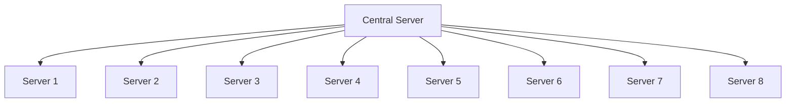

the WWW as a network has boomed after it has been discovered that the degree distribution of the webpages follows a power-law over several orders of magnitude (Albert, Jeong, Barabási 1999, Kumaret al. 1999). Since the edges of the WWW are directed, the network is characterized by two degree distributions: the distribution of outgoing edges, $P_{out}(k)$ , signifies the probability that a document has k outgoing hyperlinks and the distribution of incoming edges, $P_{in}(k)$ , is the probability that k hyperlinks point to a certain document. Several studies have established that both $P_{out}(k)$ and $P_{in}(k)$ have power-law tails:

$$
P _ {o u t} (k) \sim k ^ {- \gamma_ {o u t}} \quad \text {and} \quad P _ {i n} (k) \sim k ^ {- \gamma_ {i n}}. \tag {3}
$$

WORLD-WIDE WEB  

flowchart

This diagram illustrates a hierarchical data flow or workflow structure, showing how multiple sources (represented by arrows) are combined into a central 'HOME PAGE' node.

INTERNET  

flowchart

FIG. 1. Network structure of the World-Wide Web and the Internet. Upper panel: the nodes of the World-Wide Web are web documents, connected with directed hyperlinks (URLs). Lower panel: on the Internet the nodes are the routers and computers, the edges are the wires and cables that physically connect them. Figure courtesy of István Albert.

Albert, Jeong and Barabási (1999) have studied a subset of the WWW containing 325,729 nodes and have found $\gamma_{out} = 2.45$ and $\gamma_{in} = 2.1$ . Kumar et al. (1999) used a 40 million document crawl by Alexa Inc., obtaining $\gamma_{out} = 2.38$ and $\gamma_{in} = 2.1$ (see also Kleinberg et al. 1999). A later survey of the WWW topology by Broder et al. (2000) used two 1999 Altavista crawls containing in total 200 million documents, obtaining $\gamma_{out} = 2.72$ and $\gamma_{in} = 2.1$ with scaling holding close to five orders of magnitude (Fig. 2). Adamic and Huberman (2000) used a somewhat different representation of the WWW, each node representing a separate domain name and two nodes being connected if any of the pages in one domain linked to any page in the other. While this method lumps together often thousands of pages that are on the same domain, representing a nontrivial aggregation of the nodes, the distribution of incoming edges still followed a power-law with $\gamma_{in}^{dom} = 1.94$ .

Note that $\gamma_{in}$ is the same for all measurements at the document level despite the two years time delay between the first and last web crawl, during which the WWW had grown at least five times larger. On the other hand, $\gamma_{out}$ has an increasing tendency with the sample size or time (see Table II).

Despite the large number of nodes, the WWW displays the small world property. This was first reported by Albert, Jeong and Barabási (1999), who found that the average path length for a sample of 325,729 nodes was 11.2 and predicted, using finite size scaling, that for the full WWW of 800 million nodes that would be around 19. Subsequent measurements of Broder et al. (2000) found that the average path length between nodes in a 200 million sample of the WWW is 16, in agreement with the finite size prediction for a sample of this size. Finally, the domain level network displays an average path length of 3.1 (Adamic 1999).

The directed nature of the WWW does not allow us to measure the clustering coefficient using Eq. (1). One way to avoid this difficulty is to make the network undirected, making each edge bidirectional. This was the path followed by Adamic (1999) who studied the WWW at the domain level using an 1997 Alexa crawl of 50 million webpages distributed between 259, 794 sites. Adamic removed the nodes which have only one edge, focusing on a network of 153, 127 sites. While these modifications are expected to increase somewhat the clustering coefficient, she found C = 0.1078, orders of magnitude higher than $C_{rand} = 0.00023$ corresponding to a random graph of the same size and average degree.

TABLE I. The general characteristics of several real networks. For each network we indicated the number of nodes, the average degree $\langle k\rangle$ , the average path length $\ell$ and the clustering coefficient C. For a comparison we have included the average path length $\ell_{rand}$ and clustering coefficient $C_{rand}$ of a random graph with the same size and average degree. The last column identifies the symbols in Figs. 8 and 9.

<table><tr><td>Network</td><td>Size</td><td> $\langle k\rangle$ </td><td> $\ell$ </td><td> $\ell_{rand}$ </td><td>C</td><td> $C_{rand}$ </td><td>Reference</td><td>Nr.</td></tr><tr><td>WWW, site level, undir.</td><td>153, 127</td><td>35.21</td><td>3.1</td><td>3.35</td><td>0.1078</td><td>0.00023</td><td>Adamic 1999</td><td>1</td></tr><tr><td>Internet, domain level</td><td>3015 - 6209</td><td>3.52 - 4.11</td><td>3.7 - 3.76</td><td>6.36 - 6.18</td><td>0.18 - 0.3</td><td>0.001</td><td>Yook et al. 2001a, Pastor-Satorras et al. 2001</td><td>2</td></tr><tr><td>Movie actors</td><td>225, 226</td><td>61</td><td>3.65</td><td>2.99</td><td>0.79</td><td>0.00027</td><td>Watts, Strogatz 1998</td><td>3</td></tr><tr><td>LANL coauthorship</td><td>52, 909</td><td>9.7</td><td>5.9</td><td>4.79</td><td>0.43</td><td> $1.8 \times 10^{-4}$ </td><td>Newman 2001a,b</td><td>4</td></tr><tr><td>MEDLINE coauthorship</td><td>1, 520, 251</td><td>18.1</td><td>4.6</td><td>4.91</td><td>0.066</td><td> $1.1 \times 10^{-5}$ </td><td>Newman 2001a,b</td><td>5</td></tr><tr><td>SPIRES coauthorship</td><td>56, 627</td><td>173</td><td>4.0</td><td>2.12</td><td>0.726</td><td>0.003</td><td>Newman 2001a,b,c</td><td>6</td></tr><tr><td>NCSTRL coauthorship</td><td>11, 994</td><td>3.59</td><td>9.7</td><td>7.34</td><td>0.496</td><td> $3 \times 10^{-4}$ </td><td>Newman 2001a,b</td><td>7</td></tr><tr><td>Math coauthorship</td><td>70, 975</td><td>3.9</td><td>9.5</td><td>8.2</td><td>0.59</td><td> $5.4 \times 10^{-5}$ </td><td>Barabási et al. 2001</td><td>8</td></tr><tr><td>Neurosci. coauthorship</td><td>209, 293</td><td>11.5</td><td>6</td><td>5.01</td><td>0.76</td><td> $5.5 \times 10^{-5}$ </td><td>Barabási et al. 2001</td><td>9</td></tr><tr><td>E. coli, substrate graph</td><td>282</td><td>7.35</td><td>2.9</td><td>3.04</td><td>0.32</td><td>0.026</td><td>Wagner, Fell 2000</td><td>10</td></tr><tr><td>E. coli, reaction graph</td><td>315</td><td>28.3</td><td>2.62</td><td>1.98</td><td>0.59</td><td>0.09</td><td>Wagner, Fell 2000</td><td>11</td></tr><tr><td>Ythan estuary food web</td><td>134</td><td>8.7</td><td>2.43</td><td>2.26</td><td>0.22</td><td>0.06</td><td>Montoya, Solé 2000</td><td>12</td></tr><tr><td>Silwood park food web</td><td>154</td><td>4.75</td><td>3.40</td><td>3.23</td><td>0.15</td><td>0.03</td><td>Montoya, Solé 2000</td><td>13</td></tr><tr><td>Words, cooccurence</td><td>460.902</td><td>70.13</td><td>2.67</td><td>3.03</td><td>0.437</td><td>0.0001</td><td>Cancho, Solé 2001</td><td>14</td></tr><tr><td>Words, synonyms</td><td>22, 311</td><td>13.48</td><td>4.5</td><td>3.84</td><td>0.7</td><td>0.0006</td><td>Yook et al. 2001</td><td>15</td></tr><tr><td>Power grid</td><td>4, 941</td><td>2.67</td><td>18.7</td><td>12.4</td><td>0.08</td><td>0.005</td><td>Watts, Strogatz 1998</td><td>16</td></tr><tr><td>C. Elegans</td><td>282</td><td>14</td><td>2.65</td><td>2.25</td><td>0.28</td><td>0.05</td><td>Watts, Strogatz 1998</td><td>17</td></tr></table>

TABLE II. The scaling exponents characterizing the degree distribution of several scale-free networks, for which $P(k)$ follows a power-law (2). We indicate the size of the network, its average degree $\langle k\rangle$ and the cutoff $\kappa$ for the power-law scaling. For directed networks we list separately the indegree $(\gamma_{in})$ and outdegree $(\gamma_{out})$ exponents, while for the undirected networks, marked with a star, these values are identical. The columns $l_{real}$ , $l_{rand}$ and $l_{pow}$ compare the average path length of real networks with power-law degree distribution and the prediction of random graph theory (17) and that of Newman, Strogatz and Watts (2000) (62), as discussed in Sect. V. The last column identifies the symbols in Figs. 8 and 9.

<table><tr><td>Network</td><td>Size</td><td> $\langle k\rangle$ </td><td> $\kappa$ </td><td> $\gamma_{out}$ </td><td> $\gamma_{in}$ </td><td> $\ell_{real}$ </td><td> $\ell_{rand}$ </td><td> $\ell_{pow}$ </td><td>Reference</td><td>Nr.</td></tr><tr><td>WWW</td><td>325, 729</td><td>4.51</td><td>900</td><td>2.45</td><td>2.1</td><td>11.2</td><td>8.32</td><td>4.77</td><td>Albert, Jeong, Barabási 1999</td><td>1</td></tr><tr><td>WWW</td><td> $4 \times 10^7$ </td><td>7</td><td></td><td>2.38</td><td>2.1</td><td></td><td></td><td></td><td>Kumar et al. 1999</td><td>2</td></tr><tr><td>WWW</td><td> $2 \times 10^8$ </td><td>7.5</td><td>4,000</td><td>2.72</td><td>2.1</td><td>16</td><td>8.85</td><td>7.61</td><td>Broder et al. 2000</td><td>3</td></tr><tr><td>WWW, site</td><td>260,000</td><td></td><td></td><td></td><td>1.94</td><td></td><td></td><td></td><td>Huberman, Adamic 2000</td><td>4</td></tr><tr><td>Internet, domain*</td><td>3,015 - 4,389</td><td>3.42 - 3.76</td><td>30 - 40</td><td>2.1 - 2.2</td><td>2.1 - 2.2</td><td>4</td><td>6.3</td><td>5.2</td><td>Faloutsos 1999</td><td>5</td></tr><tr><td>Internet, router*</td><td>3,888</td><td>2.57</td><td>30</td><td>2.48</td><td>2.48</td><td>12.15</td><td>8.75</td><td>7.67</td><td>Faloutsos 1999</td><td>6</td></tr><tr><td>Internet, router*</td><td>150,000</td><td>2.66</td><td>60</td><td>2.4</td><td>2.4</td><td>11</td><td>12.8</td><td>7.47</td><td>Govindan 2000</td><td>7</td></tr><tr><td>Movie actors*</td><td>212, 250</td><td>28.78</td><td>900</td><td>2.3</td><td>2.3</td><td>4.54</td><td>3.65</td><td>4.01</td><td>Barabási, Albert 1999</td><td>8</td></tr><tr><td>Coauthors, SPIRES*</td><td>56, 627</td><td>173</td><td>1,100</td><td>1.2</td><td>1.2</td><td>4</td><td>2.12</td><td>1.95</td><td>Newman 2001b,c</td><td>9</td></tr><tr><td>Coauthors, neuro.*</td><td>209, 293</td><td>11.54</td><td>400</td><td>2.1</td><td>2.1</td><td>6</td><td>5.01</td><td>3.86</td><td>Barabási et al. 2001</td><td>10</td></tr><tr><td>Coauthors, math*</td><td>70,975</td><td>3.9</td><td>120</td><td>2.5</td><td>2.5</td><td>9.5</td><td>8.2</td><td>6.53</td><td>Barabási et al. 2001</td><td>11</td></tr><tr><td>Sexual contacts*</td><td>2810</td><td></td><td></td><td>3.4</td><td>3.4</td><td></td><td></td><td></td><td>Liljeros et al. 2001</td><td>12</td></tr><tr><td>Metabolic, E. coli</td><td>778</td><td>7.4</td><td>110</td><td>2.2</td><td>2.2</td><td>3.2</td><td>3.32</td><td>2.89</td><td>Jeong et al. 2000</td><td>13</td></tr><tr><td>Protein, S. cerev.*</td><td>1870</td><td>2.39</td><td></td><td>2.4</td><td>2.4</td><td></td><td></td><td></td><td>Mason et al. 2000</td><td>14</td></tr><tr><td>Ythan estuary*</td><td>134</td><td>8.7</td><td>35</td><td>1.05</td><td>1.05</td><td>2.43</td><td>2.26</td><td>1.71</td><td>Montoya, Solé 2000</td><td>14</td></tr><tr><td>Silwood park*</td><td>154</td><td>4.75</td><td>27</td><td>1.13</td><td>1.13</td><td>3.4</td><td>3.23</td><td>2</td><td>Montoya, Solé 2000</td><td>16</td></tr><tr><td>Citation</td><td>783, 339</td><td>8.57</td><td></td><td></td><td>3</td><td></td><td></td><td></td><td>Redner 1998</td><td>17</td></tr><tr><td>Phone-call</td><td> $53 \times 10^6$ </td><td>3.16</td><td></td><td>2.1</td><td>2.1</td><td></td><td></td><td></td><td>Aiello et al. 2000</td><td>18</td></tr><tr><td>Words, cooccurence*</td><td>460, 902</td><td>70.13</td><td></td><td>2.7</td><td>2.7</td><td></td><td></td><td></td><td>Cancho, Solé 2001</td><td>19</td></tr><tr><td>Words, synonyms*</td><td>22, 311</td><td>13.48</td><td></td><td>2.8</td><td>2.8</td><td></td><td></td><td></td><td>Yook et al. 2001</td><td>20</td></tr></table>