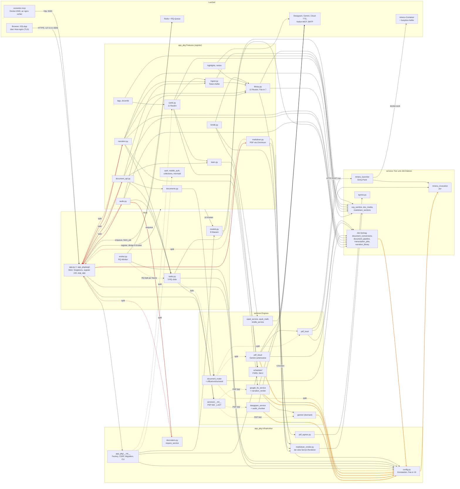

# AUDIT — Architektur & Wucherung (Karte · Hot-Spots · Verstöße · Wucherung · Tech-Debt)

> **Stand: Phase 1 abgeschlossen (2026-10-02).** Code-Check 2 von 5 (Security 2026-09-25 → Architektur → CONSIST → TEST → DOC). Vorlage: Notion „Audit — Architektur- & Wucherungs-Audit" (MINTBOX, 2026-05-16; der Prüfkatalog steht wörtlich in Anhang A des [Sprint-Prompts](../sprint-prompts/SPRINT_ARCH-AUDIT_architektur-und-wucherung_2026-10-01.md)). Messbasis HEAD `720de89`, Mac, Python 3.12.2, Flask 3.1.3; Suite-Baseline 1341 passed + 1 skipped (70,6 s). **Kein Code geändert.**
>
> **Ergebnis in Zahlen.** 14 Verstoß-Cluster (7 × Schweregrad 2, 7 × 1) und 16 Wucherungs-Cluster (1 × 3, 5 × 2, 10 × 1); kein Befund mit Schweregrad 4. 13 Teil-Urteile zu den zehn dokumentierten Entscheidungen: 5 „hält", 7 „hält mit Auflage", 1 „hält nicht" (E-6, `GeminiService` dormant). Anhaltend heiß ist nur die Infrastruktur (`app_pkg/__init__.py`, `app_pkg/config.py`, Build-Dateien); der eine Befund mit stiller Fehlwirkung ist W-4 (Item JOB-ID-REUSE). Drei Hypothesen des Sprint-Prompts trägt die Messung nicht: Closures als teuerste Einzelentscheidung, 28 Shim-Änderungen durch den Singleton-Seam, Library/Reader als Magnet.
>
> **Top 5 für den Schnitt (Vorschlag, Phase 2 wählt):** JOB-ID-REUSE (S, P1) · ARCH-NARR5 (S + S, P1) · ARCH-BUILD (S–M, P2) · ARCH-FACTORY (M, P2) · ARCH-LIBRARY-KLEIN (S, P2) — Begründung, Auflagen an bestehende Items, „später" und „nie" im Abschnitt Tech-Debt-Priorisierung.
>
> **Entstehung und Grenzen.** Messung am 2026-10-01: 14 Untersuchungen, jede unabhängig gegengeprüft (172 Einzelbefunde), danach Konsolidierung, ein Dreier-Panel zur Priorisierung und eine Vollständigkeits-Kritik. Abschluss am 2026-10-02 ohne neuen Mess-Lauf: Panel, Kritik und die Entscheidungen des Masters eingearbeitet (C.15), 35 Zahlen am Repo nachgemessen (C.16: 31 stimmen, 4 korrigiert). Die Mess-Skripte und Prototyp-Kopien existieren nicht mehr; was sich deshalb nicht nachprüfen ließ, ist im Text als „nicht nachgeprüft" bzw. „nicht nachprüfbar" gekennzeichnet. Container-, Pin- und Prod-Zahlen sind nicht gemessen.

**Skalen.** Schweregrad 1 gering/lokal · 2 spürbar bei jedem Anfassen · 3 laufende Kosten in einer Churn-Region oder stille Fehlerquelle · 4 systemisch. Aufwand XS Text-Edit · S eine Funktion · M Modul-Umbau · L Cross-Modul · XL Strukturwechsel. Maßstab ist eine Single-User-App (ein Mensch, ein Assistent); die Autoren-Dimension der Vorlage ist nicht anwendbar.

**Methode und Kürzel.** 14 Ausschnitte (Karte, Hot-Spots, Closures, Seam, Config, Jobs, Factory, Library, CSS, Dead Code, corpus/scripts, Time Bombs, Mai-Abgleich, Querschnitt), jeder von einem zweiten Lauf mit eigenen Skripten nachgemessen; wo der Gegenlauf korrigiert hat, steht seine Zahl. Prototypen liefen nur in Kopien außerhalb des Repos. Die Kürzel in den Quellen-Zeilen (KARTE-n, SEAM-n, JOBS-n, deadcode-n …) bezeichnen die Einzelbefunde dieser Ausschnitte; **V-n** und **W-n** sind die daraus gebildeten Cluster (Verstöße, Wucherung), **E-n** die zehn dokumentierten Entscheidungen. Container-, Pin- und Mintbox-Zahlen sind nicht gemessen (am Mac u. a. rq 1.16.0 statt 2.8.0, Flask-WTF 1.2.2 statt 1.2.1, nh3 0.3.5 statt 0.2.18).

**Abgrenzung.** Was CLAUDE.md als Entscheidung führt, steht unter „Dokumentierte Entscheidungen" mit Urteil und Kostenargument; V-2 und V-6 sind die gemessene Kostenseite von E-2 und E-1 und zählen einmal. Kosmetik, Testqualität und Doku-Drift stehen als Listen für CONSIST-, TEST- und DOC-AUDIT am Ende, ohne Schweregrad.

### Karte

Stufe 1 der Vorlage, Stand HEAD `720de89`. Alle Graph-Zahlen stammen aus zwei unabhängigen AST-Läufen (Untersucher und Gegenprüfer, identisch); wo sie sich in der Importlast um ein bis vier Module unterschieden, gilt die dritte Messung dieses Abschnitts (639 / 640 / 74 / 304 — die Werte des Gegenprüfers). Bewertet wird hier nichts: die Befunde stehen unter V-1 bis V-4 und V-9.

**(a) Die Karte in fünf Sätzen**

1. Zur Laufzeit gibt es vier Compose-Dienste — Web, Worker und `mineru-launcher` aus einem Image, dazu Redis; nur der Web-Container hält die SQLite (`app_data`), Web und Worker teilen ausschließlich `podcast_data`, der Launcher hält als einziger den Docker-Socket in einem internen Netz, und in den Web-Container führen zwei Eingänge: Host-nginx (außerhalb des Repos) und der converter-mcp über Docker-DNS an nginx vorbei.
2. Der Code sind 61 Module mit 14 005 LOC (`wc -l`; das Master-Skript zählt per `splitlines` 14 007, weil zwei Dateien in `services/` ohne abschließenden Zeilenumbruch enden) in drei Schichten — Root (4 / 914), `app_pkg` (25 / 7 155: 18 `register`-Module mit 74 Routen, 7 Infrastruktur-Module, die 75. Route registriert die Factory) und `services` (32 / 5 936) — mit 146 expliziten Modulpaaren und zwei Naben: `app_pkg.config` (Fan-in 19) und `models` (14); vier Feature-Module dienen anderen Features als Bibliothek (`library`, `ingest`, `cards`, `learn`).
3. Die vier kritischen Pfade sind: drei Identitätswege (Session, per-User-Bearer, Env-Token an 12 Routen) über ein `User.authenticate`; drei Job-Pfade nach Option B, die Schritt für Schritt strukturgleich laufen und sich nur in Auth, Quelle, Ergebnisform und Dedup unterscheiden; ein Server-Renderer für Reader, PDF und EPUB (dazu ein zweiter, clientseitiger für die Live-Vorschau); Karte → `get_scheduler()` → versionierte `Review`-Zeile.
4. Über Top-Level-Importe gibt es keinen Zyklus, mit späten Importen genau einen: die SCC(6) `app` ↔ `audio` / `narration` / `document_api` / `markdown` / `decorators` über acht `import app as _app_module` (Mai: fünf) — die mechanische Folge des Singleton-Seams, ohne Import- oder Laufzeitfehler auf dem Produktionsweg (V-2).
5. Die Schicht-Kante `services → app_pkg.config` ist seit Mai von 2 auf 8 Module gewachsen (12 von 32 transitiv), und weil `config.py` im Paket der Factory liegt, lädt `import app_pkg.config` 639 Module samt Flask, SQLAlchemy und `models` (326 davon sind die Factory-Hülle, etwa 190 ms einmal je Prozess); auf Paket-Ebene entsteht daraus ein Zyklus `config ↔ services`, den allein der PEP-562-Lader in `services/__init__` offen hält (V-1).

**(b) Abhängigkeits-Graph**



Rot: die zehn Kanten der SCC(6) (V-2). Orange: die Schicht-Kanten `services → app_pkg.config` und die Gegenkante `config → mineru_invocation` (V-1). Gestrichelt: später Import oder PEP-562-Auflösung. 41 Knoten bündeln die 61 Module, 93 Kanten (drei davon Sammelkanten am Feature-Block); geparst und gerendert mit Mermaid 10.9.8, die eingefärbten Kanten am erzeugten SVG nachgezählt. Gegenüber dem Entwurf des Untersuchers ergänzt: der zweite Eingang (converter-mcp).

**(c) Komponenten**

| Dienst | Verantwortung | Volumes · Netze | uid |
|---|---|---|---|
| **Web** (`markdown-converter-web`) | gunicorn, 2 Prozesse ([Dockerfile](../../../Dockerfile) Zeile 174); 75 Routen, einziger DB-Halter (SQLite), Server-Renderer und Chromium-PDF, EPUB + SMTP, Notion-Proxy, enqueue und Reconcile der drei Job-Arten | `podcast_data`, `app_data`, GCP-Schlüssel `:ro` · `default`, `notion-mcp-net` (extern), Port `127.0.0.1:5656→5000` | 1000 |
| **Worker** (`markdown-converter-worker`) | `python worker.py`; drei DB-freie Jobs (Narration, Dokument, Transkription), schreibt nur Dateien | `podcast_data`, `./doclocal_exchange`, GCP-Schlüssel `:ro`, kein `app_data` · `default`, `launch` | 1000 |
| **mineru-launcher** | Stdlib-HTTP `:8765` (`GET /health`, `POST /run`); einziger Socket-Halter, baut das `docker run`-argv aus [services/mineru_invocation.py](../../../services/mineru_invocation.py), ein Lauf zur Zeit | `/var/run/docker.sock`, kein `env_file`, kein Port · `launch` (internal) | 0 |
| **Redis** (`redis:8.4-alpine`) | RQ-Queue `default` und Job-Zustand (JSON) | – · `default` | 999 |
| mineru-Lauf, busybox-Helfer (nicht in Compose, vom Launcher gestartet) | lokale PDF-Engine je Auftrag (`mineru:3.4.4`); `dd` hinein, `cp -r` heraus | Volumes `<job>_in` / `<job>_out`; Helfer an der Austausch-Wurzel · `--network none` | 0, Copy-out 1000 |
| Host-nginx, converter-mcp (nicht im Repo) | die zwei Eingänge: TLS-Proxy auf `127.0.0.1:5656` und plain http `:5000` über Docker-DNS; belegt nur durch Kommentare in [docker-compose.yml](../../../docker-compose.yml) Zeilen 38–42 und [app_pkg/__init__.py](../../../app_pkg/__init__.py) Zeilen 43–47 | – | – |

Web, Worker und Launcher laufen aus `converter-app:latest`. Auf `podcast_data` (`OUTPUT_DIR`, [app_pkg/config.py](../../../app_pkg/config.py) Zeile 28, fünf Importeure) liegen die drei Job-Arten getrennt: `narration_<id>.wav` in der Wurzel, `doc_conversions/`, `transcriptions/` — je ein definierendes Modul in `services`. Nach außen sprechen Deepgram, Cloud TTS, Gemini, Notion-MCP, SMTP und öffentliche https-Hosts über das Tor [services/egress.py](../../../services/egress.py) Zeile 175.

**(d) Entry-Points**

- **ASGI-App** [app.py](../../../app.py) Zeile 101: der Import führt `create_app()` (Zeile 52), die Singletons (59–67) und 18× `register` (79–96) aus. Der Dev-Weg Zeilen 103–104 (`python app.py`) bootstrapt doppelt (an einer Kopie nachgestellt: 2× `create_app`), läuft am Mac aber gar nicht erst (`os.makedirs('/app/data')`) und ist im Container nicht der Startweg (W-8).
- **RQ-Worker** [worker.py](../../../worker.py) Zeilen 27–29; die drei Jobs in [tasks.py](../../../tasks.py) Zeilen 67, 131, 193 werden als Funktionsobjekt eingereiht, der Worker löst den Namen auf. `import worker` lädt 640 Module (V-1).
- **Launcher** [services/mineru_launcher.py](../../../services/mineru_launcher.py) Zeilen 446–460: 155 Module, 3 interne, kein Drittpaket. **Flask-CLI** in app_pkg/__init__.py: `create-user` (Zeile 532), `set-password` (547), `reset-collection` (629) (V-3).
- **`scripts/`**: 15 Dateien, 3 810 LOC — 5 Browser-Smokes (1 936), 2 Renderer-Gates (311), 4 Nebenläufigkeits-Messungen (1 103), 1 Modell-Probe (171), 3 Einmal-Backfills (289, je ein Commit im Juni); 6 importieren `app` und damit den vollen Bootstrap.
- **Ohne Kante in den Graph**: zwei Root-Skripte (`test_redis_connection.py`, `test_worker_libraries.py`, Mai-bekannt) und `corpus/` (11 getrackte `.py`, 2 753 LOC, 7 Shell-Einstiege) (W-10, W-11). **Routen**: 75 in 19 Modulen; 61 mit `@login_required`, 14 ohne (2 offen, 10 reine Env-Token-Routen mit `csrf.exempt`, 2 Dual-Auth in `document_api`).

**(e) Die vier kritischen Pfade**

1. **Login → Identität.** (1) Eingang: [app_pkg/auth.py](../../../app_pkg/auth.py):17 (Web) · [app_pkg/mobile_auth.py](../../../app_pkg/mobile_auth.py):87 (iOS) · `Authorization: Bearer` an 12 Routen (Env-Token) → (2) Prüfung: auth.py:26 und mobile_auth.py:99 → `User.authenticate` [models.py](../../../models.py):42–51; Env-Token über `_bearer_token` [app_pkg/ingest.py](../../../app_pkg/ingest.py):58 in vier Gates (ingest.py:122, cards.py:197, narration.py:178, document_api.py:243) → (3) Identität: `login_user` auth.py:28 · `issue_token` mobile_auth.py:46 → `ApiToken` models.py:54 · Ziel-User ingest.py:69 → (4) Folge-Request: `user_loader` app_pkg/__init__.py:121 · `request_loader` :128 → später Import :140 → mobile_auth.py:60 → (5) CSRF-Guard-Kette :274–298, Skip bei Bearer-Präsenz :287 → (6) Ablehnung :143–161 (302 `/login`, mit Bearer 401 JSON).
2. **Upload → Job → Reconcile** (Narration · Dokument · Transkription). (1) View [app_pkg/narration.py](../../../app_pkg/narration.py):235 · [app_pkg/document_api.py](../../../app_pkg/document_api.py):415 · [app_pkg/audio.py](../../../app_pkg/audio.py):248 → (2) Auth :178 (`NARRATION_TOKEN`) · :243 (Session/Bearer oder `DOC_CONVERT_TOKEN`) · `@login_required` + `require_service` :247 → (3) Quelle ablegen – · :504 · :321 → (4) Dedup per sha256 – · :475 · :293 → (5) `pending`-Zeile :287 · :502 · :306 → (6) enqueue über `app.task_queue` :305 · :521 · :337, Zeit-Umschlag aus app_pkg/config.py :105 · :152 · :236 → (7) Worker tasks.py :193 · :67 · :131 → (8) Ergebnis: WAV tasks.py:228 · `result_<id>.json` atomar tasks.py:110 · :175 → (9) Poll narration.py:327 · document_api.py:545 · audio.py:363 → (10) Reconcile file-first narration.py:122 · document_api.py:296 · audio.py:130, je mit spätem `import app` (:151 · :349 · :165) und `fetch_job` (:158 · :357 · :173).
3. **Markdown → Renderer → Ziel.** (1) `render_markdown_to_html` [app_pkg/markdown_render.py](../../../app_pkg/markdown_render.py):390 (SVG-Inseln :318 → `sanitize_svg` :312, `nh3.clean` :378) → (2a) Reader [app_pkg/library.py](../../../app_pkg/library.py):377–381 → `templates/library_detail.html`:104 · (2b) PDF [app_pkg/markdown.py](../../../app_pkg/markdown.py):159 → Renderer :194 → `app.async_playwright` :217 (später Import :141) → Egress-Tor :223 → [app_pkg/pdf_egress.py](../../../app_pkg/pdf_egress.py):95 → services/egress.py:175 · (2c) EPUB [app_pkg/kindle.py](../../../app_pkg/kindle.py):23 → Renderer :33 → `build_epub` :34 → `send_to_kindle` :38 · (2d) Live-Vorschau mit eigenem Client-Renderer `templates/markdown_converter.html`:154 → `static/js/markdown_converter.js`:186, ohne gemeinsamen Code (W-14).
4. **Karte → Scheduler → Review.** (1) Anlegen [app_pkg/cards.py](../../../app_pkg/cards.py):379 (Gate :197) → `Review` :436 → (2) Fällige holen cards.py:567 → `order_due_cards` [app_pkg/learn.py](../../../app_pkg/learn.py):219 → (3) Scheduler-Wahl [services/scheduler/__init__.py](../../../services/scheduler/__init__.py):32–40 → (4) Bewerten cards.py:732 → Schleife :754–765 → `_apply_rating` :149–195 → Commit mit `version_id_col` models.py:440 → `StaleDataError` :761 → 409 :769 → (5) Zurücksetzen per CLI app_pkg/__init__.py:629–721 → `initial_review_state` [services/scheduler/base.py](../../../services/scheduler/base.py):41 → später Import :713 `cards._naive_utc` (V-9).

**(f) Zyklen (vollständig)**

| Kantenmenge | SCC | Mitglieder | offen gehalten durch | Wirkung |
|---|---|---|---|---|
| Top-Level allein | 0 | – | – | kein Import-Zeit-Zyklus |
| Top-Level + späte Importe | 1 × 6 | `app`, `app_pkg.audio`, `.decorators`, `.document_api`, `.markdown`, `.narration` | acht `import app as _app_module`: audio.py:165, :221 · narration.py:151, :232 · document_api.py:349, :412 · markdown.py:141 · [app_pkg/decorators.py](../../../app_pkg/decorators.py):44 | V-2 |
| Top-Level + implizite Paket-Ausführung | 1 × 3 | `services.scheduler`, `.fsrs_scheduler`, `.sm2_scheduler` | Paketidiom (`__init__` importiert seine Submodule) | keine |
| alle Kantentypen (Paket-Ebene) | 1 × 19, dazu die SCC(6) | `app_pkg`, `.config`, `.cards`, `.ingest`, `.learn`, `.library`, `.markdown_render`, `.mobile_auth`, `models`, `services`, `.deepgram_service`, `.gemini`, `.gemini.client`, `.google_tts_service`, `.narration_library`, `.narration_render`, `services.scheduler` (+2) | PEP 562 in [services/__init__.py](../../../services/__init__.py):24–32; späte Importe app_pkg/__init__.py:713 (`cards._naive_utc`) und :140 (`mobile_auth.resolve_token`) | V-1, V-9 |

Nach einer Factory-Extraktion bliebe eine SCC(7) (`app_pkg.config`, `services`, `.deepgram_service`, `.gemini`, `.gemini.client`, `.google_tts_service`, `.narration_render`) über config.py:12 → `services/__init__` → deepgram_service.py:11 → `config`; der Lader bleibt Zyklus-Brecher. Am Prototyp gemessen: ein eager `services/__init__` bricht `import app_pkg` mit `ImportError` — die ganze Suite fällt bei der Sammlung; Zeile 713 als Top-Level-Import bricht nur `import services.narration_library` als ersten Import, die Suite bleibt grün, kein Produktions-Einstieg ist betroffen. Von den 24 späten Import-Statements halten zehn einen Zyklus offen; die übrigen 14 sind Lazy-Laden ohne Zyklus-Funktion (`services/document_router.py` 9, `tasks.py` 4; app_pkg/__init__.py:391 wiederholt nur den Top-Level-Import aus Zeile 31).

**(g) Fan-in und Fan-out (Top 8; in Klammern: davon nur spät oder lazy)**

| Rang | Fan-in | n | Fan-out | n |
|---:|---|---:|---|---:|
| 1 | `app_pkg.config` | 19 (1) | `app` | 25 (3) |
| 2 | `models` | 14 | `app_pkg.narration` | 9 (1) |
| 3 | `app_pkg.library` | 7 | `app_pkg.document_api` | 8 (1) |
| 4 | `services.document_conversions` | 6 (1) | `tasks` | 8 (5) |
| 5 | `app` | 5 (5) | `app_pkg.audio` | 7 (1) |
| 6 | `app_pkg.cards` | 4 (1) | `services.document_router` | 7 (6) |
| 7 | `app_pkg.ingest` | 4 | `app_pkg.library` | 6 |
| 8 | `services.doc_media` | 4 | `app_pkg` (Factory) | 5 (2) |

Gleichauf mit Rang 8: Fan-in 4 auch `services.markdown_sections` und `services.scheduler.base`, Fan-out 5 auch `app_pkg.cards`. Ohne den Bootstrap-Importeur `app` haben `library` 6, `ingest` 3, `cards` 3 und `learn` 2 Importeure; 29 Import-Statements laufen `app_pkg → app_pkg`, 7 davon tragen 11 private Namen, über Top-Level-Kanten ist der Feature-Graph azyklisch (V-4, V-7). Fan-in 0 außerhalb der Entry-Points: `services.gemini.voices` (W-1) und das leere `app_pkg/integrations/__init__.py`. Kopfzahlen: 146 explizite Modulpaare (122 Top-Level, 16 nur spät, 8 PEP 562), 58 weitere nur über implizite Paket-Ausführung; 122 Top-Level-, 24 späte und 8 lazy Import-Statements.

**(h) Schicht-Kanten `services → app_pkg` (Mai → heute)**

| Kante (alle auf `app_pkg.config`) | importiert | seit |
|---|---|---|
| [services/deepgram_service.py](../../../services/deepgram_service.py):11 | `TIMEOUT_DEEPGRAM_SECONDS` | Mai-Stand (`a6a75b1`) |
| [services/gemini/client.py](../../../services/gemini/client.py):13 | `TIMEOUT_GEMINI_SECONDS` | Mai-Stand (`a6a75b1`) |
| [services/narration_library.py](../../../services/narration_library.py):24 | `OUTPUT_DIR` | 2026-06-29, NARR-2 |
| [services/narration_render.py](../../../services/narration_render.py):37 | `TIMEOUT_TTS_SYNTH_SECONDS` | 2026-07-01, NARR-TIMEOUT |
| [services/document_conversions.py](../../../services/document_conversions.py):62 | `OUTPUT_DIR` | 2026-08-08, DOC-API |
| [services/pdf_cloud.py](../../../services/pdf_cloud.py):52 | `DOC_CONVERT_CLOUD_CENT_PER_PAGE`, `TIMEOUT_GEMINI_SECONDS` | 2026-08-09, DOC-ENGINE |
| [services/document_router.py](../../../services/document_router.py):143 (spät) | `DOC_CONVERT_CLOUD_CENT_PER_PAGE` | 2026-08-21, DOC-WEB |
| [services/transcription_jobs.py](../../../services/transcription_jobs.py):59 | `OUTPUT_DIR` | 2026-08-22, SYNC-FREEZE |
| Gegenkante app_pkg/config.py:12 → `services.mineru_invocation` | drei Namen | 2026-09-27, SEC-SOCKET (`3b887f6`) |

Mai 2 Module → heute 8 direkt, 12 von 32 transitiv; `config.py` 25 → 283 LOC; `services/__init__` eager → PEP 562. Importlast im frischen Interpreter: `app_pkg.config` 639 Module (313 lädt `config.py` als Einzeldatei, davon 304 über den eigenen `rq`-Import in Zeile 10; 326 sind die Factory-Hülle), `worker` 640, `services.mineru_invocation` 74; am Prototyp mit extrahierter Factory 315 ohne Flask. Übrige Aufwärts-Kanten: `app_pkg → app` 5 (alle spät, V-2), `app_pkg → tasks` 3 (die Task-Funktion für `enqueue`), `models → services` 1 (`svg_sanitize`). Abwärts: `app → app_pkg` 21, `app → services` 4, `app_pkg → services` 24, `app_pkg → models` 14, `tasks → services` 7, `tasks` und `worker → app_pkg` je 1.


### Hot-Spots

**Grundgesamtheit.** `git log --since=2026-05-01`: 603 Commits, 274 davon mit mindestens einer Code-Datei (`*.py *.js *.html *.css`), 0 Merge-Commits; Produkt-Code-Commits je Monat 69/72/33/30/32 (Mai–Sep). Die Churn-Liste des Masters reproduziert exakt (62/30/28/27/26/24/20/19/19/18/17/15/14/13/12). Gerankt ist **Variante B**: Produkt-Code ohne `corpus/` und ohne Tests.

**Formel (Näherung, Gewichte gesetzt):** Hot = 100 × (0,5 × Churn/62 + 0,25 × LOC/2 952 + 0,25 × fix/7), Maxima über die 30 gerankten Dateien. LOC ist über CSS, JS, HTML und Python gleich gewichtet; JS-Funktionslängen sind Schätzungen (kein JS-Parser im Setup). „Hot ab Juli" ist dieselbe Formel mit Churn und fix ab 2026-07-01 (Churn_max 17). Zwischen Rang 6 und 10 liegen fünf Dateien innerhalb von 3,3 Punkten — dort ist die Reihenfolge nicht belastbar.

**Bug-Anziehung ist ein Etikett, kein Defekt-Zähler.** Die Subject-Konvention `typ(CODE):` beginnt am 2026-06-28 (Commit 294 von 603), das erste `fix(` fällt am 2026-07-01; alle 51 fix-Commits liegen danach, 30 ältere Subjects tragen Reparatur-Vokabular ohne Etikett. Außerdem zählt das Etikett Härtungen mit (4 der 7 an `app_pkg/__init__.py` sind SEC-AUDIT). Die Spalte führt deshalb `fix` und die Sensitivität `Fix*` (fix ∪ `-FIX`-Sprint-Codes ∪ `-fix`/`hot-fix` im Subject); die Top-10-Menge ist unter beiden gleich.

**Autoren-Dimension: nicht anwendbar.** `git shortlog -sn --since=2026-05-01 HEAD` → 603 TheReallyRealComedian (ein Mensch, ein Assistent; 552 Commits mit `Co-Authored-By: Claude`). „Viele Autoren" kann hier nichts anzeigen.

Hot-Score je Zeile: Hot = 100 × (0,5 × Churn/62 + 0,25 × LOC/2 952 + 0,25 × fix/7) — eine Näherung mit gesetzten Gewichten; „ab Juli" ist dieselbe Formel mit Churn und fix ab 2026-07-01.

| Rang | File/Modul | Volatilität (Commits · Mai/Jun/Jul/Aug/Sep) | Logik-Konzentration | Bug-Anziehung (fix · Fix*) | Hot-Score (· ab Juli) | Lesart | Remediation (XS–XL) |
|---|---|---|---|---|---|---|---|
| 1 | [static/css/style.css](../../../static/css/style.css) | 62 · 22/23/7/3/7 | 2 952 LOC · 414 Stilregeln (431 öffnende Klammern mit `@media`/`@keyframes`) · 30× `!important` | 5 · 8 | **92,9** · 92,9 (R1) | Folge-Churn, laufend: 55 von 62 Commits reisen mit Template/JS, 6 allein; weiter jeder fünfte Produkt-Commit | XS TOC/Marker-Abgleich + S Selektoren-Inventar als Skript (V-11); tote Podcast-Regeln XS (W-9); kein Split (E-4) |
| 2 | [app_pkg/__init__.py](../../../app_pkg/__init__.py) | 24 · 7/3/6/3/5 | 743 · `_register_cli_commands` 191 (Blatt `reset_collection_cmd` 89) · 1 Route | 7 · 7 | **50,6** · 72,5 (R2) | **laufend heiß**: drei Änderungsgründe (10 Migration, 8 Factory/Security, 3 CLI), Anteil 7 % → 15 % | M = vier mechanische Verschiebungen (`migrations.py`, `cli.py`, `security.py`, `db_runtime.py`), davor der Boot-Test (V-3) |
| 3 | [app_pkg/library.py](../../../app_pkg/library.py) | 30 · 9/16/0/3/2 | 773 · `register` 551 (Blatt `library` 148, CC 18) · 12 Routen | 2 · 5 | **37,9** · 28,4 (R11) | Aufbau-Historie: 25 von 30 Commits Mai/Juni, seit Juli +37 Zeilen | S, nur beim nächsten Anfassen: Query-Aufbau aus `register.library` als Modul-Funktion (V-4, V-6) |
| 4 | [static/js/library_detail.js](../../../static/js/library_detail.js) | 26 · 13/11/0/1/1 | 1 830 · 76 Top-Level-Funktionen im globalen Scope · längste ≈ 164 (Schätzung) | 0 · 3 | **36,5** · nicht in Top 12 | Aufbau-Historie: 189 Zeilen bei Anlage (03.05.), 1 787 am 30.06.; seit Juli 2 Commits (+40, +3) | nicht präventiv; S je lose Gruppe, L für den Anker-Kern (Z. 644–710 und 860–1045, 253 Zeilen; mit der Highlight-UI Z. 625–1365), nur bei Anlass (V-5) |
| 5 | [models.py](../../../models.py) | 19 · 5/7/4/2/1 | 541 · `to_dict` 25 · acht Klassen | 3 · 3 (alle additiv) | **30,6** · 35,9 (R9) | Folge-Churn: ein Block je Feature, 19 von 19 Commits mit Test | keine |
| 6 | [app_pkg/config.py](../../../app_pkg/config.py) | 18 · 3/1/2/9/3 | 283 (77 SLOC, 58 % Kommentar) · längste Funktion 16 | 3 · 3 (alle additiv) | **27,6** · 54,3 (R3) | **laufend heiß durch Anbau**: 12 von 18 Commits hängen einen Abschnitt an, Anteil 3 % → 15 % | kein eigener Schritt; Zeit-Umschläge wandern nur mit einem Job-Modul (M, W-3); Lage der Datei: V-1 |
| 7 | [static/js/review.js](../../../static/js/review.js) | 15 · 0/3/8/3/1 | 931 · IIFE, 39 Funktionen, längste 60 | 2 · 3 | **27,1** · 50,3 (R4) | Aufbau-Welle Lernen (Juli), klingt ab | keine; ab etwa 1 200 Zeilen das Statistik-Panel auslagern (S) |
| 8 | [app.py](../../../app.py) | 28 · 14/7/2/4/1 | 104 · `fetch_job` 8 | 1 · 1 | **27,0** · nicht in Top 12 | **Scheibe**: 12 Commits am 02.05. (Split 950 → 72 Zeilen), danach 12 Registrier-Zweizeiler + 4 Plumbing | keine aus Churn (Seam: V-2, E-2); Docstring „blueprints" → DOC-Liste |
| 9 | [app_pkg/cards.py](../../../app_pkg/cards.py) | 19 · 0/10/7/2/0 | 834 · `register` 494 (Blatt `api_review_state` 162, CC 25) · 11 Routen | 1 · 2 | **26,0** · 37,1 (R7) | Aufbau-Welle Juni/Juli, klingt ab (September 0) | S: Scope-Aufbau und `next_ahead` aus `api_review_state` als Modul-Funktionen in `cards.py` (V-6) |
| 10 | [templates/library_detail.html](../../../templates/library_detail.html) | 27 · 11/13/0/2/1 | 302 · Inline-Script 16 Z. | 0 · 1 | **24,3** · nicht in Top 12 | Folge-Churn der Reader-Aufbauwelle (21 von 27 mit `library_detail.js`) | keine |
| 11 | [app_pkg/audio.py](../../../app_pkg/audio.py) | 11 · 6/1/0/2/2 | 379 · `register` 163 (Blatt 112) · 4 Routen | 3 · 3 | **22,8** · 25,7 (R12) | Aufbau-Historie Mai + SYNC-FREEZE; Job-Zwilling | mit den Zwillingen (W-3) |
| 12 | [app_pkg/document_api.py](../../../app_pkg/document_api.py) | 8 · 0/0/0/7/1 | 603 · `register` 190 (Blatt 128) · 4 Routen | 3 · 3 | **22,3** · 39,4 (R5) | Scheibe August (DOC-API bis DOC-WEB-ASYNC); Job-Zwilling | mit den Zwillingen (W-3) |
| 13 | [app_pkg/narration.py](../../../app_pkg/narration.py) | 9 · 0/6/2/0/1 | 453 · `register` 226 (Blatt 89) · 4 Routen | 3 · 3 | **21,8** | Aufbau-Historie Juni; Job-Zwilling | mit den Zwillingen (W-3) |
| 14 | [static/js/audio_converter.js](../../../static/js/audio_converter.js) | 10 · 6/2/0/1/1 | 827 · längste ≈ 142 (Schätzung) | 1 · 1 | **18,6** | Aufbau-Historie | keine (Poll-Schleife: W-13) |
| 15 | [templates/library.html](../../../templates/library.html) | 20 · 9/10/0/1/0 | 279 · Inline-Script 1 Z. | 0 · 0 | **18,5** | Aufbau-Historie, seit Juli 1 Commit | keine |
| 16 | [app_pkg/learn.py](../../../app_pkg/learn.py) | 8 · 0/0/5/2/1 | 534 · `true_retention` 50 · 4 Routen | 2 · 2 | **18,1** · 35,2 (R10) | Aufbau-Welle Juli | keine |
| 17 | [templates/review.html](../../../templates/review.html) | 14 · 0/3/8/2/1 | 235 · Inline-Script 9 Z. | 1 · 2 | **16,9** · 37,9 (R6) | Folge-Churn (13 von 14 mit `review.js`) | keine |
| 18 | [services/document_conversions.py](../../../services/document_conversions.py) | 9 · 0/0/0/9/0 | 277 · längste 24 | 2 · 2 | **16,7** · 36,0 (R8) | Scheibe August | keine |
| 19 | [static/js/markdown_converter.js](../../../static/js/markdown_converter.js) | 9 · 4/3/0/0/2 | 519 · längste ≈ 63 (Schätzung) | 1 · 2 | **15,2** | Aufbau Mai/Juni, im September zwei Reader-Sprints | keine |
| 20 | [templates/markdown_converter.html](../../../templates/markdown_converter.html) | 10 · 5/3/0/0/2 | 185 · Inline-Script 9 Z. | 1 · 1 | **13,2** | Folge-Churn | keine |
| 21 | [tasks.py](../../../tasks.py) | 13 · 3/2/0/8/0 | 240 · `convert_document_task` 62 | 0 · 0 | **12,5** | Scheibe August; reist mit `config.py` (8 gemeinsame Commits) | mit den Zwillingen (W-3) |
| 25 | [templates/document_converter.html](../../../templates/document_converter.html) | 12 · 9/1/0/2/0 | 84 · Inline-Script 6 Z. | 0 · 1 | **10,4** | Mai-Welle (9 von 12 Commits); nach Churn Platz 15 der Master-Liste, im Score Rang 25 | keine |
| 26 | [app_pkg/tags.py](../../../app_pkg/tags.py) | 6 · 2/4/0/0/0 | 500 · `register` 385 (Blatt `api_delete_tag_token` 107, CC 19) · 9 Routen | 0 · 0 | **9,1** | kalt seit Juli; Kern-Datei des Master-Vorschlags wegen der `register`-Länge, kein Hot-Spot | keine (V-6 beim nächsten Anfassen) |
| A: 2 | [corpus/bakeoff/harness/adapters.py](../../../corpus/bakeoff/harness/adapters.py) | 17 · 0/0/0/17/0 | 925 · längste 124 | 13 · 13 | 46,5 nur in Variante A | **Scheibe**: 17 Commits vom 07. bis 09.08., seither 0; nicht im Image | keine; Hot-Spot-Läufe mit Pathspec `':!corpus'` (E-9, W-11) |

**Kern-Dateien des Master-Vorschlags.** Von den 13 vorgeschlagenen Dateien stehen 12 unter den ersten 21 Rängen. `app_pkg/tags.py` ist nach Messung kein Hot-Spot (6 Commits, alle Mai/Juni, Rang 26) und bleibt nur als Fundstelle von V-6. Ergänzt wurden `static/js/review.js`, `app_pkg/learn.py`, `services/document_conversions.py` (alle drei im Fenster ab Juli unter den ersten zehn) und die Deploy-Dateien außerhalb des Pathspec. Die Ränge 22–24 (`templates/audio_converter.html` 11,9 · `services/scheduler/fsrs_scheduler.py` 11,3 · `static/js/document_converter.js` 11,3) tragen keinen Befund.

Rechnet man `corpus/` wörtlich mit (Variante A), stellt die Bake-off-Harness mit 13 fix-Etiketten das Spalten-Maximum (statt 7) und halbiert die Fix-Komponente aller Produkt-Dateien; die Top-10-Menge der Produkt-Dateien bleibt gleich. Für den Vergleichslauf gilt Variante B.

**Was die Messung zur Master-Annahme „Library/Reader ist der Magnet" ergibt: Sie trägt nicht.** Die Region führt das Ranking wegen der Aufbauwelle, nicht wegen laufender Arbeit. 55 der 64 Region-Commits liegen im Mai/Juni; auf den fünf Kerndateien (`library.py`, `library_detail.js/.html`, `library.html`, `library.js`) sind es seit 2026-07-01 acht Commits (nachgemessen). LESEMODUS, READER-SCOPE, READER-STIL und READER-SCROLLBAR sind gar nicht dort gelandet, sondern in `style.css`, `markdown_converter.js/.html`, `reader_settings.js` und `pdf_styles/dark/`; RICH-MEDIA hat `library_detail.js` um 3 Zeilen berührt, LOST-UPDATE `library.py` um +2/−1. Im Fenster ab Juli fällt `library.py` auf Rang 11, `library_detail.js` und `library_detail.html` aus den Top 12. Die drei Fix-Commits der Detailseite sitzen alle im Highlight-Anker, der seit 2026-06-01 unverändert ist. Was bleibt, ist Logik-Konzentration (V-4, V-5): teuer beim Anfassen, aber ohne laufende Kosten — ein eigener Library-Sprint räumte dort auf, wo kaum noch geändert wird.

#### Churn je Monat — Top 10 (Commits; Anteil = an den Produkt-Code-Commits des Zeitraums)

| Datei | Mai | Jun | Jul | Aug | Sep | Anteil Mai–Jun → Jul–Sep | Verlauf |
|---|---|---|---|---|---|---|---|
| `static/css/style.css` | 22 | 23 | 7 | 3 | 7 | 32 % → 18 % | halbiert, bleibt jeder fünfte Commit |
| `app_pkg/library.py` | 9 | 16 | 0 | 3 | 2 | 18 % → 5 % | läuft aus |
| `app.py` | 14 | 7 | 2 | 4 | 1 | 15 % → 7 % | halbiert (nur noch Registrierzeilen) |
| `templates/library_detail.html` | 11 | 13 | 0 | 2 | 1 | 17 % → 3 % | ausgelaufen |
| `static/js/library_detail.js` | 13 | 11 | 0 | 1 | 1 | 17 % → 2 % | ausgelaufen |
| `app_pkg/__init__.py` | 7 | 3 | 6 | 3 | 5 | 7 % → 15 % | **steigt** |
| `models.py` | 5 | 7 | 4 | 2 | 1 | 9 % → 7 % | gleichmäßig |
| `app_pkg/cards.py` | 0 | 10 | 7 | 2 | 0 | 7 % → 9 % | Juni/Juli-Welle, klingt ab |
| `app_pkg/config.py` | 3 | 1 | 2 | 9 | 3 | 3 % → 15 % | **steigt** (August-Welle) |
| `static/js/review.js` | 0 | 3 | 8 | 3 | 1 | 2 % → 13 % | Juli-Welle, klingt ab |

Nach Region (Commits Mai/Jun/Jul/Aug/Sep): Infrastruktur 24/13/9/14/9 · Library/Reader 22/33/0/5/4 · Lernen 0/12/17/6/2 · Dokument-Dienst 12/2/5/16/2 · Audio/Narration 10/11/4/3/2 · Markdown/Renderer 9/5/2/0/8.

**Kernbefund.** Anhaltend heiß ist nur die **Infrastruktur** — und zwar `app_pkg/__init__.py` (247 → 743 Zeilen seit dem 30.06.) und `app_pkg/config.py` (20 → 283), nicht `app.py`. Sie ist stärker, als der Pathspec zeigt: außerhalb von `*.py *.js *.html *.css` liegen `requirements.txt` (19 Commits), [Dockerfile](../../../Dockerfile) (11, davon 7 im August, 2 im September) und [docker-compose.yml](../../../docker-compose.yml) (8, alle August/September, 4 mit fix-Etikett — mehr als 24 der 30 gerankten Dateien); deren Inhalt behandeln W-5 und W-6. **Auslaufend** sind Library/Reader (seit Juli 9 Commits) und die Lern-Region (17 → 6 → 2; `api_review_state` zuletzt am 30.07.). Der Dokument-Dienst war eine August-Scheibe (16), Markdown/Renderer kam im September zurück (8, nachgemessen: RICH-MEDIA ×4, READER-STIL, READER-SCROLLBAR, SEC-AUDIT, SEC-SSRF). `style.css` folgt der jeweils aktiven UI-Region (seit Juli 17 Commits, 10 davon in der Sektion REVIEW).

Die Volatilität ist keine Massen-Edit-Folge: Median 2 Code-Dateien je Commit, nur 3 Commits mit ≥ 15 Dateien (DOC-WEB 23, NARR-5 21, HYG 15), je Top-5-Datei 16–41 verschiedene Sprint-Codes.

#### Co-Change (gemeinsame Commits, ohne Tests; Kopplungsgrad = gemeinsam / min(Churn A, Churn B))

| # | A | B | gemeinsam | Grad | Art |
|---|---|---|---|---|---|
| 1 | `static/js/library_detail.js` | `templates/library_detail.html` | 21 | 0,81 | Seiten-Dreieck Reader |
| 2 | `static/css/style.css` | `templates/library_detail.html` | 20 | 0,74 | Seiten-Dreieck Reader |
| 3 | `static/css/style.css` | `static/js/library_detail.js` | 17 | 0,65 | Seiten-Dreieck Reader |
| 4 | `static/js/review.js` | `templates/review.html` | 13 | 0,93 | Seiten-Dreieck Lernen |
| 5 | `static/css/style.css` | `templates/review.html` | 12 | 0,86 | Seiten-Dreieck Lernen |
| 6 | `static/css/style.css` | `templates/library.html` | 12 | 0,60 | Seite ↔ Stylesheet |
| 7 | `static/css/style.css` | `static/js/review.js` | 11 | 0,73 | Seiten-Dreieck Lernen |
| 8 | `app_pkg/__init__.py` | `models.py` | 11 | 0,58 | Schema ↔ Inline-Migration |
| 13 | `app_pkg/config.py` | `tasks.py` | 8 | 0,62 | Job-Umschlag ↔ Task |

Dreier-Commits: `library_detail.html` + `.js` + `style.css` 15, `review.html` + `.js` + `style.css` 11. Drei Kopplungen stehen damit **jenseits des Import-Graphen**: (1) die Seiten-Dreiecke Template ↔ JS ↔ CSS — erwartete Kopplung server-gerenderter Seiten, kein Verstoß, aber der Grund, warum `style.css` Rang 1 hält und warum die Frontend-Hot-Spots ohne pytest-Gate ändern (Commits mit Testdatei: `style.css` 17 von 62, `library_detail.js` 12 von 26, gegen `models.py` 19 von 19 → TEST-Liste). (2) `__init__.py` ↔ `models.py`: 9 Commits mit `ALTER`-Zeilen plus eine Daten-Migration — jede Schema-Änderung editiert die Datei, die auch Cookie-, CSRF- und Header-Logik trägt; die Kopplung zieht mit einer Extraktion nach `migrations.py` um, verlässt aber die Factory (V-3). (3) `config.py` ↔ `tasks.py`: jeder Job-Sprint zieht Konstanten-Datei, Task und Test gemeinsam.

**Option-B-Zwillinge** (`audio.py`, `narration.py`, `document_api.py`): 3 Commits fassen mindestens zwei an, 1 alle drei. Als Entlastung taugt die Zahl nicht — die drei Reconciles koexistieren erst seit 2026-08-22, und in diesem Fenster fassen 2 von 3 Folge-Commits mehrere Zwillinge an (LOST-UPDATE P3, SEC-REDIS-AUTH); 5 der 9 fix-Einträge stammen aus gemeinsamen Sprints. Aus Co-Change ist Entscheidung 3 nicht entscheidbar, Tendenz gekoppelt; das Urteil steht beim Diff der Zwillinge (W-3, E-3).

#### Zerlegung der drei auffälligsten Zahlen

- **`style.css` (62):** Median 1 Sektion je Commit, 33 Commits berühren genau eine; TOC-Kopf in 18 Commits (seit Juli 3 von 17). Der globale `DARK MODE`-Block (ab Z. 2524) wurde in 13 Commits berührt, seit Juli in 3 — er ist der Dark-Spiegel des Token-Blocks plus elf globale Regeln und enthält keine REVIEW- oder Reader-View-Regel; „Dark-Overrides zur Komponente ziehen" hat kein Objekt. Von vier Darstellungs-Fixes seit Juli ist einer ein datei-interner Spezifitäts-Defekt (READER-SCOPE, dazu 163 entfernte tote Zeilen).
- **`app.py` (28):** +148/−995 Zeilen; 14 Commits ≤ 5 Zeilen. Nur 3 Commits betreffen den Singleton-Bestand (je höchstens 14 Zeilen). Die Master-Hypothese „28 Shim-Änderungen kostet der Seam" trägt aus Churn-Sicht nicht; die Rechnung des Seams steht auf der Leser-Seite (V-2).
- **`app_pkg/__init__.py` (24):** +755/−12, kein Commit ≤ 5 Zeilen (Median 15,5); `create_app` und `_run_pending_migrations` in je 10 von 24 Commits. Rang 2 hält im Fenster ab Juli mit und ohne Fix-Term.

#### radon-Zusatz (6.0.1, Mac-venv)

468 Blöcke, Rang A 344 · B 86 · C 34 · D 4 · E/F 0; mittlere CC 4,38. Komplexeste Funktionen: `_entry_markdown` 26 ([services/pdf_local.py](../../../services/pdf_local.py), Z. 136) · `register.api_review_state` 25 (`cards.py`, Z. 567) · `_run_pending_migrations` 23 (flache Liste aus Spalten-Guards) · `register.api_ingest_conversion` 21 ([app_pkg/ingest.py](../../../app_pkg/ingest.py), Z. 120) · `register.api_patch_card` 19 · `register.api_delete_tag_token` 19 · `register.library` 18 · `parse_recorded_at_from_filename` 18 · `validate_turns` 18. 15 der 38 Blöcke mit Rang ≥ C sind View-Closures (75 Views: mittlere CC 6,9, Median 25 Zeilen, 9 Views ≥ 80 Zeilen).

Hohe Komplexität **und** Churn fallen nur in drei Views zusammen: `api_review_state` (CC 25, 9 von 19 `cards.py`-Commits, zuletzt 30.07.), `register.library` (CC 18, 12 von 30), `convert_markdown` ([app_pkg/markdown.py](../../../app_pkg/markdown.py), Z. 159; CC 15, 8 von 8, zuletzt SEC-SSRF am 28.09. — nachgemessen sind sechs der acht Commits aus dem Mai, einer vom 26.06., seit Juli nur SEC-SSRF: auch das ist Aufbau-Historie, aber die eine View, die ein offenes BACKLOG-Item anfasst, PDF-LAZY-IMG). `api_list_conversions`, `api_delete_tag_token` und `api_annotate_highlight` sind seit ihrer Entstehung unberührt — die Auflage zu Entscheidung 1 gilt deshalb „beim nächsten Anfassen", nicht als Umbau-Liste (V-6, E-1).

**Mess-Falle:** `radon cc -s -n C` zeigt ohne `--show-closures` nur 20 der 38 Blöcke mit Rang ≥ C; die 18 fehlenden sind Closures, 15 davon Views. `register()` selbst misst in jedem Modul CC 1. Jeder spätere Lauf braucht das Flag (Anhang B). Der Maintainability-Index trennt nicht: alle 60 Module Rang A (schlechtester Wert `cards.py` 37,7; `config.py` 42,8 bei 58 % Kommentaranteil) — nicht als Kennzahl führen.

#### Gelöschte Dateien im Churn (nicht im Ranking)

22 gelöschte Dateien mit zusammen 59 Datei-Commits seit 2026-05-01: `app_pkg/podcasts.py` 8 (NARR-5, 30.06.) · `services/gemini_service.py` 6 (Stage 3, 02.05.) · `tests/test_podcasts.py` 6 · `services/gemini/tts.py` 5 · `tests/test_audio.py` 5 · `services/pdf_extraction/service.py` 4 (fix 3; DOC-WEB-Abriss 21.08.) · Rest ≤ 3. Zusätzlich ausgefiltert: 85 Pfade unter `.claude/worktrees/`, am 2026-05-03 versehentlich committet und wieder entfernt. Zwei der drei Commits mit ≥ 15 Dateien sind solche Abrisse (NARR-5 Podcast-Flow, DOC-WEB `pdf_extraction`).

**Nicht ableitbar:** echte Defekt-Rate je Datei (Etikett erst seit 28.06., zählt Härtungen mit); Zeitaufwand je Änderung; CC für JavaScript; ob die 13 fix(DOC-BAKE)-Commits Defekte der Harness oder der getesteten Fremd-Werkzeuge waren.


### Architektur-Verstöße

Dreizehn Cluster aus den Einzelbefunden der Untersucher, jeweils mit den Korrekturen der Gegenprüfer; V-10 ist geteilt, weil die zwei Vokabulare in verschiedenen Code-Regionen liegen und verschieden schwer wiegen. Schweregrad: 1 gering/lokal · 2 spürbar bei jedem Anfassen · 3 laufende Kosten in einer Churn-Region oder stille Fehlerquelle · 4 systemisch. **Entscheidung ≠ Verstoß:** V-2 ist die Kostenseite von Entscheidung E-2, V-6 die Größenseite von E-1 — beide stehen hier einmal und zählen nicht zusätzlich als Entscheidungskosten.

| # | Verstoß-Typ | Fundstelle | Warum problematisch | Schweregrad 1-4 |
|---|---|---|---|---|
| V-1 | Schicht-Verletzung | [app_pkg/\_\_init\_\_.py](../../../app_pkg/__init__.py) Z. 20–32 · [app_pkg/config.py](../../../app_pkg/config.py) Z. 12–16 · [worker.py](../../../worker.py) Z. 9 | Die Konstanten liegen im Paket der Factory: wer eine Frist liest, führt die Flask-Factory aus. Worker und 14 von 32 Service-Modulen laden Web-Stack und `models`; kein Test pinnt diese Import-Fläche. | 2 |
| V-2 | Zyklus (Kostenseite E-2) | [app.py](../../../app.py) Z. 52, 59–77 · [app_pkg/audio.py](../../../app_pkg/audio.py) Z. 165, 221 · [tasks.py](../../../tasks.py) Z. 17 | SCC(6) über acht späte `import app`; jeder neue Job-Pfad bringt zwei dazu. `import app`/`import tasks` haben Dateisystem-Seiteneffekte. | 1 |
| V-3 | God-File | [app_pkg/\_\_init\_\_.py](../../../app_pkg/__init__.py) Z. 301–410 (Migrationen), Z. 519–743 (CLI), Z. 169–173 (Bootstrap) | 12 Verantwortungen, 45 % der Datei sind CLI und Migrationen; einzige Infrastruktur-Datei mit steigendem Commit-Anteil; der Bootstrap-Block ist ungetestet. | 2 |
| V-4 | God-File / Tight Coupling | [app_pkg/library.py](../../../app_pkg/library.py) Z. 69, 119–220 · [app_pkg/learn.py](../../../app_pkg/learn.py) Z. 92 · [app_pkg/ingest.py](../../../app_pkg/ingest.py) Z. 58, 69 | Helfer wohnen im Feature, das sie zuerst brauchte: library hat Fan-in aus 6 Feature-Modulen, learn liegt zu 81 % außerhalb von `register()` und trägt den geteilten Settings-Writer. | 1 |
| V-5 | God-File | [static/js/library_detail.js](../../../static/js/library_detail.js) Z. 224–441 (Notion), Z. 644–710 + 860–1045 (Anker-Kern) | 1 830 Zeilen, 76 Funktionen im globalen Scope, 11 lose gekoppelte Gruppen; 8 davon ohne Browser-Gate; der nächste Sprint erweitert eine davon. | 2 |
| V-6 | God-File nachgewachsen (Form-Urteil bei E-1) | [app_pkg/library.py](../../../app_pkg/library.py) Z. 223 · [app_pkg/cards.py](../../../app_pkg/cards.py) Z. 341, 567 · [app_pkg/tags.py](../../../app_pkg/tags.py) Z. 116 | `register()`-Summe 651 → 2 899 Zeilen; die komplexesten Funktionen des Pakets sind Views, nur über HTTP erreichbar und in Historie und Werkzeugen nicht adressierbar. | 2 |
| V-7 | Cross-cutting ohne Layer | [app_pkg/ingest.py](../../../app_pkg/ingest.py) Z. 58, 69, 122–139 · [app_pkg/cards.py](../../../app_pkg/cards.py) Z. 197 · [app_pkg/mobile_auth.py](../../../app_pkg/mobile_auth.py) Z. 129–133 | Token-Auth hat keinen Ort: Auth-Primitive als private Namen in einem Routen-Modul, Gate in vier Kopien, Bearer-Header dreimal von Hand geparst. | 1 |
| V-8 | Cross-cutting ohne Layer | [app_pkg/library.py](../../../app_pkg/library.py) Z. 69 · [app_pkg/cards.py](../../../app_pkg/cards.py) Z. 120, 263, 274–819 · [app_pkg/tags.py](../../../app_pkg/tags.py) Z. 21 | Owner-Scope: fünf Helfer mit drei Verträgen, 22 Handstellen in vier Formen; die eine Invariante, deren Fehlen ein Datenleck wäre. | 1 |
| V-9 | Cross-cutting ohne Layer | [app_pkg/cards.py](../../../app_pkg/cards.py) Z. 110 · [services/scheduler/base.py](../../../services/scheduler/base.py) Z. 26 · [app_pkg/\_\_init\_\_.py](../../../app_pkg/__init__.py) Z. 713 | aware/naive-UTC-Naht: zwei Helfer in zwei Schichten, zwölf Inline-Kopien, ein später Import mit nicht reproduzierbarer Begründung — an einer Naht mit zwei dokumentierten Lehren. | 2 |
| V-10a | Cross-cutting ohne Layer | [app_pkg/library.py](../../../app_pkg/library.py) Z. 18–32, 252–261 · [templates/library.html](../../../templates/library.html) Z. 36–41, 125–129 · [static/css/style.css](../../../static/css/style.css) Z. 1740–1745 | `conversion_type` an sechs Stellen in vier Dateien, zwei davon mit sichtbaren Lücken; zwei der drei letzten Typ-Einführungen zogen nur Python nach. | 2 |
| V-10b | Cross-cutting ohne Layer | [services/narration_library.py](../../../services/narration_library.py) Z. 54–56 · [services/document_conversions.py](../../../services/document_conversions.py) Z. 64–66 · [services/transcription_jobs.py](../../../services/transcription_jobs.py) Z. 63–65 | Job-Status pending/ready/failed dreimal definiert, im Frontend durchgehend Literal — 22 wirksame Stellen. | 1 |
| V-11 | Tight Coupling | [templates/base.html](../../../templates/base.html) Z. 10–30 · [static/css/style.css](../../../static/css/style.css) Z. 845, 851, 988, 991 und Z. 4–35 (TOC) | Zwei Stil-Systeme ohne festgeschriebene Ordnung: `style.css` hängt an Utility-Klassen des Laufzeit-CDN; Reihenfolge entscheidet, die Schichtregel steht nirgends; die innere Gliederung driftet. | 2 |
| V-12 | Cross-cutting ohne Layer | [static/js/_utils.js](../../../static/js/_utils.js) Z. 6–17 · [static/js/library_detail.js](../../../static/js/library_detail.js) Z. 505, 759, 1141, 1727, 1784 | 18 von 44 Antwort-Parses gehen an `safeJSON` vorbei; 24 `window`-Funktionen existieren nur für Inline-Handler. | 1 |
| V-13 | Cross-cutting klein | [app_pkg/collections.py](../../../app_pkg/collections.py) Z. 74, 87, 107 | `name.strip()` statt `Collection.normalize_name` — ein Name mit doppeltem Leerzeichen ist über die UI eine andere Sammlung als über den Agenten-Pfad. | 1 |

Eigene Nachmessungen am Repo (HEAD 720de89, nur lesend), wo Ausschnitte auseinanderlagen: `import app_pkg.config` lädt 569 neue Module (639 gesamt), `config.py` als Einzeldatei 243, Factory-Anteil also +326 — die Angaben 638 und 564 sind andere Zählweisen · 14 von 32 Service-Modulen laden beim Import die Factory (Graph über Top-Level-Kanten: 12; die Differenz sind Paket-Init-Kanten von `services.gemini`) · 9 Views ≥ 80 Zeilen von `def` bis Ende, 10 mit Dekoratorzeilen · 5 Owner-Helfer-Definitionen in 4 Modulen, nicht 4 · 11 `csrf.exempt`-Aufrufe (der zwölfte Grep-Treffer ist ein Docstring) · `from app_pkg import <Name>`: 10 Zeilen in 10 Dateien, sechs Namen.

#### V-1 — Konstanten im Factory-Paket (Schweregrad 2 · Aufwand S)
- **Messung:** `services → app_pkg.config` in 8 Modulen direkt (Inventar Mai 0, Wellen-Schluss 2; das Master-Ist nennt 7, [services/document_router.py](../../../services/document_router.py) Z. 143 importiert spät), dazu `worker.py` Z. 9 und `tasks.py` Z. 11. Weil `config.py` im Paket der Factory liegt, lädt jeder dieser Importe Flask, Flask-WTF, SQLAlchemy, click, `models`, nh3 und fsrs: +326 Module, warm ≈ 190 ms, einmal je Prozess — im Worker also im Elternprozess, die SDK-Kette je Auftrag steht bei W-1 (davon 47 ms der Passwort-Hash in `models.py` Z. 20). Auf Modul-Ebene gibt es keinen Zyklus `config ↔ services.mineru_invocation` (das Blatt importiert nur `re`, `uuid`); auf Paket-Ebene schon: SCC(19) mit impliziter `__init__`-Ausführung und PEP-562-Kanten. Prototypen in Scratch-Kopien: ein eager `services/__init__` bricht `import app_pkg.config` mit `ImportError` (die ganze Suite fällt bei der Sammlung); Factory nach `app_pkg/factory.py` mit PEP-562-Init → Suite 1341 + 1 Skip, `import worker` 248 Module ohne Flask und `models` (Karte und Anhang C.0 nennen für `import app_pkg.config` am selben Prototyp 315 — vermutlich neu geladene Module gegen Gesamtzahl in `sys.modules`; die Zählweise ist unbenannt und ohne Prototyp nicht nachprüfbar), die SCC schrumpft auf 7.
- **Wirkung:** Der „DB-freie" Worker ist DB-frei über seine Mounts, nicht über seine Importe; der Docstring `config.py` Z. 3–4 („without pulling in Flask") war schon am Anlage-Tag falsch. Kein Betriebsfehler belegt. Zweimal hat das Paket-Init den Entwurf geformt: die Bake-off-Harness umgeht es mit Fake-Parent-Packages ([corpus/bakeoff/harness/adapters.py](../../../corpus/bakeoff/harness/adapters.py) Z. 98–106), und die mineru-Fristen liegen in `services`, weil der Launcher `app_pkg` nicht laden darf. Jeder neue Top-Level-Import in `__init__.py` (Churn 24) landet im Worker; der späte Import Z. 713 hält heute rund 95 Module heraus.
- **Empfehlung:** Zusammen mit V-3: Inhalt von `app_pkg/__init__.py` nach `app_pkg/factory.py`, das Paket-Init als PEP-562-Lader, der sechs Namen weiterreicht (`create_app`, `_run_pending_migrations`, `_startup_lock`, `_startup_lock_path`, `_migrate_conversion_tags_csv_to_junction`, `HttpsOnlySecureSessionInterface`) — nur `create_app` weiterzureichen ergibt 9 Sammelfehler. Der Rest-Zyklus `config.py` Z. 12 → `services/__init__` → `deepgram_service.py` Z. 11 bleibt, der Lader in `services/__init__` bleibt Zyklus-Brecher; auflösbar nur, wenn `config` die drei mineru-Namen aus einem Blatt außerhalb des `services`-Pakets bezieht (S, optional). Gate: Suite 1341 + 1, neuer Subprozess-Sentinel „`import app_pkg.config`, `import worker`, `import services.narration_library` laden weder flask noch sqlalchemy noch models", Container-Suite auf dem Pin.
- **Quellen:** KARTE-2, CONFIG-1, CONFIG-2, FACTORY-2, CROSSCUT-5, MAI-5. Drei Gegenprüfer halten 2, zwei korrigieren auf 1 (keine gemessene Betriebswirkung); 2 wegen der zwei belegten Entwurfs-Umwege und der ungepinnten Import-Fläche.

**Config: wem gehört welcher Name?** Von den 34 Top-Level-Namen in `app_pkg/config.py` (29 Konstanten, 5 Funktionen) haben 5 mehrere Produktions-Konsumenten (`LOCAL_TZ`, `OUTPUT_DIR`, `RQ_SERIALIZER`, `TIMEOUT_GEMINI_SECONDS`, `DOC_CONVERT_CLOUD_CENT_PER_PAGE`), 8 genau einen (`TIMEOUT_DEEPGRAM_SECONDS`, `TIMEOUT_TTS_SYNTH_SECONDS`, `rq_job_timeout_for`, `doc_convert_job_timeout_for`, `DOC_CONVERT_BUDGET_EUR`, `transcribe_job_timeout_for`, `SQLITE_BUSY_TIMEOUT_SECONDS`, `WEB_SYNC_THREADS`), 18 sind config-interne Bausteine der drei Umschläge, 3 liest nur ein Test, 0 sind tot. Nach Schicht: 7 Namen liest nur `app_pkg`, 4 nur `services`, 2 liegen quer (`OUTPUT_DIR`, `RQ_SERIALIZER`). **Urteil:** Die acht Ein-Konsumenten-Namen bleiben, wo sie sind — sie zum Konsumenten umzusortieren wäre reine Umstellung ohne gemessenen Schaden, und der Sammelort ist das Ergebnis der Mai-Findings F-004 und F-015. Die Schicht-Kante V-1 tragen nur die fünf Namen, die `services` liest; V-1 löst sie über die Lage der Factory, nicht über einen Umzug der Konstanten. Die drei Umschläge (152 von 283 Zeilen, je ein Konsument) ziehen nur mit einem Job-Modul um (W-3). Die Tabelle der 13 importierten Namen mit ihren Konsumenten steht in Anhang C.5.

#### V-2 — Singleton-Seam als Zyklus `app` ↔ `app_pkg` (Schweregrad 1 · Aufwand XS sofort, S–M huckepack)
- **Messung:** Über Top-Level-Importe 0 Zyklen, mit späten Importen genau eine SCC(6) aus `app`, `audio`, `decorators`, `document_api`, `markdown`, `narration` über 8 `import app as _app_module` (4 in `register()`, 3 in `reconcile_*`, 1 im Decorator; Wellen-Schluss Mai 5, seither −2/+5). 11 Lesestellen von 5 Namen (`task_queue` 4, `fetch_job` 3, `deepgram_service` 2, `DEEPGRAM_API_KEY` 1, `async_playwright` 1 — zehn direkte Attribut-Zugriffe plus der `getattr` im Decorator, `decorators.py` Z. 45; W-1 und Anhang C.13 zählen nur die zehn direkten), 7 davon RQ-Mechanik der drei Job-Pfade. Tests: `patch('app.…')` 0 Treffer; 13 Patch-Akte in 4 Dateien, 87 von 1 145 Testfunktionen mit Patch am Shim (88 mit dem einen Test, der `app.task_queue` nur liest; 1 145 = `def test_` in `test_*.py`, die 1 146. steht in `conftest.py`), fast alle über zwei conftest-Fixtures. Von 28 `app.py`-Commits betreffen 3 den Singleton-Bestand (+17/−7), dazu 6 Leser-Commits in `app_pkg`. `import app` und `import tasks` scheitern auf dem Mac außerhalb von pytest an `tasks.py` Z. 17 (`os.makedirs` auf `/app/output_podcasts`); `conftest.py` ersetzt dafür prozessweit `os.makedirs`. Das Web importiert `tasks` top-level (`audio.py` Z. 60, `document_api.py` Z. 92, `narration.py` Z. 43), was keine SDK-Last hinzufügt (`app.py` Z. 45 lädt die Klassen selbst). Vier Umzugs-Prototypen bestehen die Suite (1341 + 1): `app.extensions`, Registry, neutraler Halter ohne Test-Änderung, Proxy-Modul (+13/−8 Produktionszeilen, 0 Testzeilen, 8 späte Importe → 1).
- **Wirkung:** Kein Import-Zeit- und kein Betriebsfehler; jede Fehlform stirbt laut beim Boot. Kosten: das Idiom samt Kommentar je neuem Leser (zuletzt `fetch_job`, 27.09.), der volle Bootstrap in 6 von 15 Skripten, und eine gemeinsame Job-Mechanik (W-3) kann nicht in ein eigenes Modul wandern, solange das Root-Modul die Singletons trägt. Die zwei toten Singletons stehen bei W-1, der Doppel-Bootstrap unter `python app.py` bei W-8.
- **Empfehlung:** Kein eigener Sprint. XS: `tasks.py` Z. 17 in die Task-Funktionen bzw. die `ensure_*`-Helfer ziehen. Beim Bau des Job-Moduls: `task_queue` und `fetch_job` in ein neutrales `app_pkg/services_registry.py` (Registry-Prototyp, M) oder als Zwischenschritt das Proxy-Modul (S). Gate: Suite, `grep -rnE '\bimport app\b' app_pkg services tasks.py`, Sentinel `test_rq_plumbing_only_in_app_and_worker` um den neuen Ort ergänzt, Container-Suite (rq 2.8.0). Die CLAUDE.md-Regel „New SDK integrations must follow this convention" umdrehen → DOC-AUDIT.
- **Quellen:** KARTE-1, SEAM-1, CROSSCUT-6, KARTE-8. Abweichung vom Maximum: SEAM-1 hält 2 (Wachstum je Job-Typ), KARTE-1 und CROSSCUT-6 sind auf 1 korrigiert; 1, weil kein Fehlerpfad gemessen ist und die Kosten acht Einzeiler sind.

**Wer liest was am Shim** (eigene AST-Zuordnung der Kritik am Repo):

| Singleton (`app.py` Zeile) | Leser (Funktion · Datei Zeile) | gepatcht durch |
|---|---|---|
| `task_queue` (67) | `api_create_transcription` audio.py 337 · `api_create_narration` narration.py 305 · `api_narration_retry` narration.py 431 · `api_create_document_conversion` document_api.py 521 | Zuweisung in der Fixture `mock_redis_queue` (80 Testfunktionen) |
| `fetch_job` (70) | `reconcile_transcription` audio.py 173 · `reconcile_narration` narration.py 158 · `reconcile_document_conversion` document_api.py 357 | `patch.object(app_module.Job, 'fetch')` in derselben Fixture und in test_rq_serializer.py |
| `deepgram_service` (59) | `get_deepgram_token` audio.py 239 · `require_service`-Wrapper decorators.py 45 (zwei Views) | Fixture `mock_deepgram` (19), Inline-Zuweisung test_transcriptions.py 171 |
| `DEEPGRAM_API_KEY` (48) | `audio_converter` audio.py 228 | nie |
| `async_playwright` (19) | `convert_markdown` markdown.py 217 | `patch.object` in test_markdown.py (4 Stellen) |
| `redis_conn`, `Job` (66, 22) | nur `app.py` selbst | test_rq_serializer.py 209, conftest |
| `gemini_service` (60), `google_tts_service` (61), `GEMINI_API_KEY` (49) | kein Leser | nur drei Fixtures ohne Nutzer (W-1) |

11 Lesestellen über 5 Namen, 7 davon RQ-Mechanik; 13 Patch-Akte in 4 Dateien, 10 lebend.

#### V-3 — `app_pkg/__init__.py` als God-File (Schweregrad 2 · Aufwand M)
- **Messung:** 743 LOC, 31 Funktionen, 12 Verantwortungen: CLI 225, Migrationen 112 (zusammen 45 %), Factory-Kern 75, Auth-Loader 46, CSRF-Inversion 46, Startup-Lock 44, Filter 43, Pragmas 33, Header 29, Error-Handler 27, Cookie 22, CSRF-Endpoint 7. Wachstum 128 (02.05.) → 247 (01.07.) → 743; Churn 24 (10 Migration, 8 Factory/Security, 3 CLI), Anteil an den Produkt-Commits 7 % → 15 %, Hot-Score Rang 2 auch im Fenster ab Juli; 11 von 24 Commits gemeinsam mit `models.py`. Längste Funktion `_register_cli_commands` 191 Zeilen, höchste CC 23 (`_run_pending_migrations`, flache Liste aus Spalten-Guards). Ein echter Bugfix (26acad5), ein Commit über zwei Gruppen (nur Text). Die Factory greift spät in zwei Feature-Module (Z. 140 `mobile_auth.resolve_token`, Z. 713 `cards._naive_utc`). Prototyp: fünf Module (`migrations` 116, `cli` 234, `security` 109, `db_runtime` 86, `template_filters` 47 LOC; Rest 178) mit 2 geänderten Test-Importzeilen → Suite 1341 + 1. Mutationen: 28 Läufe, 19 erkannt; alle 14 Registrierungs-Mutationen erkannt, überlebt haben Startup-Lock weg, Migrationsaufruf weg, CSV-Aufruf weg, drei Spalten-Schritte und der 413-Handler.
- **Wirkung:** Anhänge-Register: jeder Schema-Sprint und jedes Operator-Werkzeug editiert die Datei, die Cookie-, CSRF- und Header-Logik trägt und zugleich Paket-Init ist (V-1). Die Kosten je Anfassen sind gering (Modul-Funktionen, additive Blöcke); der Grad kommt aus der Frequenz. Die Suite ist Gate für Registrierungen, nicht für den Bootstrap-Block — genau die Stelle, die eine Extraktion umverdrahtet.
- **Empfehlung:** Mechanisch verschieben: Z. 301–410 → `app_pkg/migrations.py`, Z. 519–743 → `app_pkg/cli.py`, Cookie-Interface + CSRF-Inversion + Header + CSRF-Endpoint → `app_pkg/security.py`, Z. 178–252 → `app_pkg/db_runtime.py`. Der Import Z. 713 bleibt in `cli.py` lokal, solange das Paket-Init nicht leer ist. Gate: **vorher** ein Boot-Test „Legacy-Schema-SQLite → `create_app()` → alle zehn Spalten vorhanden" (≈ 40 Zeilen, im Scratch gezeigt), dann Suite 1341 + 1, Aufruf-Reihenfolge in `create_app` byte-gleich, Container-Suite auf dem Pin (Flask-WTF-Guard-Replikation).
- **Quellen:** FACTORY-1, HOTSPOTS-2, KARTE-3; Gate-Lücke FACTORY-8.

**Gruppen der Factory und ihre Tests:**

| Gruppe in `app_pkg/__init__.py` | LOC | deckende Tests | Lücke |
|---|---:|---|---|
| Migrationen (301–412) | 112 | 8 Spalten-Tests (7 von 10 Spalten), 7 CSV-Tests | Aufruf in `create_app`, drei Spalten-Schritte |
| CLI (519–743) | 225 | test_set_password 11, test_reset_collection 10 | `create-user`-Erfolgspfad; 3 der 11 bleiben ohne Kommando grün |
| CSRF-Inversion (255–300) | 46 | test_csrf_inversion 10, test_proxy_fix 4 | – |
| Security-Header (440–468) | 29 | test_security_headers 6 | – |
| Cookie-Interface (35–56) | 22 | test_cookie_secure 5 | – |
| Pragmas + Startup-Lock (178–254) | 77 | test_db_runtime 6 | Lock-Aufruf in `create_app` |
| Auth-Loader (116–161) | 46 | test_mobile_auth 20, test_auth 7 | – |
| Error-Handler (413–439) | 27 | 3 (nur CSRF-JSON) | 413-Handler, HTML-Zweig |

**Reicht die Suite als Gate für ein reines Verschieben?** Für Registrierungen ja (14 von 14 Mutationen erkannt), für den Bootstrap-Block nein (0 von 3 nicht-äquivalenten: Startup-Lock, Migrationsaufruf, CSV-Aufruf) — deshalb der Boot-Test vor dem ersten Schnitt. Von den 9 überlebenden der 28 Mutationen sind 2 äquivalent.

#### V-4 — `library.py` und Routen-Module als Helfer-Hubs (Schweregrad 1 · Aufwand S, optional M)
- **Messung:** `library.py` 773 LOC, 12 Views, 7 Verantwortungen (Liste/Finder 165, JSON-CRUD 243, `recorded_at`-Parser 102, Platzieren 91, Fortschritt 46, Tags 33, Detail 13 LOC — Views samt ihrer eigenen Helfer; ohne Helfer 150 und 206, so zählt Anhang C.8). Fan-in aus 6 Feature-Modulen: `highlights`, `kindle`, `narration`, `notion` (`get_owned_conversion`), `audio` (Parser), `ingest` (`ALLOWED_CONVERSION_TYPES`). Feature-Graph gesamt: 29 Import-Statements `app_pkg → app_pkg`, Fan-in ohne Bootstrap library 6, ingest 3, cards 3, learn 2; 11 private Namen in 7 Statements kreuzen Modulgrenzen. `learn.py`: 534 LOC, davon 99 (18,5 %) in `register()`, 15 Top-Level-Funktionen mit 342 LOC; `document_api` importiert `learn` für `write_settings_keys`. Churn `library.py` 30, davon 25 im Mai/Juni; die vier exportierten Namen sind seit Juni unverändert.
- **Wirkung:** Keine gemessene Folgearbeit aus der Kopplung. Jede Extraktion aus `library.py` muss sechs Kanten mitnehmen; wer `ingest` oder `highlights` importiert, lädt den Renderer mit. Der Befund ist Vorbedingungs-Inventar, kein Anlass für einen eigenen Sprint.
- **Empfehlung:** S: Parser Z. 119–220 → `app_pkg/recorded_at.py` (nicht `services/` — sonst entsteht wegen `LOCAL_TZ` eine weitere `services → config`-Kante), vier Nachzieh-Stellen plus Rück-Import `library.py` Z. 512–516; `get_owned_conversion` → Ownership-Modul (V-8); `write_settings_keys` samt Roh-Leser → `app_pkg/user_settings.py`; Re-Exporte einen Sprint stehen lassen. M, nur wenn die Region ohnehin geöffnet wird: die zehn JSON-Routen (JSON-CRUD 5, Fortschritt 1, Platzieren/Queue 2, Tags 2; Z. 389–773) → `app_pkg/conversions_api.py` mit eigenem `register(app)`. Gate: 128 Tests (test_library, _ia, conversion_progress, conversion_tags, reading_list, lifecycle); die Dotted-Name-Assertions `tests/test_ingest.py` Z. 321 und `tests/test_mobile_auth.py` Z. 242 ziehen mit.
- **Quellen:** LIBRARY-3, CROSSCUT-4, HOTSPOTS-3, KARTE-4. LIBRARY-3 und CROSSCUT-4 sind je von 2 auf 1 korrigiert; die 2 aus HOTSPOTS-3 misst Aufbau-Historie, nicht Struktur.

**Verantwortungs-Karte `library.py`: 12 Routen → Gruppen, mit Gate** (LOC der Views allein, Helfer in Klammern):

| Gruppe | Routen (Endpoint · Zeilen) | LOC Views (+ eigene Helfer) | Gate |
|---|---|---:|---|
| Liste/Finder | `GET /library` · `library` 224–373 | 150 (+15 `pagination_args`) | Suite (test_library, test_library_ia); kein funktionaler Browser-Smoke |
| Detail/Reader | `GET /library/<id>` · `library_detail` 375–387 | 13 | `gate_render_bytes.py` (Renderer-Bytes), `smoke_reader_media.py`, `measure_highlight_anchors.py` |
| JSON-CRUD | `api_list_conversions` 389–468 · `api_create_conversion` 470–539 · `api_get_conversion` 541–548 · `api_update_conversion` 550–583 · `api_delete_conversion` 585–598 | 206 (+37 `_conversion_summary`) | Suite |
| Fortschritt | `PATCH …/progress` · 600–645 | 46 | Suite (test_conversion_progress) |
| Platzieren/Queue | `POST …/place` 647–697 · `POST …/queue` 699–738 | 91 | Suite (test_lifecycle, test_reading_list) |
| Tags | `POST …/tags` 740–761 · `DELETE …/tags/<tag_id>` 763–773 | 33 | Suite (test_conversion_tags) |
| `recorded_at`-Parser (keine Route) | 119–220 | 102 | Suite |

Natürliche Schnittlinien: Parser gegen Rest (keine Abhängigkeit zur Library); HTML-Views (2 Routen, 163 LOC) gegen JSON-API (10 Routen, 388 LOC) mit `get_owned_conversion` als einzigem gemeinsamen Helfer. `smoke_markdown_reader.py` gehört zum Markdown-Konverter und zum Reader-Scope in `style.css`, nicht zur Library-Region.

#### V-5 — `static/js/library_detail.js` (Schweregrad 2 · Aufwand S für den Notion-Schnitt, L für den Anker-Kern)
- **Messung:** 1 830 LOC, 76 Top-Level-Funktionen ohne Modul-Wrapper, 11 Gruppen (Highlights 734 Zeilen = UI 481 + Anker-Kern 253, Notion 218, Fortschritt 174, Narration 138, Dokument-Tags 123, Reader-Shell 97, Titel-Autosave 94, Platzieren 75, Aktionen 58, Transkription 39, Kindle 24; die Gruppierung ist eine Lesart, keine Messung). 7 von 8 modulweiten `let` sind gruppenprivat, 16 gruppenübergreifende Funktionsverweise, 9 davon auf Drei-Zeilen-Helfer. 97,7 % der Zeilen stammen aus Mai/Juni; Churn 26, seit Juli zwei Commits (+40, +3); Co-Change mit dem Template 21 von 26. Gates: Anker-Kern doppelt gemessen; 8 von 11 Gruppen (904 Zeilen) ohne Browser-Check; die Gates rufen fünf seitenglobale Namen (`readerRawText`, `highlightReaderEl`, `locateHighlightOffset`, `scrollToHighlight`, `rawOffsetForPoint`) plus `window.ReaderFigures`. Dazu ein Zwillings-Tag-Picker in der Datei (rund 120 Zeilen je Seite). Prototyp (nur Ladephase): der Notion-Block lädt als eigenes klassisches Skript in beiden Reihenfolgen erst mit Z. 6, 29 und 1826–1828 (223 statt 218 Zeilen).
- **Wirkung:** Schweregrad 2 gilt für die Notion-Gruppe, die der nächste Sprint erweitert; der Rest der Datei ist kalt (zwei Commits seit Juli) und läge für sich bei 1 — das L für den Anker-Kern ist keine Empfehlung und steht in keiner Summe. Jedes Detailseiten-Feature öffnet dieselbe Datei; es gibt keine Regel, wann ein Widget eine eigene Datei bekommt (NARR-5 und SYNC-FREEZE gingen trotz des seit Juni bestehenden Musters hinein). Derzeit eingefroren — akut wird es mit NOTION-MEETING-LINK, das die drittgrößte Gruppe ohne jedes Browser-Gate erweitert. Ein IIFE oder ES-Modul bräche beide Gates.
- **Empfehlung:** Nicht präventiv zerlegen. Phase 0 von NOTION-MEETING-LINK: die 7 Notion-Funktionen samt Zustand und den genannten fünf Zeilen wörtlich nach `static/js/library_notion.js`; Gate: neuer Dialog-Smoke im selben Sprint. XS: Regel „neues Detailseiten-Widget = neue Datei" und die fünf Gate-Namen im Dateikopf. Anker-Kern nur mit Anlass: wörtlich, als klassisches Skript vor `library_detail.js`, Init-Reihenfolge Z. 1805–1817 unverändert; Gate: `smoke_reader_media.py` und `measure_highlight_anchors.py` vor und nach.
- **Quellen:** LIBRARY-2, HOTSPOTS-4; Gate-Lage LIBRARY-10, LIBRARY-13.

#### V-6 — `register()` nachgewachsen, Logik in Views (Schweregrad 2 · Aufwand XS sofort, S je View)
- **Messung:** `register()`-Summe 651 (Stage 2) → 870 (Wellen-Schluss) → 2 899 Zeilen = 52,7 % der 5 504 Zeilen der 18 Routen-Module; längste 199 → 366 → 551; Routen-Module über 250 LOC 1 → 2 → 8. 75 Views (74 in `register()`, die 75. registriert die Factory); Median 27 Zeilen und Maximum 164 gelten für die 74. 15 Views mit radon-Rang C/D: `api_review_state` 25, `api_ingest_conversion` 21, `api_delete_tag_token` 19, `api_patch_card` 19, `library` 18, `api_list_conversions` 17, `convert_markdown` 15. Komplexität und Churn fallen nur bei drei zusammen: `api_review_state` (9 von 19 `cards.py`-Commits, zuletzt 30.07.), `library` (12 von 30), `convert_markdown` (8 von 8). 0 Tests importieren eine View, 589 gehen über HTTP; `get_deepgram_token` und `api_notion_suggestions` trifft kein Test. 63 von 75 Views fangen nichts aus dem `register`-Scope ein (62 der 74 in `register()`), die übrigen 12 nur `app.logger` und `_app_module`. Werkzeugkosten: 170 von 336 Hunks seit Mai tragen den Header `def register(app):`, `git log -L :view:datei` scheitert, radon zeigt ohne `--show-closures` 20 statt 38 Blöcke ab Rang C. Prototyp: 74 Views mechanisch auf Modulebene gehoben, AST-gleich, Suite 1341 + 1 ohne Test-Änderung, 76 Regeln in identischer Reihenfolge.
- **Wirkung:** Kein Fix-Commit und kein blockierter Sprint geht auf die Form zurück. Die Kosten sind Lesen und Adressieren: Query-Bau, Validierung und Budget-Logik sind nur durch die HTTP-Grenze testbar. Wo direkte Tests gewollt waren, wurde Logik herausgezogen (`learn.py`: 15 Helfer, 32 Direkt-Tests); in `cards`, `library`, `tags`, `ingest` ist das nicht nachgezogen. Die Schranke „<250 LOC" war ein einmaliges Stage-2-Abnahmekriterium, nie Regel.
- **Empfehlung:** XS sofort: `.gitattributes` mit `*.py diff=python` (170 → 2 `register`-Header, `git log -L` trägt); Audits mit `radon cc --show-closures`, Einheit ist die View. S je View beim nächsten Anfassen: Scope-Aufbau (`cards.py` Z. 622–651) und `next_ahead` (Z. 680–697) als Modul-Funktionen, den Query-Aufbau aus `library()` (Z. 226–373) als `build_library_query(user_id, args)`; Gate: bestehende HTTP-Tests plus neue Direkt-Tests. Kein Sprint nur fürs Heben; falls ein Modul geteilt wird, Heben als erster reiner Whitespace-Commit (M für alle 18), Gate AST-Gleichheit je View + Routen- und Exempt-Sonde + Suite + Container-Suite (Flask-WTF 1.2.1).
- **Quellen:** MAI-1 (3 → 2), CLOSURES-1 (2 → 1, sonst Doppelzählung mit CLOSURES-2), CLOSURES-2, CLOSURES-3, HOTSPOTS-9.

#### Closures je Modul — Vermessung und Aufwand eines Hebens (Prototyp, alle 18 Module)

Mechanik-Vorschlag: ein Dekorator-Sammler (`app_pkg/routing.py`, 20 Zeilen; `@routes.route(...)` an der Modul-Funktion, `register(app)` spielt die Tabelle ab). Er hält die Regel an der View und die Endpoint-Namen flach; `app.add_url_rule(rule, endpoint='login', view_func=login)` leistet dasselbe (gemessen: `url_for('login')` trägt), trennt aber Regel und View. Ein Blueprint liefert flache Namen nur für genau einen Blueprint je App.

| Modul | LOC | `register()` | Views | Helfer außerhalb (n / LOC) | Commits seit 05-01 | Diff ohne Whitespace | Handarbeit über den Dedent hinaus | Aufwand |
|---|---:|---:|---:|---|---:|---:|---|---|
| `library.py` | 773 | 551 | 12 | 5 / 140 | 30 | 48 | 1× `app.logger` | S |
| `cards.py` | 834 | 494 | 11 | 15 / 230 | 19 | 41 | – | XS |
| `tags.py` | 500 | 385 | 9 | 7 / 72 | 6 | 35 | – | XS |
| `narration.py` | 453 | 226 | 4 | 7 / 141 | 9 | 31 | 2× `_app_module`, 3× `app.logger` | S |
| `document_api.py` | 603 | 190 | 4 | 11 / 253 | 8 | 26 | 1× `_app_module`, 1× `app.logger` | S |
| `audio.py` | 379 | 163 | 4 | 6 / 126 | 11 | 30 | 3× `_app_module`-Import in die View, 2× `app.logger`; vorab ein Test für `get_deepgram_token` | S |
| `collections.py` | 175 | 144 | 6 | 1 / 6 | 2 | 26 | – | XS |
| `markdown.py` | 277 | 141 | 2 | 2 / 48 | 8 | 22 | 1× `_app_module`, 2× `app.logger`, async View, ein f-String-Literal nicht dedentieren | S |
| `learn.py` | 534 | 99 | 4 | 15 / 342 | 8 | 20 | – | XS |
| `docwrite.py` | 161 | 99 | 2 | 0 / 0 | 4 | 14 | – | XS |
| `ingest.py` | 211 | 94 | 1 | 4 / 52 | 4 | 11 | – | XS |
| `highlights.py` | 100 | 80 | 4 | 0 / 0 | 2 | 20 | – | XS |
| `documents.py` | 107 | 67 | 2 | 0 / 0 | 9 | 21 | 3× `app.logger` | S |
| `mobile_auth.py` | 145 | 60 | 3 | 3 / 38 | 3 | 17 | – | XS |
| `integrations/notion.py` | 155 | 48 | 2 | 6 / 64 | 4 | 18 | 1× `app.logger`, relativer Import | S |
| `auth.py` | 42 | 27 | 2 | 0 / 0 | 2 | 14 | – | XS |
| `kindle.py` | 45 | 26 | 1 | 0 / 0 | 1 | 15 | 1× `app.logger` | S |
| `mermaid.py` | 10 | 5 | 1 | 0 / 0 | 1 | 11 | – | XS |
| **Σ 18** | 5 504 | 2 899 | 74 | 82 / 1 512 | 131 | 420 | 8 Module mit Capture-Ersatz | **M** (10 × XS, 8 × S) |

Die 75. View (`get_csrf_token`) registriert die Factory. Nach dem Heben: 76 Regeln in identischer Reihenfolge, Exempt-Menge (11) identisch, Suite 1341 + 1 ohne Test-Änderung; 21 inhaltlich geänderte Zeilen, 6 davon von keinem Test ausgeführt. Gate je Modul: AST-Gleichheit je View, Routen- und Exempt-Sonde vorher/nachher, Suite, Container-Suite auf dem Pin (Flask-WTF 1.2.1). Das Heben ist nach E-1 eine Option beim Teilen eines Moduls, kein Item.

#### V-7 — Token-Auth ohne Ort (Schweregrad 1 · Aufwand S)
- **Messung:** 12 token-geschützte Views von 75 (8 CARD_TOKEN in `cards` 3, `tags` 3, `docwrite` 2; 1 NARRATION; 1 INGEST inline; 2 Dual), vier Geheimnisse. Das Gate steht viermal: `cards ↔ narration` normalisiert 1,000, `↔ document_api` 0,938 (zwei Zeilen Session-Vorspann), `↔ ingest`-inline 0,963; variabel sind Env-Name und Label. 8 Cross-Modul-Importe privater Auth-Namen (`_bearer_token` ×3, `_resolve_target_user` ×3, `_authorize_card_write` ×2 unter dem Alias `_authorize_agent_write`). Der Bearer-Header wird dreimal von Hand geparst (`ingest.py` Z. 58–66, `__init__.py` Z. 134–139, `mobile_auth.py` Z. 129–133), dazu zwei Präsenzprüfungen mit absichtlich anderer Semantik. `git log -L`: jede Kopie genau ein Commit, nie nachträglich geändert. Prototyp `token_auth.py` (42 Zeilen): Suite unverändert grün; ein invertiertes `compare_digest` lässt 93 Tests fallen.
- **Wirkung:** Bisher keine Drift und keine Folgearbeit. Die Spiegelung der Gates und die Wiederverwendung der Ingest-Bausteine sind dokumentierte Entscheidung (E-3; die Token-Trennung hält). Als Verstoß bleibt der Ort: wer das Card-Gate ändert, ändert Tag-Löschen und Dokument-Schreiben mit, und das steht nur im Alias-Namen. Risiko erst bei einer Mechanik-Änderung (Ablauf, Rate-Limit, Log-Form): vier Gates und drei Parser.
- **Empfehlung:** Beifang für den Sprint, der eine der Stellen ohnehin öffnet: `app_pkg/token_auth.py` mit `bearer_token()`, `resolve_target_user()` und `make_token_gate(env_name, log_label, …)`; die drei `_authorize_*`-Namen bleiben als Einzeiler (Patch-Punkte), `ingest` re-exportiert, `request_loader` und Logout nutzen denselben Parser. Keine Token-Zusammenlegung. Gate: die Token-Tests in test_cards, test_ingest, test_narration_write, test_document_api, test_docwrite, test_tag_*, test_csrf_inversion; Antwort-Bodies und Log-Texte byte-gleich.
- **Quellen:** CROSSCUT-1, JOBS-6, JOBS-10, TIMEBOMBS-10 (alle auf 1 bzw. „Teil der Entscheidung" korrigiert).

#### V-8 — Owner-Scope (Schweregrad 1 · Aufwand S für den Wächter, M für den Umbau nur mit Anlass)
- **Messung:** Fünf Helfer in vier Modulen mit drei Verträgen (`first_or_404` · `get_or_404` + None · None für beides); `get_owned_conversion` deckt 16 Views. 22 Handstellen in 7 Modulen und vier Formen: `filter_by(id, user_id)` 13, `get_or_404` + Vergleich 6, `filter_by(id).first()` + Vergleich 2, `get()` + Vergleich 1. 13 davon sind Session-Stellen für Card (7), Tag (4) und Highlight (2) — das Mai-Finding F-010 (damals 4 Stellen, für Conversion gelöst) ist für die seither neuen Entitäten nachgewachsen. 6 Token-Handstellen können die `current_user`-Helfer nicht nutzen. Die Stellen liefern drei verschiedene 404-Körper, die kein Test prüft.
- **Wirkung:** Kein fehlender Check gefunden; SEC-AUDIT hat alle Stellen als haltend belegt. Auf der Single-User-Instanz (Konten nur per CLI) ist das Risiko latent. Jede neue Card- oder Tag-Route kopiert die Nachbarzeile.
- **Empfehlung:** Zuerst nur der Wächter (S): die drei 404-Körper und den Fremd-Zugriff je Stelle pinnen, dazu ein Regel-Satz in CLAUDE.md — 22 Handstellen der einen Invariante mechanisch umzuschreiben, während ihre Antworten ungetestet sind, trüge mehr Regressionsrisiko als der Befund (Einwand des Panels, übernommen). Der Umbau (M) erst mit Anlass, einer neuen owner-gescopten Entität: `app_pkg/ownership.py` mit `owned(Model, obj_id, user_id) -> obj | None` (Highlight über `conversion.user_id`), `get_owned_conversion` als dünner Aufrufer; die 22 Stellen mechanisch ersetzen, jede behält Statuscode und Körper — kein `abort` im Helfer, sonst ändern sich Antworten für iOS-App und converter-mcp unbemerkt. Gate: vorab die 404-Körper je Stelle pinnen (heute ungetestet), dann Suite (49 Owner-/Fremd-Testfunktionen).
- **Quellen:** CROSSCUT-2, MAI-2 (beide 2 → 1).

#### V-9 — aware/naive-UTC-Naht (Schweregrad 2 · Aufwand S)
- **Messung:** `_naive_utc` (privat in `cards.py` Z. 110) hat 3 Aufrufe, `as_aware_utc` (`services/scheduler/base.py` Z. 26) 4, alle in `fsrs_scheduler`. Inline: 6× `replace(tzinfo=None)` (`cards` 80; `learn` 169, 330, 331, 479; `__init__` 609) und 6× `replace(tzinfo=timezone.utc)` (`cards` 689; `learn` 187, 344, 417; `library` 218; `mobile_auth` 78). `cards.py` Z. 436 schreibt `due` aware am Konverter vorbei. „Jetzt" ist dagegen einheitlich: 28× `datetime.now(timezone.utc)`, 0× `utcnow`. Die Begründung „top-level wäre zirkulär" (Kommentar `__init__.py` Z. 711–712, CLAUDE.md LEARN-BACK) ist nicht reproduzierbar: als Top-Level-Import in acht Import-Reihenfolgen fehlerfrei, Suite 1341 + 1; tatsächlich hält der späte Import rund 95 Module aus `import app_pkg.config`.
- **Wirkung:** Kein aktueller Defekt. An dieser Naht hängen zwei dokumentierte Lehren (LEARN-BACK, LEARN-MORE/`parseUTC`); der Konverter ist ein privater Name im Karten-Routen-Modul, die CLI der Factory importiert ihn aus einem Feature, `learn.py` rechnet siebenmal von Hand.
- **Empfehlung:** Ein benannter Ort — `app_pkg/timeutil.py` oder neben `as_aware_utc` — mit `naive_utc`, `aware_utc` und `local_day_bounds`/`local_day_end` aus `learn.py` Z. 68–90; `cards._naive_utc` bleibt Alias. Die 12 Inline-Stellen einzeln ersetzen, ohne Semantik zu ändern (`learn.py` Z. 479 strippt ohne `astimezone` — so lassen oder mit Test belegen). Gate: Suite (test_learn, test_scheduler, test_cards, reset-collection), Sentinel „das Zeit-Modul importiert kein Feature-Modul". Kommentar und CLAUDE.md-Satz → DOC-AUDIT.
- **Quellen:** CROSSCUT-3 (2 bestätigt), KARTE-3, CLOSURES-7.

#### V-10a — Typ-Vokabular `conversion_type` (Schweregrad 2 · Aufwand XS für die Lücken, S für die Registry)
- **Messung:** 7 erlaubte Typen, gepflegt an sechs Stellen in vier Dateien. Lücken: keine Regel `.type-document_conversion` (6 Regeln für 7 Typen — der Typ jeder Browser-PDF-Umwandlung seit DOC-WEB-ASYNC); `library.html` ohne Label-Zweig und ohne Filter-Option für `audio_narration`, die Badge zeigt den rohen Typ-String. Von drei Typ-Einführungen in fünf Monaten zog NL1 vier Dateien nach, NARR-2 und DOC-API nur `library.py`. `dialogue_formatting` hat keinen Schreiber mehr, trägt aber Allow-Liste, zwei Label-Zweige, eine Filter-Option und eine CSS-Regel.
- **Wirkung:** Zwei sichtbare Darstellungslücken (aus dem Code hergeleitet, nicht im Browser gesehen). Der dynamisch gebaute Klassenname `type-{{ conversion_type }}` ist ein Vertrag ohne Prüfer und macht jede Dead-Selector-Analyse blind.
- **Empfehlung:** XS: `.type-document_conversion` in die Selektorliste von `.type-document_to_markdown`, Zweig und Filter-Option für `audio_narration`. S beim nächsten neuen Typ: Registry neben `ALLOWED_CONVERSION_TYPES` (Typ → Label, Ton, Filter-Gruppe) als Jinja-Global, Sentinel „jeder erlaubte Typ hat Label und Ton". Gate: test_library_ia, Sichtprüfung Liste und Detail hell/dunkel.
- **Quellen:** LIBRARY-4, CSS-6.

#### V-10b — Job-Status-Vokabular (Schweregrad 1 · Aufwand S, Beifang zu W-3)
- **Messung:** 22 wirksame Stellen: 9 Konstanten in drei Namensschemata (`NARRATION_STATUS_*`, `DOC_STATUS_*`, `STATUS_*`), ein nacktes Literal ([app_pkg/narration.py](../../../app_pkg/narration.py) Z. 362), 9 Status-Vergleiche in JS, 3 im Template. Die drei Metadaten-Schlüssel sind Kontrakt und stehen in gespeicherten Zeilen.
- **Wirkung:** Ein vierter Zustand — etwa `cancelled` im Zuge von W-4 — wäre an 22 Stellen zu entscheiden. Heute ohne Schaden.
- **Empfehlung:** Mit W-3: die drei Werte einmal in `services/job_files.py`, die Modul-Konstanten als Aliase; `narration.py` Z. 362 auf die Konstante; im Frontend ein `JOB_STATUS` in `_utils.js` zusammen mit dem Poll-Helfer (W-13). Schlüssel und Antwortformen nicht angleichen. Gate: Suite, die zwei Konverter-Smokes.
- **Quellen:** JOBS-9 (28 → 22 Stellen korrigiert).

#### V-11 — `style.css` ↔ Tailwind und Reihenfolge-Schulden (Schweregrad 2 · Aufwand XS + S)
- **Messung:** 2 952 Zeilen, 414 Regeln, 33 Sektions-Marker; Churn 62 (Rang 1; 55 Commits sind Co-Change mit Template oder JS, 0 Merges). 1 366 Klassen-Token im Markup, davon 33 % aus `style.css`, 67 % Tailwind-Utilities des Laufzeit-Play-CDN (Bootstrap kommt im Repo nicht vor). Vier `style.css`-Selektoren hängen an Tailwind-Utility-Klassen; 4 der 7 Reader-`!important` zielen auf Tailwind-Layout; die `tailwind.config` in `base.html` und `login.html` ist um eine Zeile auseinandergelaufen. 30 `!important` (15 in TAB & LANGUAGE ohne heutigen Gegner; Verlauf 56 bei 1 101 Zeilen → 30, seit Mai +5 in 4 Commits), 6 sektionsübergreifende reihenfolge-abhängige Klassenpaare, eine ungeschriebene Schichtregel. Ein Commit behebt eine dateiinterne Reihenfolge-Falle (READER-SCOPE, dabei 163 tote Zeilen entfernt). Gliederung: 31 TOC-Einträge gegen 33 Marker, 23 von 414 Regeln hart fehlplatziert; der TOC wurde in 18 von 62 Commits gepflegt, seit Juli in 3 von 17. Die Gliederung folgt zwei Achsen, nicht den Feature-Modulen. Sektionen 1–12 und 29–32 sind Komponenten und Schichten (Tokens, Surface, Button, Input, Card, Alerts, Drop Zone, Split-Pane, Theme, Dark, Responsive); 13–28 und 33 sind Feature-Sektionen, die größten REVIEW (424 Zeilen), AUDIO CONVERTER PAGE (220), READER MODE (217), READER MODE — DISTRACTION-FREE TOGGLES (155) und READER VIEW (140). Ohne eigene Sektion sind Dokument- und Markdown-Konverter (sie leben in den Komponenten-Sektionen DROP ZONE und SPLIT-PANE), Sammlungen (in REVIEW) und Login. Die Zuordnung ist aus den Sektionsnamen abgelesen, nicht per Selektor-Scan gemessen. Als Gliederung trägt das; was nicht mehr trägt, ist der TOC als Index (drei Marker ohne Eintrag, ein Eintrag ohne Marker, Reihenfolge abweichend).
- **Wirkung:** Die Kaskaden-Ordnung zwischen den zwei Systemen ist nirgends festgelegt; `style.css` bricht still, wenn ein Template eine Utility tauscht. Akut wird das mit CSP-BASELINE Phase 1 (Tailwind zur Build-Zeit): dort wird die Ladeordnung erstmals explizit. Kein Test liest CSS. Die Ein-Datei-Form selbst ist Entscheidung E-4; der vorgeschlagene Umzug der Dark-Overrides zur Komponente hat kein Objekt (widerlegt).
- **Empfehlung:** Kein eigener Sprint. XS: TOC aus den Markern neu erzeugen, Schichtregel (Tokens → Basis `c-*` → Layout → Features → Theme/Dark → Responsive) in den Dateikopf. S: die 23 Regeln in ihre Sektion (nur ohne Ordnungs-Partner), die `!important` der Tab- und Sprach-Zustände probeweise entfernen (15 in der Sektion TAB & LANGUAGE; das Material nennt an dieser Stelle 17 — die Differenz ist nicht nachgeprüft) und berechnete Stile vergleichen. Als Auflage in CSP-BASELINE Phase 1: vier Haken auf Eigenklassen, Ladeordnung festschreiben, eine `tailwind.config`-Quelle. Gate: `smoke_markdown_reader.py`, `smoke_reader_media.py`, `smoke_review_skip.py`, `smoke_audio_converter.py`, Sichtprüfung hell/dunkel.
- **Quellen:** CSS-3, CSS-4, CSS-2, HOTSPOTS-1, HOTSPOTS-16. Die drei Struktur-Befunde stehen je bei 1; 2 aus HOTSPOTS-1 (3 → 2), weil die Datei in 18 % der Produkt-Commits seit Juli angefasst wird.

#### V-12 — Frontend: `safeJSON` umgangen, `window`-Exporte (Schweregrad 1 · Aufwand S)
- **Messung:** 59 `fetch`-Stellen in 7 Dateien; von 44 Antwort-Parses gehen 26 über `safeJSON`, 18 über rohes `.json()` (`library_detail.js` 10, `document_converter.js` 3, `tags.js` 2, `audio_converter.js` 2, `markdown_converter.js` 1; `review.js` 12 zu 0). 9 der 18 sind Mutationen — dort stirbt eine abgelaufene Session am CSRF-Handler mit 400 JSON; den 302 → HTML-200-Pfad treffen nur die 9 GET-Stellen. 24 `window`-Funktionen für 32 Inline-Handler, 24 davon in der Library-Region; 59 Zeilen Inline-JS außerhalb von `PageData`.
- **Wirkung:** Seltener Randfall (Login etwa monatlich): an 9 Stellen ein Parse-Fehler statt „Sitzung abgelaufen". Inline-Handler und `window`-Exporte sind die Vorbedingung, an der CSP-BASELINE hängt — Mengengerüst, kein neues Item.
- **Empfehlung:** Die 18 Stellen auf `safeJSON`, dazu `isSessionExpired(err)` und eine `SESSION_EXPIRED_MSG` in `_utils.js` (heute 2 Definitionen, 5 Regex-Stellen auf den englischen Fehlertext). Gate: `smoke_reader_media.py`, `smoke_document_converter.py`, `smoke_audio_converter.py`, ein Browser-Check mit abgelaufener Session je Seite. Die 32 Handler an CSP-BASELINE übergeben.
- **Quellen:** CROSSCUT-12 (2 → 1), CROSSCUT-17.

#### V-13 — Collection-Gate von zwei Session-Routen umgangen (Schweregrad 1 · Aufwand XS)
- **Messung:** 11 `csrf.exempt`-Aufrufe am Ende von `register()`, Abstand zur View 57–453 Zeilen. Seit der CSRF-Inversion überspringt Bearer-Präsenz die Prüfung vor der Exempt-Menge ([app_pkg/\_\_init\_\_.py](../../../app_pkg/__init__.py) Z. 287–296): funktional tragend ist 1 von 11 (Login, `mobile_auth.py` Z. 145), bei den übrigen bestimmt die Zeile nur 401/503 statt 400 für header-lose Anfragen. Die Dekorator-Form `@app.extensions['csrf'].exempt` funktioniert in der heutigen Closure (gemessen 200/401/400). Collection: `collections.py` normalisiert mit `name.strip()` und baut `Collection(...)` direkt; `Collection.normalize_name` (kollabiert innere Leerraum-Läufe) und `get_or_create` nutzen nur `cards.py` Z. 304 und `__init__.py` Z. 735.
- **Wirkung:** Der Ort der elf `csrf.exempt`-Aufrufe ist Konsistenz, kein Struktur-Befund: er steht in der CONSIST-Liste und zählt als Werkzeug-Kosten der Closure-Form bei E-1 (der Gegenprüfer hat ihn so umgestuft; die Messung oben bleibt als Beleg stehen). Tragend ist das Collection-Gate: ein Name mit doppeltem Leerzeichen ist über die UI eine andere Sammlung als über den Agenten-Pfad — der Agent fände die UI-Sammlung nicht und legte eine zweite an (am Code nachvollzogen, kein Vorfall belegt).
- **Empfehlung:** XS: `collections.py` Z. 71–78 und 106–113 auf `Collection.normalize_name`, Test „zwei Leerzeichen" über beide Wege. XS beim nächsten Anfassen: die Exempts als Dekorator an die View; Gate: Exempt-Menge 11 vorher = nachher plus die CSRF-scharf-Tests.
- **Quellen:** CLOSURES-4 (Aufwand S → XS, Kategorie eher CONSIST), CROSSCUT-10.

**Was gesund ist.** Neun dokumentierte Ein-Ort-Regeln halten ohne Umgehung (CROSSCUT-16): `Conversion.set_content` (4 Aufrufer plus der dokumentierte bedingte UPDATE, 0 nackte Zuweisungen), `Tag.get_or_create` (8 Aufrufer, 0 Konstruktoren außerhalb `models`), `learn.write_settings_keys` (eine Schreibstelle), der Server-Renderer (3 Konsumenten, ein `MarkdownIt`), die SVG-Policy, `check_media_limits` (5 Stellen, ein Helfer), `fetch_job` (3 Reconciles), `LOCAL_TZ` und die Tagesgrenzen; im Frontend ein globaler `fetch`-Wrapper, keine eigenen Toast- oder Alert-Funktionen, alle 9 `_utils.js`-Exporte genutzt. Der Feature-Graph in `app_pkg` ist azyklisch (KARTE-4: 29 Import-Statements, 0 SCC über Top-Level-Kanten); außer V-1 und V-2 gibt es nur das Paketidiom in `services/scheduler`. `models.py` ist kein God-Object (FACTORY-10: 541 LOC, 8 Klassen, größte 94 LOC, höchste CC 8, 0 Importe aus `app_pkg`, eine pure Service-Kante; `services`, `tasks` und `worker` importieren `models` nicht direkt). `app_pkg` ist flach: 18 Routen-Module, die Factory und fünf Infrastruktur-Module liegen nebeneinander; `markdown_render.py` (413 LOC, Flask-frei, drei Feature-Konsumenten, zwei Gates lesen es per Pfad) ist der Definition nach ein Service — ohne gemessenen Schaden, ein Umzug nur zusammen mit einem Renderer-Sprint, weil das Byte-Gate beide Pfade kennen muss. Dokumente haben zwei Eingänge und zwei Zeilentypen (`document_to_markdown` synchron, `document_conversion` als Auftrag), an drei Stellen wieder zusammengeführt; das ist dokumentiert bewusst. Eine vierte Zusammenführungs-Stelle wäre der Anlass, neu zu entscheiden. Das Muster dahinter: was nach einem gemessenen Schaden als „ein Ort" festgeschrieben wurde, ist unversehrt; ausgefranst sind die Themen, die nie als Regel formuliert wurden (Auth-Gate, Owner-Scope, aware/naive) — für V-7 bis V-9 dieselbe Form wählen: ein benannter Ort plus ein Satz in CLAUDE.md.

**Verteilung:** sg1 7 (V-2, V-4, V-7, V-8, V-10b, V-12, V-13) · sg2 7 (V-1, V-3, V-5, V-6, V-9, V-10a, V-11) · sg3 0 · sg4 0. Kein Verstoß erreicht 3: die Gegenprüfer haben die zwei Kandidaten (MAI-1, HOTSPOTS-1) auf 2 korrigiert, weil kein Defekt und kein blockierter Sprint aus der Struktur belegt ist. Der eine Befund mit stiller Fehlwirkung steht bei den Wucherungen (W-4, Schweregrad 3).


### Wucherungs-Findings

Stufe 4 der Vorlage. Jede Zeile ist ein Cluster aus den Einzelbefunden der Untersucher; wo der Gegenprüfer korrigiert hat, steht seine Zahl, sein Schweregrad und seine Einordnung. Schweregrad 1–4 und Aufwand XS–XL wie im Kopf des Dokuments. W-16 ist neu (zwei Funde der Gegenprüfung, die in keinem Cluster lagen). Cargo-Cult: geprüft, kein Finding (Abschnitt unter den Clustern).

| # | Pattern | Fundstelle | Was zu tun | Aufwand | Schweregrad |
|---|---|---|---|---|---|
| W-1 | Dead Code / Abandoned Refactoring (NARR-5) | [app.py](../../../app.py) Z. 45, 49–50, 60–61 · [app_pkg/decorators.py](../../../app_pkg/decorators.py) Z. 14–24 · [services/gemini/](../../../services/gemini/__init__.py) · [services/google_tts_service.py](../../../services/google_tts_service.py) Z. 21–99 · [docker-compose.yml](../../../docker-compose.yml) Z. 45 | Zwei Schritte in fester Reihenfolge: erst Code (Singletons, Decorator-Schlüssel, tote Methoden, Fixtures; WAV-Helfer aus `services.gemini` ziehen) und deployen, dann den Schlüssel-Bind am Web streichen | S + S | 2 |
| W-2 | Abandoned Refactoring | [app_pkg/library.py](../../../app_pkg/library.py) Z. 535 · [models.py](../../../models.py) Z. 104–107, 159 · [app_pkg/\_\_init\_\_.py](../../../app_pkg/__init__.py) Z. 384–410 | `tags=` am POST streichen; danach Spalte und Start-Migration nach einer Prod-Zählung entfernen | XS + S | 1 |
| W-3 | Parallel-Implementierung | [app_pkg/narration.py](../../../app_pkg/narration.py) Z. 109–172 · [app_pkg/document_api.py](../../../app_pkg/document_api.py) Z. 285–370 · [app_pkg/audio.py](../../../app_pkg/audio.py) Z. 119–185 · drei Trabanten-Module in `services/` | Gerüst erst mit Auslöser (vierter Job-Typ, vierter Status, nächster Commit an mindestens zwei Zwillingen); Drift-Stellen 1 und 2 reisen mit JOB-ID-REUSE, 3 einzeln | M | 2 |
| W-4 | Time Bomb | [app_pkg/library.py](../../../app_pkg/library.py) Z. 585–598 · [models.py](../../../models.py) Z. 95 · Reconciles Z. 142 / 320 / 149 | Worker schreibt seine `job_id` ins Ergebnis, Reconcile verwirft fremde; Delete räumt je Typ auf; enqueue-Fehler abfangen | S (M mit RQ-Abbruch) | 3 |
| W-5 | Time Bomb | [requirements.txt](../../../requirements.txt) Z. 16–17, 31–33 · [constraints.txt](../../../constraints.txt) · [Dockerfile](../../../Dockerfile) Z. 48–56 | `pip freeze` des deployten Images als Protokolldatei einchecken und je Build diffen; die zwei SDK-Floats exakt pinnen | S | 2 |
| W-6 | Time Bomb | [docker-compose.yml](../../../docker-compose.yml) Z. 164 · [corpus/bakeoff/gpu/build_gpu.sh](../../../corpus/bakeoff/gpu/build_gpu.sh) Z. 11–13 · [Dockerfile](../../../Dockerfile) Z. 6, 94–99 · [requirements.txt](../../../requirements.txt) Z. 6 | `docker save mineru:3.4.4` + Image-Inspect im Launcher-Startlog; Text-Sentinel Image-Tag == Playwright-Pin; NLTK-Rückgabewert im Build prüfen | S (S + XS + XS) | 2 |
| W-7 | Time Bomb | [app_pkg/\_\_init\_\_.py](../../../app_pkg/__init__.py) Z. 319–331, 349–356 gegen [models.py](../../../models.py) Z. 117, 122, 215 | Generischer Index-Abgleich am Ende von `_run_pending_migrations` + Test „Legacy-DB → Indexmenge == `create_all`" | S | 1 |
| W-8 | Time Bomb (klein, fünf Teile) | [app_pkg/integrations/notion.py](../../../app_pkg/integrations/notion.py) Z. 51, 72–101 · [academic-latex.css](../../../static/css/pdf_styles/academic-latex.css) Z. 2 · [services/deepgram_service.py](../../../services/deepgram_service.py) Z. 217 · [app.py](../../../app.py) Z. 103–104 · [scripts/cleanup_tags.py](../../../scripts/cleanup_tags.py) Z. 86–89 | Je ein Edit: WARNING statt stiller leerer Liste; Font pinnen; `__main__`-Zweig streichen; `cleanup_tags.py` archivieren; `nova-3` nur bei Bedarf | XS je Teil (`nova-3`: S) | 1 |
| W-9 | Dead Code | [static/css/style.css](../../../static/css/style.css) Z. 2809–2952 (fünf Blöcke) und 192–194 | Blöcke löschen, `.tab-btn[aria-disabled]` (Z. 2816–2822) bleibt, TOC-Zeile kürzen | XS | 1 |
| W-10 | Dead Code (klein, sechs Teile) | Root-Skripte · [requirements.txt](../../../requirements.txt) Z. 13, 32–33 · [app_pkg/config.py](../../../app_pkg/config.py) Z. 118, 147–149 · [tasks.py](../../../tasks.py) Z. 20–39 · [corpus/bakeoff/harness/adapters.py](../../../corpus/bakeoff/harness/adapters.py) Z. 98–112 · `scripts/` | Beim nächsten Anfassen der jeweiligen Datei mitnehmen, kein eigener Sprint | XS je Teil | 1 |
| W-11 | Time Bomb | `corpus/bakeoff/envs/` (untracked) · [.dockerignore](../../../.dockerignore) Z. 34 · [tests/test_dockerignore.py](../../../tests/test_dockerignore.py) Z. 38–50 | `corpus/` in `MUST_EXCLUDE` aufnehmen; lokale venvs löschen; toten Adapter kennzeichnen | XS | 1 |
| W-12 | Parallel-Implementierung | sechs Playwright-Skripte unter `scripts/` | Nicht als Item schneiden; `scripts/_smoke.py` erst mit dem nächsten neu geschriebenen Smoke beginnen | M | 1 |
| W-13 | Parallel-Implementierung (Frontend) | [document_converter.js](../../../static/js/document_converter.js) Z. 151–224 · [audio_converter.js](../../../static/js/audio_converter.js) Z. 491–540 · [library_detail.js](../../../static/js/library_detail.js) Z. 1634–1794 · [library.js](../../../static/js/library.js) | `sleep`, `formatElapsed`, `lastLine`, `withServerSuffix` nach [\_utils.js](../../../static/js/_utils.js); `pollJob` erst nach W-3/W-4 | S | 1 |
| W-14 | Parallel-Implementierung (klein, acht Teile) | [templates/library.html](../../../templates/library.html) Z. 16, 50 · [app_pkg/library.py](../../../app_pkg/library.py) · vier Upload-Views · [markdown_converter.js](../../../static/js/markdown_converter.js) Z. 186–190 · [app_pkg/config.py](../../../app_pkg/config.py) · [style.css](../../../static/css/style.css) | Einzeln als Beifang; die rohe Listen-Vorschau zuerst | XS–S je Teil | 1 (Listen-Vorschau: 2) |
| W-15 | Dead Code — Kandidat, extern nicht ausschließbar | [app_pkg/library.py](../../../app_pkg/library.py) Z. 571–580 · [models.py](../../../models.py) Z. 108, 161 · [app_pkg/collections.py](../../../app_pkg/collections.py) Z. 162–175 | Nicht löschen; Entscheidung an Oli nach Blick in den MCP-Quelltext und iOS-`origin/main` | n/a | 1 |
| W-16 (neu) | Time Bomb | [services/deepgram_service.py](../../../services/deepgram_service.py) Z. 227, 37–45 · [pytest.ini](../../../pytest.ini) Z. 7–8 | Log-Zeile + Probe-Eintrag für die Diarisierung; Warnungs-Filter auf benannte Fremd-Warnungen verengen | S + XS | 2 |

**W-1 — NARR-5 hat die Verwender entfernt, nicht die Anbieter.** *Messung:* Vier-Kanal-Nachweis in einem Satz: Importe absolut und relativ (`_app_module.<name>` in `app_pkg`: `task_queue` 4, `fetch_job` 3, `deepgram_service` 1, `async_playwright` 1, `DEEPGRAM_API_KEY` 1 — `gemini_service` und `google_tts_service` 0), lazy Lader und Strings (`_LAZY`, Decorator-Mapping; `require_service(` hat 2 Aufrufe, beide `'deepgram'`), Templates/JS/`url_for` (0) sowie Tests und Skripte (drei Fixtures in [tests/conftest.py](../../../tests/conftest.py) Z. 202–209, 212–219, 252–258 mit 0 Nutzern; Positivkontrolle `mock_deepgram` 21, `mock_redis_queue` 80) zeigen für beide Web-Singletons, `GeminiService`/`create_client`, [voices.py](../../../services/gemini/voices.py) (49 LOC) und `GoogleTTSService.list_voices`/`.synthesize_speech` (Z. 21–99, 79 Zeilen, nachgezählt) keinen Leser. Löschung in einer Scratch-Kopie (196 Zeilen): Suite unverändert 1341 passed + 1 skipped; `import app` 0,935 → 0,560 s, 2 172 → 1 718 Module, 207,6 → 170,1 MB je Prozess (Mac, google-genai 1.64.0; Container nicht gemessen). *Wirkung:* Jeder der zwei Web-Prozesse baut einen gRPC-TTS-Client, den keine Route liest; der GCP-Schlüssel-Bind am aus dem Internet erreichbaren Web-Container existiert nur dafür, und ohne die Datei startet der Web-Prozess nicht (`DefaultCredentialsError`, nachgestellt) — ebenso jedes `flask --app app …` und sechs Skripte. Über [services/gemini/\_\_init\_\_.py](../../../services/gemini/__init__.py) Z. 14 zieht der lebende Narrations-Pfad ([narration_render.py](../../../services/narration_render.py) Z. 38, `google_tts_service.py` Z. 6) das schwebende `google-genai` mit, ohne es zu nutzen; ein genai-Importfehler nähme den Renderer im Worker mit. Im Worker fällt die SDK-Kette je Auftrag an, nicht je Prozessstart: [worker.py](../../../worker.py) importiert `tasks` nicht (nachgesehen), RQ forkt je Job ein Work-Horse und löst die Task-Funktion dort auf — `import tasks` (1 889 Module, rund 1,0 s am Mac; ohne das genai-Paket 1 409 Module, 0,58 s) zahlt also jeder Narrations-, Dokument- und Transkriptions-Auftrag einmal. *Was zu tun:* **Reihenfolge zwingend.** (1) Code: `app.py` Z. 50/61 samt Import, Schlüssel `google_tts` in `decorators.py`, die zwei toten Methoden, Fixture `mock_google_tts`; WAV-Concat und `is_pydub_available` nach `services/wav_concat.py` (Prototyp: `import tasks` 1 889 → 1 409 Module, Suite grün). `gemini_service`, `GeminiService`, `create_client`, `voices.py`, Schlüssel `gemini` und zwei Fixtures folgen dem Urteil zu E-6 im selben Schnitt. Deployen. (2) Erst danach den Bind `docker-compose.yml` Z. 45 am Web streichen und `test_credentials_bind_is_read_only` in [tests/test_compose_socket.py](../../../tests/test_compose_socket.py) auf „nur Worker" stellen — umgekehrt stirbt der Web-Container beim Boot. Compose-Z. 59 zu streichen ist wirkungslos (`env_file: .env` liefert die Variable weiter). Gate: Suite 1341 + 1 Skip, Container-Suite auf dem Pin, `test_launcher_import_surface_is_minimal`, eine Narration Ende-zu-Ende, [probe_configured_models.py](../../../scripts/probe_configured_models.py) im Worker, Schlüsseldatei im Web-Container fehlt. *Quellen:* deadcode-1 (Schweregrad 3 → 2), deadcode-2, SEAM-2, SEAM-3, TIMEBOMBS-8, MAI-3 (Schnitt korrigiert: der `gemini`-Teil fällt unter E-6), CLOSURES-5, CROSSCUT-14, CROSSCUT-7, FACTORY-5; „Übersehen" deadcode, seam, timebombs.

**W-2 — Die tote Spalte `Conversion.tags` wird beschrieben.** *Messung:* Scratch-Probe: `POST /api/conversions` mit `tags="alpha, beta"` → 201, Spalte gefüllt, `tag_refs=[]`; erst `_migrate_conversion_tags_csv_to_junction` beim nächsten Boot macht daraus Tags. `tags=["a","b"]` → 500 (`sqlite3.ProgrammingError`). Sender: drei JS-Aufrufer ohne das Feld, iOS-Clone sendet und dekodiert es nicht, MCP legt über Ingest an, ein Test sendet einen String ohne Assertion. *Wirkung:* Kein bekannter Client betroffen; 27 LOC Migration, 7 Tests und eine Spalte leben wegen einer Zeile, und die „einmalige" Migration ist ein Verarbeitungsschritt bei jedem Boot. *Was zu tun:* XS: `tags=` in `library.py` Z. 535 streichen (oder wie der Ingest über `Tag.get_or_create`, Nicht-String → 400). S, eigener Zuschnitt: auf Prod nicht-leere Zeilen zählen, dann Spalte, `'tags'` in `to_dict` und Migration entfernen. Gate: `test_library`, `test_conversion_tags`, DB-Backup-Rezept. *Quellen:* FACTORY-4, LIBRARY-7, deadcode-3 (Schweregrad 2 → 1).

**W-3 — Job-Mechanik dreifach kopiert.** *Messung* (AST, normalisiert, difflib; vom Gegenprüfer mit eigenem Skript reproduziert): `reconcile_*` 27 / 42 / 39 Code-Zeilen, Ratio Narration↔Dokument 0,696 · Narration↔Transkription 0,727 · Dokument↔Transkription 0,840, 24 Zeilen in allen drei gleich; 7 Helfer-Gruppen normalisiert 1,000 identisch (17 Exemplare, 10 überzählige Kopien).

| Schritt im Lebenszyklus | Urteil |
|---|---|
| Terminal-Idempotenz · Datei-zuerst vor Job-Fetch · `fetch_job` · kein `job_id` / Job weg → failed · Redis-Blip bleibt pending · failed mit `exc_info`-Tail · unlesbar → failed | identisch |
| Erfolgssignal (WAV-Existenz gegen strukturiertes Lesen) · Status-Default ohne Schlüssel (`ready` bei Legacy-Transkripten) · `set_content` · Scratch-Aufräumen · Dedup-Zusatzschlüssel · Retry-Weg · 202-Antwortform | bewusst verschieden |
| Ergebnis atomar abgelegt (Narration nicht) · Fehlerzeile im UI (erste statt letzte) · Engine-Marke im Dedup (Transkription ohne) · Aufräumen beim Löschen (nur Narration) | zufällig verschieden |
| Bindung Ergebnis ↔ Auftrag | gemeinsame Lücke → W-4 |

Ob jeder „bewusst verschiedene" Punkt in einem Kontrakt steht ([docs/document_api_contract.md](../../document_api_contract.md), [docs/narration_reframe.md](../../narration_reframe.md)), ist **nicht nachgeprüft**; die Einordnung „bewusst" stützt sich auf CLAUDE.md und die Docstrings der Zwillinge.

Drei Drift-Belege (die vierte „zufällig verschiedene" Stelle der Tabelle, das Aufräumen beim Löschen, steht bei W-4): (1) `library_detail.js` Z. 1694–1696 liest `msg.split('\n')[0]` und zeigt „Traceback (most recent call last):" — der Server speichert seit NARR-FAIL (ee974fc) den Tail, das UI des Erst-Zwillings (aeb1877) wurde nie nachgezogen; richtig an vier anderen Stellen. (2) [tasks.py](../../../tasks.py) Z. 230 `shutil.move` vom Container-`/tmp` aufs Volume ist Kopie + unlink, der Reconcile liest „Datei existiert == fertig"; Wirkung eng (die Dauer kommt aus dem WAV-Header, der Player lädt erst auf Klick). (3) `audio.py` Z. 99–114 dedupt ohne Engine-Marke, `document_api.py` Z. 233–234 mit (6bc3a04, sechs Tage vor dem Zwilling 292692b), ohne dokumentierten Grund. *Prototyp* (Scratch-Kopie, keine Testdatei geändert): `services/job_files.py` + `app_pkg/jobs.py` + `app_pkg/token_auth.py`; 1 434 → 1 355 Code-Zeilen (−236 in acht Modulen, +157 in drei neuen); Suite unverändert 1341 passed + 1 skipped, vom Gegenprüfer in eigener Kopie wiederholt; Mutationskontrolle: `raise` im Gerüst → 36 failed / 54 passed, invertiertes `compare_digest` → 93 failed / 71 passed. Nicht belegt: der Pin (rq 2.8.0), Submit-Seite, Tasks, Frontend. *Wirkung* (Korrektur des Gegenprüfers): Auf Reconcile-Ebene ist jede Lehre gewandert; der gemessene Preis sind 5 geänderte Zeilen in 2 Commits (6af0ae8 dreimal, b3f59e2 zweimal) bei mäßigem Churn (11 / 9 / 8 Commits). Drei der vier Drift-Stellen liegen außerhalb des vorgeschlagenen Gerüsts (JS, WAV, Dedup). *Was zu tun:* Das Gerüst (M) trägt sich nicht allein (netto −79 Zeilen). Der Abschnitts-Entwurf hatte es als Träger der W-4-Fixes empfohlen; nach dem Panel gilt: **W-4 wird allein behoben** (JOB-ID-REUSE, S, in den drei bestehenden Reconciles — Begründung im Dissens-Absatz der Priorisierung), das Gerüst wartet auf einen benannten Auslöser: ein vierter Job-Typ, ein vierter Status (`cancelled`) oder der nächste Commit, der mindestens zwei Zwillinge anfassen muss. Drift (1) XS, (2) XS–S (`.part` + `os.replace`, Test „pending, solange nur `.part` liegt"), (3) S oder in CLAUDE.md als Entscheidung begründen. Unangetastet: vier Env-Namen, drei Metadaten-Schlüssel, drei Antwortformen (Kontrakte). Gate: Suite, Container-Suite, Live-Smoke einer failed-Narration. *Quellen:* JOBS-1 (Begründung korrigiert), JOBS-3, JOBS-4 (Wirkung enger), JOBS-5, JOBS-14.

**W-4 — Ergebnis-Artefakte ohne Auftragsbindung.** *Messung:* Ende-zu-Ende gegen die echte App in einer Scratch-DB: Submit A → Delete während pending → Worker schreibt `result_1.json` → Submit B bekommt id 1 (SQLite ohne AUTOINCREMENT vergibt die höchste id neu) → Poll B: `ready` mit dem Markdown von A. Für die Transkription vom Gegenprüfer ebenso gefahren (Inhalt von A unter Titel b), dazu die zweite Tür (Ergebnis lag schon, nie gepollt). Negativkontrolle ohne Löschen: pending. Die Narration heilt beim Überschreiben. 0 Tests. Dazu zwei Lücken der viermal kopierten Submit-Folge (Gegenprüfer): `enqueue` steht ungeschützt nach dem ersten Commit (Redis-Fehler → 500, pending-Zeile ohne `job_id`, Quelle bis 100 bzw. 500 MB bleibt liegen); im Fenster zwischen den zwei Commits setzt ein gleichzeitiger Dedup-Reconcile die frische Zeile auf failed und löscht ihre Quelle (deterministisch nachgestellt, real ein Millisekunden-Fenster). *Wirkung:* Still und bei Dokument und Transkript dauerhaft (fremder Inhalt unter richtigem Titel). **Schweregrad 3 — Entscheidung des Masters vom 2026-10-02** (Untersucher und Gegenprüfer hatten 2 gesetzt, „seltener Eintritt"; alle drei Panelisten verlangten 3): der Eintritt ist ein natürlicher Bedienweg — falsche Datei hochgeladen, `pending`-Zeile gelöscht, richtige hochgeladen, gleiche id —, das Fenster ist die Job-Laufzeit (Transkription Sekunden bis Minuten, lokales PDF bis rund 13 Minuten), die Wirkung stiller Fremdinhalt. Seltenheit gehört in die Frequenz, nicht in den Schweregrad. Der Befund steht als Item **JOB-ID-REUSE** (S, P1) im [BACKLOG](../../../BACKLOG.md). Eintrittshäufigkeit und Waisen auf dem Prod-Volume: nicht aus Input ableitbar. *Was zu tun:* S: `job_id` ins Ergebnis-JSON, Vergleich im Reconcile; Submit räumt ein vorhandenes `narration_<id>.wav`; `api_delete_conversion` ruft je Typ den Discard; enqueue-Fehler abfangen. Mit Abbruch eines laufenden RQ-Jobs M. Gate: die zwei E2E-Skripte als pytest-Fälle, Suite, Container-Suite. *Quellen:* JOBS-2 (bestätigt und erweitert); „Übersehen" jobs.

**W-5 — Der Layer-Cache ist das einzige Lockfile.** *Messung:* 26 exakte Pins, 5 Floats (darunter `google-cloud-texttospeech>=2.31.0` und `google-genai>=1.0.0`), 10 Constraints, kein eingechecktes Freeze; 19 Commits an `requirements.txt` seit Mai, der letzte 2026-08-22. *Wirkung:* Der nächste pip-Layer-Rebuild löst alle nicht gelisteten Transitiven neu auf; in 19 Rebuilds ist kein Vorfall dokumentiert. Ob ein frischer Resolver-Lauf heute auflöst (`filelock==3.14.0`, [BACKLOG.md](../../../BACKLOG.md) Z. 39): nicht ableitbar. *Was zu tun:* S in der Protokoll-Variante (Freeze einchecken, je Build diffen, zwei SDK-Floats pinnen) — nicht als vollständige `-c`-Datei, die jeden Bump zum Constraint-Edit macht. Kein Text-Edit: wer die Floats in `requirements.txt` pinnt, invalidiert den pip-Layer ([Dockerfile](../../../Dockerfile) Z. 53–56) und löst in diesem Build genau die Neuauflösung aus, vor der der Pin schützt — also Freeze vorher, Diff nachher, Container-Suite, Modell-Probe und ein Extraktions-Smoke (Einwand des Panels, übernommen). Danach erst DEPS-FLOAT. Gate: Container-Suite, pip-freeze-Diff leer, Modell-Probe exit 0. *Quellen:* TIMEBOMBS-1 (Schweregrad 3 → 2); Urteil E-7.

**W-6 — Build- und Image-Reproduzierbarkeit.** (a) *mineru:* Compose pinnt `mineru:3.4.4`, der Code-Default in [mineru_invocation.py](../../../services/mineru_invocation.py) Z. 59 ist `mineru:latest`; gebaut wurde aus dem Upstream-Dockerfile auf `master`, ein Neubau liefert eine andere, ungemessene Engine; `--rm`, kein Container hält das Image; `/health` prüft weder Daemon noch Image. S: `docker save` an einen zweiten Ort (Olis Hand) und `docker image inspect` ins Launcher-Startlog — keine dritte Route, die Routenfläche des Socket-Halters ist gepinnt. (b) *Playwright:* Tag `v1.62.0-noble` und `playwright==1.62.0` sind gleich, 0 Tests pinnen das; Zünder nur ein einseitiger Bump, Ausfall laut beim ersten PDF. XS: Text-Sentinel nach dem Muster von `test_nonroot`. (c) *NLTK:* `nltk.download()` gibt bei Fehlschlag `False` zurück statt zu werfen (Prototyp), das Dockerfile ignoriert den Wert, der Build bleibt grün; unstructured 0.18.32 lädt beim Import still ins HOME nach, ein Laufzeitfehler entsteht nur ohne Netz. XS: Rückgabewert und `nltk.data.find` prüfen, sonst `sys.exit(1)`. Derselbe Block schaltet die TLS-Prüfung ab ([Dockerfile](../../../Dockerfile) Z. 75–79: `ssl._create_unverified_context` als Default-Kontext, nachgesehen), und die Downloads von pandoc (Z. 32–33) und Docker-CLI (Z. 118) laufen ohne Prüfsumme — Integrität statt Verfügbarkeit, gehört in denselben Edit und ändert den Schweregrad nicht (Einwand des Panels). *Quellen:* TIMEBOMBS-2, TIMEBOMBS-3 (2 → 1), TIMEBOMBS-4 (2 → 1, Folge korrigiert).

**W-7 — Migrierte DB ≠ deklariertes Schema.** *Messung:* Simulation frische DB gegen Legacy-DB + Migration: 18 gegen 15 Indizes — `ix_conversion_lifecycle_status`, `ix_conversion_queue_position`, `ix_tag_parent_id` fehlen; `lifecycle_status`-Default None gegen `'inbox'`; der Fremdschlüssel `tag.parent_id` fehlt ebenfalls (ohne FK-Pragma inert). Die Tests stellen den Legacy-Zustand her, indem sie den Index selbst droppen. *Wirkung:* Bei Single-User-Datenmenge keine; ein künftiger UNIQUE-Index über denselben Weg wäre ein Korrektheitsfehler. Zustand der Prod-DB nicht gemessen. *Was zu tun:* S: Abgleich `CREATE INDEX IF NOT EXISTS` für fehlende Modell-Indizes + Test. Die Entscheidung „kein Alembic" bleibt. *Quellen:* FACTORY-3 (2 → 1).

**W-8 — Fünf kleine Zünder.** Notion: non-200 wird ohne Log zu `{}` bzw. `[]` und 3600 / 300 s gecacht; wahrscheinlicherer Zünder als die API-Version ist ein 401 nach einer Token-Rotation; der Schreibweg läuft über den notion-mcp-server. `cm-web-fonts@latest`: einziger schwebender CDN-Verweis neben dem Play-CDN, der SRI-Sentinel prüft nur `<script>`; Folge Ersatzschrift im PDF. `nova-3`: an zwei Orten hart, ohne Env, nicht in der Probe; ein Abschalten wäre laut. `python app.py`: `create_app()` läuft zweimal, zwei Singleton-Sätze; Prod startet über gunicorn, der Zweig hat keinen Nutzer und trüge `debug=True` auf `0.0.0.0`. `cleanup_tags.py`: kennt `conversion_tags` und `highlight_tags`, nicht `card_tags` — im Prototyp verliert eine Karte ihr Tag; heute 0 betroffene Zeilen, scharf erst nach einer Regeländerung plus Re-Lauf. *Quellen:* TIMEBOMBS-5, -6, -7, SEAM-6, CORPUS-7 (2 → 1).

**W-9 — Podcast-Rest in `style.css`.** *Messung:* 24 Regeln, 134 LOC (131 in der Sektion AUDIO CONVERTER PAGE = 59,5 % der Sektion, dazu `.c-surface--raised`), 4,5 % der Datei; eigene Nachzählung: 23 Regeln in den fünf Blöcken + 1. Kanal-Befund: 17 Klassen und 2 IDs ohne Treffer in Templates, JS, Python, Skripten, Tests, PDF-Stilen und Kontrakten (Positivkontrolle `.reader-view`, Negativkontrolle Kunstname); das Markup fiel mit cbbcc88, der Commit fasste das CSS nicht an. *Wirkung:* Lese- und Suchkosten in der Datei mit dem höchsten Churn, kein Laufzeitrisiko. Gate: `smoke_audio_converter.py`, Sichtprüfung hell/dunkel. *Quellen:* CSS-1, TIMEBOMBS-9.

**W-10 — Kleinreste, je Fall mit Kanal-Befund.**
- [test_redis_connection.py](../../../test_redis_connection.py), [test_worker_libraries.py](../../../test_worker_libraries.py) (62 LOC): kein Import, kein Aufruf, von `testpaths = tests` nicht gesammelt, nicht im Image; das Redis-Skript verbindet ohne Passwort und ist seit SEC-REDIS-AUTH falsch. Offene Mai-Entscheidung ([cleanup_plan.md](../../cleanup_plan.md) Z. 57). `git rm` samt zwei `.dockerignore`-Zeilen und Muss-Liste.
- `pytest-asyncio`, `responses`, `asyncio_mode = auto`: 0 Importe in `tests/`, `scripts/`, `corpus/`, laut Git-Historie nie benutzt; zusammen streichen. `pdfminer.six`: 0 direkte Importe, wirkt als CVE-Pin auf eine Transitive — bleibt, mit Kommentar nach `constraints.txt`.
- Namen ohne Leser: `update_job_stage` und das enqueue-`meta` (Schreiber ohne Leser im Repo; ein Redis-Leser von Hand ist nicht ausschließbar — vorher fragen), `DOC_STATUSES`, `NARRATION_STATUSES`, `PROVENANCE_VALUES`, `_MATH_CLASSES`, `app.csrf`, `PageData.libraryUrl`, `places=` (alle Kanäle 0). Nur von Tests gelesen: `ApiToken.to_dict`, `narration_audio_filename`, drei `TIMEOUT_*`-Exporte — vor dem Streichen von `TIMEOUT_RQ_JOB_SECONDS` einen echten Test für `rq_job_timeout_for` ergänzen. **Nicht tot** (Korrektur): `User.conversions` und `Tag.children` tragen die ORM-Lösch-Semantik; `provenance_document_only` ist Reserve-Vokabular des Kontrakts.
- [measure_sync_blocking.py](../../../scripts/measure_sync_blocking.py): kein Dead Code — [verify_concurrency.py](../../../scripts/verify_concurrency.py) und `measure_lost_updates.py` importieren 8 bzw. 3 Namen. Tot ist der Audio-Vektor (`POST /transcribe-audio-file` → 404), auch hinter `verify_concurrency --audio`. XS–S: Vektor umstellen oder entfernen.
- Harness-Adapter `eigenbau`: importiert das gelöschte `services.pdf_extraction.service` (1 von 18 Adaptern), das README-Beispiel nutzt ihn. XS: kennzeichnen.
- Einmal-Werkzeuge: `backfill_recorded_at.py` (Prod-Lauf 2026-06-14) und `cleanup_tags.py` (2026-06-13; derselbe Edit wie in W-8, einmal zu zählen) nach `scripts/archive/`, je Skript `parents[2]` statt `parents[1]`; für `backfill_titles.py` ist der Prod-Lauf nicht belegt — kein Dead Code.

*Quellen:* deadcode-4, -5, -6, CORPUS-2, -8, -9, TIMEBOMBS-11, -12 (Kategorie korrigiert), -13, MAI-6, MAI-7, CONFIG-5 (Typ korrigiert: Nur-Test-Export), JOBS-7, FACTORY-5 (korrigiert).

**W-11 — `corpus/`: 6,3 GB hängen an einer ungepinnten Zeile.** *Messung:* `corpus/` 6,5 GB, davon 6,3 GB in 187 052 untracked Dateien unter `bakeoff/envs/`; naives `grep -r` 8–13,5 s gegen 0,03 s; belegter Vorfall COPY-Layer 7,08 GB. `MUST_EXCLUDE` im Sentinel führt weder `corpus/` noch `tests/` noch `docs/`. Getrackt: 78 % des gepackten Clones sind corpus-Blobs, allein 71 % des Clones die Outputs eines nicht gewählten Kandidaten mit base64-Bildern; absolut ist der Clone rund 19,6 MiB groß. Getrackt sind 462 Dateien / 29,75 MB — Harness-Code 22 Dateien (10 Harness-Module + `pruefen.py` = 2 753 LOC, 7 Shell-Einstiege, 2 Dockerfiles; 0,12 MB) · Gold und Referenzen 7 (0,11 MB) · Ergebnisse 412 (87 Roh-Outputs `output.md` = 28,96 MB; 307 Metrik-JSON = 0,42 MB; 18 Judge-Verdikte) · 15 Klassen-READMEs · 6 Doku-Dateien. Die Harness läuft: 10 von 10 Modulen importieren im Subprozess; von 18 Adaptern ist einer tot (`eigenbau`), keiner misst den Prod-Pfad; letzter Lauf 2026-08-21. *Was zu tun:* XS: eine Zeile im Test, lokale venvs löschen (Harness seit 41 Tagen kalt, laut [corpus/.gitignore](../../../corpus/.gitignore) reproduzierbar). Ein Prod-Adapter für die Harness ist Schritt 1 von DOC-SPAN-MERGE (S), kein eigenes Item und keine Parallel-Implementierung — die wörtliche Übernahme der Bake-off-Invokation ist dokumentierte Entscheidung. Keine History-Bereinigung. *Quellen:* CORPUS-1 (2 → 1, XS), CORPUS-3 (Kategorie und Schweregrad korrigiert), CORPUS-4; „Übersehen" corpus; Urteil E-9.

**W-12 — Smoke-Boilerplate.** *Messung:* 34 Block-Vorkommen, 138 LOC = 6,5 % von 2 111; ENV-Kopf in 6 von 6 wortgleich; die SEC-NONROOT-Zeile kostete fünf identische Edits (107be85). Korrektur: Der Selektor-Unterschied ist funktional keiner, und der Konto-Wächter sitzt genau in den drei Skripten mit ORM-Zugriff. *Was zu tun:* Nichts schneiden — M-Aufwand mit sechs Live-Smokes als Gate (Deepgram-Kosten, mineru-Lauf) für 138 LOC. *Quellen:* CORPUS-6 (2 → 1); Urteil E-10.

**W-13 — Frontend-Zwillinge, F-018 nachgewachsen.** *Messung:* Vier Poll-Schleifen in zwei Bauarten (2 s → 5 s mit `runId`-Guard; fest 3 s ohne Guard, pollt bei non-ok endlos); `sleep`, `formatElapsed`, `lastLine` byte-gleich in beiden Konverter-Seiten (eingeführt mit 341d88b und 292692b), `withServerSuffix` und `isDark` byte-gleich doppelt, `SESSION_EXPIRED_MSG` zweimal plus 5 Regex-Stellen; Tag-Picker-Zwilling in `library_detail.js` (16 von 18 Zeilen, rund 120 Zeilen je Seite); JSON-POST-Vorspann 26-mal. `_utils.js`: 0 Commits seit Mai bei 3 090 → 5 972 LOC JS. *Wirkung:* Drift (1) aus W-3 ist die direkte Folge. *Was zu tun:* S; Gate sind die Smokes (`smoke_document_converter`, `smoke_audio_converter`, `smoke_reader_media`), `pytest` sieht kein JS. *Quellen:* JOBS-8, CROSSCUT-13 (5 statt 6 Regex-Stellen), MAI-4, LIBRARY-9; „Übersehen" jobs, library, crosscut.

**W-14 — Acht kleine Doppelungen.**
- Listen-Projektion (Schweregrad 2, S): `library.html` Z. 50 schneidet `conv.content[:200]` roh, die JSON-Liste nutzt `strip_media_for_preview` (einziger Aufrufer `library.py` Z. 115) — ein Dokument, das mit einer Figur beginnt, zeigt SVG-Quelltext. Die `data-content`-Einbettung (Z. 16) ist eine Mai-Entscheidung mit offenem Vermerk in `BACKLOG.md` Z. 386 und wird hier nur referenziert.
- Orts-Ableitung (S): zwei identische Jinja-Ausdrücke, zwei Umkehrformen in `library.py`, kein `Conversion.place`; die fünfte Ableitung steht in der iOS-App.
- Upload-Vorspann (S): vier Kopien — die nie gebaute Mai-Aktion F-006, seither von 3 auf 4 gewachsen; als offenes Mai-Item führen.
- Titel-Komposit (XS): drei Stellen; `_is_degenerate_title` hat vier Importeure.
- Live-Vorschau (XS): `linkify: true` im JS gegen `False` im Server-Renderer; das JS anpassen, nicht den Server (Render-Bytes).
- config-Spiegel (XS–S): 8 Literale, 4 ungepinnt (TTS-Retry-Form, Audio-Backoff, `'lokal'`); dazu rechnet der Cloud-PDF-Umschlag mit einem Call je Seite, [pdf_cloud.py](../../../services/pdf_cloud.py) Z. 202–220 macht bis zu drei. Die Audio-Schwellen nicht verlegen.
- CSS-Blöcke (S): zwei Tag-Chips mit 10 von 10 gleichen Deklarationen, zwei identische Spin-Keyframes. Der Paginierungs-Parser (zwei Implementierungen an drei Stellen) ist ein Form-Unterschied und steht nur in der CONSIST-Liste.
- Drei Test-Patch-Muster: kein Wucherungs-Finding — Input für DOC-AUDIT und Auflage zu E-2.

*Quellen:* LIBRARY-6 (korrigiert), LIBRARY-5, CROSSCUT-8 (als Mai-Item), CROSSCUT-11, CROSSCUT-9, CONFIG-3 (korrigiert), CSS-5, SEAM-4 (Kategorie korrigiert).

**W-15 — Kandidaten, extern nicht ausschließbar; kein Urteil.** `DELETE /api/collections/<id>/cards/<card_id>` (14 Zeilen): Web 0, iOS-Clone 0, kein MCP-Tool, 3 Tests — eine Route ohne Bedienweg auf drei Clients. `Conversion.is_favorite`: UI seit R2-H weg, der PUT-Zweig ohne Aufrufer; die iOS-App dekodiert das Feld aber nicht-optional — entfernbar sind nur Spalte und PUT-Zweig, solange beide Serialisierer weiter `false` liefern. PUT-Zweige `lifecycle_status` und `content`: nur Test-Aufrufer (Web-JS sendet allein `title`, iOS kein PUT, MCP-Tool-Liste ohne PUT); `lifecycle_status` per PUT umgeht die Exklusivität von `/place`. Grenze der Prüfung: iOS ist der lokale Clone (`ac6942a` = Build 11, zwei Commits vor `origin/main`), die MCP-Zuordnung stammt aus Tool-Namen und Briefen, nicht aus dem Quelltext. *Quellen:* deadcode-7, deadcode-8, LIBRARY-8 (alle drei korrigiert).

**W-16 — Stille Degradation und abgeschaltete Frühwarnung (neu).** `diarize_model=v2` reist als roher Query-Parameter am typisierten SDK vorbei; `format_diarized_transcript` gibt bei leeren Utterances, `speaker=None` oder weniger als zwei Sprechern ohne Log-Zeile den Fließtext zurück. Fällt der Parameter upstream weg, liefert jede Mehrsprecher-Aufnahme still Fließtext, von einem Einzel-Diktat nicht zu unterscheiden; `test_diarization` pinnt nur die eigene Anfrageform, die Probe hat keinen Deepgram-Eintrag. S: Log-Zeile „Diarisierung angefordert, keine Sprecher geliefert" und eine Deepgram-Zeile in der Probe. `pytest.ini` filtert global `DeprecationWarning`: ohne den Filter 537 Warnungen (367 `datetime.utcnow`, davon 365 aus Flask-Login 0.6.3; 165 SQLAlchemy `Query.get` aus 10 Code-Stellen; SQLAlchemy ist ungepinnt). XS: Filter auf benannte Fremd-Warnungen verengen. *Quellen:* „Übersehen" timebombs.

#### Cargo-Cult-Prüfung: die drei `_authorize_*`

Es sind vier Kopien: `_authorize_card_write` ([cards.py](../../../app_pkg/cards.py) Z. 197–222), `_authorize_narration_write` (`narration.py` Z. 178–208), `_authorize_document_access` (`document_api.py` Z. 243–280) und die Inline-Prüfung in [ingest.py](../../../app_pkg/ingest.py) Z. 122–139. **Identisch** ist die Mechanik (Token aus der Env, fail-closed 503, Bearer lesen, `hmac.compare_digest`, 401, Ziel-User auflösen): card ↔ narration normalisiert 1,000 (15 von 15 Zeilen), ↔ document 0,938, ↔ ingest 0,963. **Absichtlich verschieden** sind je Kopie der Env-Name und vier Strings, beim Dokument-Dienst zwei Zeilen Session-Weg (Dual-Auth ohne CSRF-Exemption), beim Ingest die Rückgabeform. **Urteil: kopiert mit Verständnis.** CLAUDE.md führt die Spiegelung als Entscheidung (eigener Token je Billing-Fläche, „gespiegelt, cards.py unberührt"; im Code „mirrored, not shared"), jede Kopie hat genau einen Commit, keine Folge-Änderung, kein Drift. Kein Cargo-Cult und kein Wucherungs-Finding; der Befund ist der Ort der Bausteine (→ V-7). Eine Token-Fabrik (Prototyp 42 Zeilen, Suite grün) lohnt erst beim nächsten neuen Secret. *Quellen:* JOBS-6 und CROSSCUT-1 (beide in der Kategorie korrigiert), TIMEBOMBS-10.

#### Abandoned-Refactoring-Prüfung: die vier Kandidaten des Sprint-Prompts

- **Blueprint-Vokabular ohne Blueprints** (`app.py` Z. 6, 14 · `app_pkg/__init__.py` Z. 5–6 · `decorators.py` Z. 1 · `auth.py` Z. 6 „reserved for Stage 5“): kein halb migriertes Muster — die Mechanik `register(app)` ist vollständig, der Text steht seit Stage 2 so. Kein Finding → DOC-Liste.
- **Podcast-Namen** (`OUTPUT_DIR = '/app/output_podcasts'`, Volume `podcast_data`): kein abgebrochener Umbau, sondern ein nie begonnenes Umbenennen; E-8 hält → CONSIST-Liste. Die echten Podcast-Reste sind Code: W-9 (CSS) und W-1.
- **`GeminiService`**: Abandoned im Wortsinn — NARR-5 entfernte die Verwender, nicht die Anbieter → W-1, Urteil E-6.
- **Halb zentralisierte Helfer** — das dichteste Muster des Audits, acht Fälle: `require_service` (für sechs Stellen gebaut, 2 Aufrufe für einen Dienst; W-1, Mai F-011) · `_validate_upload` (Mai-Aktion nie gebaut, Kopien 3 → 4; W-14, F-006) · `_bearer_token` (zentral für die Env-Token, daneben zwei Hand-Parser; V-7) · `get_owned_conversion` (für Conversion zentral, für Card/Tag/Highlight 13 Handstellen; V-8, F-010) · `_naive_utc`/`as_aware_utc` (neben zwölf Inline-Kopien; V-9) · `Collection.normalize_name` (von zwei Session-Routen umgangen; V-13) · `_utils.js` (0 Commits seit dem Wellen-Schluss, fünf neue Helfer-Paare daneben; W-13, F-018) · `Conversion.tags` CSV → Junction (Schreibpfad blieb; W-2).

Gemeinsame Form: ein Helfer entsteht für den ersten Fall und wird für die Nachzügler nicht verallgemeinert. Wo der eine Ort als Regel in CLAUDE.md steht, hält er (Abschnitt „Was gesund ist“).

#### Time Bombs — Wächter und Tragfähigkeit

| Kandidat | Befund | Wächter vorhanden? | Trägt für Single-User? |
|---|---|---|---|
| Notion-Version `2022-06-28` (Sprint-Prompt) | W-8 | nein | mit Wächter (WARNING statt stiller Liste) |
| `mineru:3.4.4` nur lokal (Sprint-Prompt) | W-6 a | nur String-Sentinel | mit Wächter (`docker save`, Startlog) |
| Playwright-Pin ↔ Image-Tag (Sprint-Prompt) | W-6 b | nein, nur Kommentar | ja; Sentinel als XS |
| `constraints.txt`-Freeze (Sprint-Prompt) | kein Finding; E-7 hält mit Auflage — die Bombe ist, was der Freeze nicht einfriert (W-5) | BACKLOG DEPS-FLOAT | ja, mit der Auflage aus W-5 |
| SQLite-Einzeldatei als Skalengrenze (Sprint-Prompt) | kein Finding: keine Frist; Grenze = ein Host, eine Datei, ein Schreiber zur Zeit; WAL schließt Netz-Dateisystem und zweiten Host aus, Option B ist damit konsistent; Reserve gemessen (3 200 Schreibvorgänge je Lauf, Sonden 3–9 ms) | 6 Tests in `test_db_runtime` | ja |
| Layer-Cache als Lockfile | W-5 | manuell (Container-Suite, Modell-Probe) | mit Wächter |
| NLTK-Download im Build | W-6 c | nur Pfad-Sentinel | ja, heilt sich mit Netz selbst |
| Inline-Migration ohne Abgleich | W-7 | nein | ja bei heutiger Datenmenge |
| Ergebnis ohne Auftragsbindung | W-4 (Schweregrad 3, Item JOB-ID-REUSE) | nein, 0 Tests | nein — der eine Kandidat mit stiller Fehlwirkung |
| `diarize_model=v2`, Warnungs-Filter | W-16 | nein bzw. abgeschaltet | mit Wächter |
| `corpus/`-Ausschlusszeile | W-11 | Zeile ohne Sentinel | ja, sobald gepinnt |
| `cm-web-fonts@latest`, `nova-3`, `python app.py`, `cleanup_tags.py` | W-8 | nein | ja (kosmetisch, laut oder ohne Aufrufer) |
| busybox-Digest, torch `+cpu`, pandoc-deb, Script-CDN, Preis-Konstanten, fsrs, nh3, Flask-WTF-Guard, asgiref | kein Finding | Sentinel bzw. lauter Build-Bruch | ja |

Positivbefund: 34 Tests pinnen bewusst Fremd-Zustand — 14 Bibliotheks-Sentinels über 7 Pakete, 6 Vektor- und Artefakt-Pins, 14 Text-Sentinels über Dockerfile, Compose und `.dockerignore` (3,0 % von 1 145 Testfunktionen; kuratierte Zahl, mit den fünf rq-Tests wären es 39). Ein Bump fällt dort in der Suite auf statt in Produktion. Einschränkung für TEST-AUDIT: Auf dem Mac weichen 10 der 26 exakten Pins ab, und der unstructured-Sentinel läuft nirgends.

#### Dead Code — geprüft und live

- [services/document_pipeline.py](../../../services/document_pipeline.py): live — `pdf_cloud.py` und `pdf_local.py` rufen `run_paged_conversion`; der Docstring „no production caller" ist veraltet (→ DOC-AUDIT).
- [app_pkg/documents.py](../../../app_pkg/documents.py): live, keine Reste nach DOC-WEB-ASYNC (der PDF-Zweig sind 7 Zeilen 400).
- [services/scheduler/sm2_scheduler.py](../../../services/scheduler/sm2_scheduler.py): live per Konfiguration (`SCHEDULER_ENGINE=sm2`), 10 Tests; ob Prod es setzt, wurde nicht gelesen.
- `services/narration_library.py`, `services/gemini/audio.py`, `is_pydub_available`, [keyterms.json](../../../keyterms.json): live (letzteres nur über Dateipfad-Lesung zur Laufzeit sichtbar).
- `services/pdf_extraction/`: sauber abgerissen, im Code nur drei Kommentar-Erwähnungen.
- Routen: 75 in 19 Modulen — 54 mit internem Aufrufer, 20 nur extern dokumentiert, 1 Kandidat (W-15), 0 nachweislich tot.
- JS: 296 Definitionen, 0 ohne Referenz; 206 DOM-ID-Zugriffe, 0 ins Leere. Templates, Partials, Filter, Makros: alle referenziert. 46 Env-Variablen: kein gesetzter Regler ohne Leser.
- Methode: Die vier Kanäle der Messfalle reichten nicht; nötig waren zusätzlich Dateipfad-Lesung zur Laufzeit und Basisklassen-Overrides. vulture: 117 Treffer, 102 Fehlalarme.

**Verteilung:** 16 Cluster. Schweregrad 4: 0 · 3: 1 (W-4) · 2: 5 (W-1, W-3, W-5, W-6, W-16) · 1: 10. Aufwand XS: 4 (W-8, W-9, W-10, W-11) · XS + S: 2 (W-2, W-16) · S: 7 (W-1, W-4, W-5, W-6, W-7, W-13, W-14) · M: 2 (W-3, W-12) · ohne Schätzung: 1 (W-15) · L/XL: 0. Pattern: Time Bomb 7 · Dead Code 4 · Parallel-Implementierung 4 · Abandoned Refactoring 1 (W-2; W-1 anteilig) · Cargo-Cult 0. Der eine Schweregrad 3 ist W-4 (stille Fehlerquelle auf einem natürlichen Bedienweg; Entscheidung des Masters, siehe dort). Die zwei 3er-Einstufungen der Untersucher (deadcode-1, TIMEBOMBS-1) haben die Gegenprüfer auf 2 gesetzt; W-11 steht nach dem Einwand zweier Panelisten bei 1 (die Ausschlusszeile steht, ihr Wegfall wäre laut), W-5 mit Aufwand S statt XS. Die NARR-5-Region hat seit 2026-06-30 keinen Commit.


### Mai-Abgleich

Gemessen per `git show`/`git ls-tree` an vier Ständen: Inventar `fb32f8c` (2026-05-02), Stage-2-Abnahme `06f6452` (2026-05-02), Wellen-Schluss `a6a75b1` (2026-05-11), heute `720de89` (2026-10-01). Dazwischen 444 Commits (207 mit Code, 223 nur `.md`) und 84 datierte Sprint-Prompts. Bilanz der 18 Findings aus [docs/cleanup_plan.md](../../cleanup_plan.md) (Z. 158–287): 12 Abhilfen halten (vier mit Konsistenz-Resten), 3 sind überholt (Modul abgerissen), 2 sind nachgewuchert (F-010, F-018), F-011 hält für seinen einen Nutzer und ist in neuer Form zurück. Nachgewachsen ist weniger ein einzelnes Mai-Muster als die Größe, die Stage 2 abgebaut hatte (→ V-6, V-3, V-4).

#### (a) Die 18 Mai-Findings heute

| F | Muster (Mai) | Stand heute (gemessen) | Urteil |
|---|---|---|---|
| F-001 | breites `except` um `Job.fetch` macht Redis-Fehler zu 404 (Critical) | Routen mit NARR-5 weg; ein Leseweg `fetch_job` ([app.py](../../../app.py) Z. 70); drei Reconciles trennen `NoSuchJobError` (→ failed) vom Transportfehler (bleibt pending) | hält; Fix-Form dreifach kopiert → W-3 |
| F-002 | `except Exception` in `highlight_code` | `ClassNotFound` ([app_pkg/markdown_render.py](../../../app_pkg/markdown_render.py) Z. 47) | hält |
| F-003 | 3 unbenutzte Importe in `app.py` | 2 in 61 Modulen ([services/deepgram_service.py](../../../services/deepgram_service.py) Z. 8, [app_pkg/document_api.py](../../../app_pkg/document_api.py) Z. 81) | hält (→ CONSIST) |
| F-004 | `OUTPUT_DIR`-Literal in 3 Dateien | 1 Definition ([app_pkg/config.py](../../../app_pkg/config.py) Z. 28), 5 Konsumenten-Module (nachgemessen: `app_pkg/narration.py`, `services/document_conversions.py`, `services/narration_library.py`, `services/transcription_jobs.py`, `tasks.py`; `library.py` Z. 26 ist nur ein Kommentar); Rest-Literal nur im toten Root-Skript `test_worker_libraries.py` Z. 26 | hält; Nebenfolge der Abhilfe → V-1, Rest → W-10 |
| F-005 | Pfadprüfung per `startswith` | `is_relative_to` ([app_pkg/narration.py](../../../app_pkg/narration.py) Z. 374, [services/narration_library.py](../../../services/narration_library.py) Z. 209) | hält |
| F-006 | 3 Upload-Endpunkte in 3 Formen, keine Endungsprüfung | 4 Endpunkte, alle mit Allowlist; 4 offene Blöcke in 3 Formen; der empfohlene Helfer `_validate_upload` wurde nie gebaut | Abhilfe hält; Kopierform 3 → 4 → W-14 |
| F-007 | `secure_filename(None)` | Guard `or ''` ([app_pkg/markdown.py](../../../app_pkg/markdown.py) Z. 174) | hält |
| F-008 | `exc_info` in 6 von 11 Fehlerpfaden | 12 von 20 `logger.error` in `except` ohne `exc_info`, 0 davon in `app_pkg` (tasks 6, services 6) | hält im Routen-Layer (→ CONSIST) |
| F-009 | lokales `import re` in Methoden | Datei abgerissen; Muster »lokaler Stdlib-Import« 2× neu ([services/document_router.py](../../../services/document_router.py) Z. 141, [services/pdf_cloud.py](../../../services/pdf_cloud.py) Z. 117) | überholt (→ CONSIST) |
| F-010 | owner-scoped Conversion-Lookup 4× offen | Conversion: `get_owned_conversion` 16 Aufrufe in 5 Modulen. Card 7, Tag 4, Highlight 2 = 13 offene Session-Stellen bei 5 Helfern und 3 verschiedenen 404-Körpern, die kein Test prüft | **nachgewuchert → V-8** |
| F-011 | »nicht konfiguriert → 503« 6× | `require_service` 2× genutzt (nur `deepgram`); Schlüssel `google_tts` ohne Nutzer, `gemini` gehört zu E-6; Muster 5× neu offen kodiert (4 Token-Gates, Kindle) | hält für Deepgram; Rest → W-1; neue Form → V-7 / E-3 |
| F-012 | toter Zweig `if not file` | 0 Treffer | hält |
| F-013 | Nutzer-Strings ohne Allowlist an SDKs | 20 Allowlist-/Strict-Stellen in `app_pkg` | hält |
| F-014 | stilles `pass` in `pdf_extraction` (Wontfix) | Modul abgerissen (DOC-WEB); eine Stelle lebt in [services/pdf_local.py](../../../services/pdf_local.py) Z. 118–122; breite stille Handler 2 → 13, 10 mit Begründung | überholt |
| F-015 | 3 magische Timeouts | `config.py` 5 Konstanten / 25 LOC → 29 Konstanten + 5 Funktionen / 283 LOC; 7 `timeout=`-Literale außerhalb (5 aus dem Mai) | hält; die Abhilfe säte V-1 |
| F-016 | Doppel-Log in `gemini_service` | Modul stillgelegt (NARR-5) | überholt |
| F-017 | `get_json` ohne Typprüfung | 29 von 29 Stellen mit Guard; Block 27× wortgleich | hält (→ CONSIST) |
| F-018 | `safeJSON` in zwei Templates dupliziert | 5 zeilengleiche Helfer-Paare, `sendToKindle` 13 von 17 Zeilen gleich; [static/js/_utils.js](../../../static/js/_utils.js) 0 Commits seit Wellen-Schluss (180 LOC damals wie heute) | **nachgewuchert → W-13** |

#### (b) Wachstum seit Mai

| Kennzahl | Inventar `fb32f8c` (05-02) | Wellen-Schluss `a6a75b1` (05-11) | heute `720de89` (10-01) | Faktor seit Wellen-Schluss |
|---|---:|---:|---:|---:|
| Python-LOC (Root-Module, `app_pkg`, `services`) | 4 249 | 5 040 | 14 005 | ×2,78 |
| davon SLOC (radon) · Kommentar-/Docstring-Anteil | 3 077 · 9 % | 3 523 · 11 % | 7 750 · 30 % | ×2,20 |
| `app_pkg` LOC / Module | – | 1 452 / 12 | 7 155 / 25 | ×4,93 |
| `services` LOC / Module | 3 135 / 13 | 3 358 / 20 | 5 936 / 32 | ×1,77 |
| `app_pkg/__init__.py` | – | 156 | 743 | ×4,76 |
| `app_pkg/config.py` | – | 25 | 283 | ×11,3 |
| `app_pkg/library.py` | – | 163 | 773 | ×4,74 |
| `models.py` LOC (Klassen) | 55 (2) | 55 (2) | 541 (8) | ×9,84 |
| Routen / Module mit Routen | 25 / 1 | 26 / 9 | 75 / 19 | ×2,88 |
| JS-Dateien / LOC | 0 | 8 / 3 090 | 13 / 5 972 | ×1,93 |
| `style.css` LOC / Bytes (`!important` als grep-Zeilen 59 → 31; heute 30 Deklarationen und 1 Kommentar) | 1 173 / 29,8 KB | 1 618 / 42,7 KB | 2 952 / 91,5 KB | ×1,82 / ×2,14 |
| Testdateien / Testfunktionen (AST) | 0 | 6 / 71 | 74 / 1 145 | ×12,3 / ×16,1 |
| `services`-Module, die `app_pkg` importieren | 0 | 2 | 8 (7 am Modulkopf + 1 später Import) | ×4 |
| `CLAUDE.md` Bytes (→ DOC) | 1 577 | 9 083 | 138 557 | ×15,3 |

Lesart: Das LOC-Wachstum überzeichnet (SLOC ×2,20, der Kommentaranteil hat sich verdreifacht). Überproportional gewachsen sind die Sammelstellen `config.py`, `models.py`, `__init__.py` und `library.py`, nicht die Service-Schicht. Bei `services → app_pkg` gilt die eigene Nachmessung (8); das mai-Material zählte 7, weil der späte Import in [services/document_router.py](../../../services/document_router.py) Z. 143 fehlte.

#### (c) `register()`-Größenverlauf

| Messpunkt | `register()`-Funktionen | Views darin | Summe Zeilen | längste | Routen-Module über 250 LOC |
|---|---:|---:|---:|---|---|
| `06f6452` (05-02, Stage-2-Abnahme) | 8 | 24 | 651 | 199 (podcasts) | 1 (podcasts 252) |
| `a6a75b1` (05-11, Wellen-Schluss) | 8 | 25 | 870 | 366 (podcasts) | 2 (432, 255) |
| `720de89` (10-01) | 18 | 74 | 2 899 | 551 (library), dann cards 494, tags 385, narration 226, document_api 190 | 8 mit `register()` (834, 773, 603, 534, 500, 453, 379, 277); 9 mit `app_pkg/__init__.py` (743, 1 Route) |

Seit der Entscheidung ×4,45 in der Summe und ×2,77 in der längsten Funktion (eigene AST-Nachmessung an allen drei Ständen deckt sich). 62 der 74 Views fangen nichts aus `register()` ein, 12 nur `app` bzw. `_app_module`. Die Schranke »every blueprint <250 LOC« ([docs/cleanup_plan.md](../../cleanup_plan.md) Z. 74) war ein einmaliges Abnahme-Kriterium von Stage 2, bei der Abnahme schon verfehlt und nie Regel in CLAUDE.md — der Befund ist deshalb »God-File nachgewachsen« (→ V-6, Schweregrad 2), nicht »Abandoned Refactoring«; das Urteil über die Closure-Form steht bei E-1.

#### (d) Sprints seit Mai nach Region gegen Churn (`a6a75b1..HEAD`, ohne `tests/` und `scripts/`)

| Region | Sprint-Prompts | Datei-Berührungen | Commits | Lesart |
|---|---:|---:|---:|---|
| Reader/Library (inkl. Markdown-Konverter, Kindle, VIS) | 27 | 140 | 69 | deckt sich; laut Hot-Spot-Abschnitt liegen 55 der 64 Library/Reader-Commits im Mai/Juni |
| Learn (Karten, Tags, Review) | 18 | 85 | 44 | deckt sich; Juni/Juli-Welle, abklingend |
| Dokument-Dienst | 7 | 57 (+43 in `corpus/`) | 24 | wenige, große Sprints (Re-Architektur) |
| Narration/Audio | 9 | 44 | 20 | deckt sich |
| Security | 8 | 8 in Auth-/Egress-Dateien | 6 | landet in Kern, Compose und Dockerfile |
| Agent-/Fremd-Flächen 6 · Infra/Image/Deps 4 · Nebenläufigkeit 2 · Hygiene 2 · Audit 1 | 15 | 5 | 5 | die 5 Berührungen stammen aus den Agent-Flächen; der Rest landet im Kern bzw. in Dockerfile/Compose (außerhalb des Filters) |
| **Kern** (`app.py`, `__init__`, `config`, `models`, `tasks`, `base`, `decorators`) | 0 eigene | 88 | 54 | Sammelbecken aller Regionen, kein eigener Sprint (→ V-3, V-1) |
| **`style.css`** | 0 eigene | 49 | 49 | Sammelbecken aller UI-Sprints, kein eigener Sprint (→ V-11, E-4) |
| Summe (inkl. 43 in `corpus/` und 6 sonstige Berührungen) | 84 | 525 | 207 mit Code | Zuordnung der Prompts ist Hand-Klassifikation |

#### (e) Konsolidierungen seit Mai — und was fehlte

Die These »seit Mai kein Refactor, keine Gegenkraft« hält nicht. Mindestens sieben Konsolidierungen liefen innerhalb von Feature- und Security-Sprints: (1) R1-A `c84e469` (05-25) — [app_pkg/markdown_render.py](../../../app_pkg/markdown_render.py) als geteilter Renderer; (2) R2-E `cfa3b6c` (06-12) — `Tag.normalize_name` als ein Gate; (3) READER-ADJ `78c8038`/`0a5744e` (06-22) — geteilte `reader_settings.js` samt Aa-Partial für beide Reader (erklärtes Phasenziel); (4) DOC-WEB P1 `864d304` (08-16) — [services/document_router.py](../../../services/document_router.py), ein Router für Web und API (erklärtes Phasenziel); (5) RICH-MEDIA `cc4f8e5` (09-19) — die SVG-Policy als ein Export; (6) SEC-REDIS-AUTH `6af0ae8` (09-27) — `fetch_job` als einziger Leseweg, ein `RQ_SERIALIZER`; (7) SEC-SOCKET `3b887f6` (09-27) — [services/mineru_invocation.py](../../../services/mineru_invocation.py) als der eine Ort für Vektor und Fristen. Dazu vier subtraktive Schnitte: NARR-5 `cbbcc88` (−2 478 Zeilen netto ohne Tests), DOC-WEB P2 `acdc421` (−1 387, eigene Nachmessung; im Material −1 397), `fd20ec6` (−197), READER-SCOPE `7c989f9` (−162).

Was fehlte: Kein Sprint hatte den Rückbau der Mai-Größen (`register()`-Länge, Modul-LOC) zum Ziel, und keine der Stage-Schranken wurde je zum Sentinel (in `tests/` weder ein `url_map`-Inventar noch ein Größen-Test). Lesart: Konsolidiert wurde, wo ein Sprint einen zweiten Konsumenten brachte; wo nur angebaut wurde (Factory, Config, `library.py`, `cards.py`, `_utils.js`), gab es keinen Anlass. Das ist ein Info-Befund ohne Schweregrad; die Folgen stehen in V-6, V-3 und W-13.

#### (f) Benannt, nicht gebaut — offene Struktur-Schulden laut [BACKLOG.md](../../../BACKLOG.md) und [CLAUDE.md](../../../CLAUDE.md)

Zeilennummern des BACKLOG am Stand `720de89`; seither sind dort drei Items dazugekommen (ab Z. 15 um 6 höher).

- **Daten und Nebenläufigkeit:** `rating_event`-Tabelle statt JSON-`rating_history` (M; BACKLOG Z. 362) · Furthest-Read-Rennen ungeschützt, selbstkorrigierend (XS; BACKLOG Z. 360) · kein Migrations-Framework — `_run_pending_migrations` mit 81 Zeilen, 19 `ALTER TABLE`, CC 23, seit Wellen-Schluss von 0 gewachsen (M; [app_pkg/__init__.py](../../../app_pkg/__init__.py) Z. 301–381, Kommentar Z. 302; → W-7, V-3) · zwei Tag-Systeme nebeneinander (BACKLOG Z. 381).
- **Job- und Dokument-Dienst:** Library-Detail rekonziliert `pending`-Dokumentaufträge nicht (BACKLOG Z. 53) · Launcher räumt nach SIGKILL/OOM nicht auf, Modell-Cache read-write (CLAUDE.md, DOC-LOCAL-Bullet) · `mode=deterministisch` nicht gebaut (BACKLOG Z. 47) · `.md` läuft verlustbehaftet durch `partition` (BACKLOG Z. 287) · `_strip_fence` bei reiner Code-Seite (BACKLOG Z. 370, Pfad dort veraltet → DOC).
- **Dormante oder ungebaute Seams:** `GeminiService` (→ E-6, W-1) · `EPUB_MATH_MODE=image` (L; BACKLOG Z. 391) · AssemblyAI-Fallback für die Diarisierung (CLAUDE.md, DIARIZE-Bullet).
- **Frontend und Test:** kein JS-Test-Harness, Playwright-UI-Tests als Item (L; BACKLOG Z. 401; → TEST) · Static-Asset-Cache-Busting (XS; BACKLOG Z. 389) · `TEMPLATES_AUTO_RELOAD` nicht verdrahtet (XS; BACKLOG Z. 387).
- **Extern oder gedroppt:** iOS-Parität als zweiter Renderer (CARD-MD, Waisen-Pille, Skip, Figuren; BACKLOG Z. 85, 356, 358) · Web-Article-Save R3 (L; BACKLOG Z. 328).


### Dokumentierte Entscheidungen

Die zehn Entscheidungen aus dem Ist-Zustand des Sprint-Prompts, beurteilt nach gemessenen Kosten gegen die gemessenen Kosten der Alternative. Sie sind keine Verstöße: wo eine Entscheidung eine Kostenseite hat, steht diese genau einmal als V-/W-Befund und wird hier nur referenziert. E-1 und E-3 sind geteilt, weil ihre Teile verschieden ausfallen (13 Teil-Urteile). „Hält nicht" steht nur dort, wo ein laufender Schaden gemessen ist. Wo Untersucher und Gegenprüfer auseinanderlagen, entscheidet eine eigene Nachmessung am Repo (HEAD `720de89`, nur lesend, System-Python 3.12.2 auf dem Mac — nicht der Container-Pin); der Dissens steht je Entscheidung in einem Satz.

| E | Entscheidung (Quelle CLAUDE.md) | Urteil | Kostenargument (gemessen) | Auflage |
|---|---|---|---|---|
| E-1a | Kein Blueprint, Endpoint-Namen flach (*Routing pattern*) | **hält** | 19 Namen an 53 Aufrufstellen plus `login_view`; kein Blueprint-Merkmal wird gebraucht; die Flachheit kostet nichts | keine |
| E-1b | Views als Closures in `register()` (Folge von `@app.route`, in CLAUDE.md nicht eigens festgeschrieben) | **hält mit Auflage** | Nur Werkzeugkosten: 170 von 336 Hunks unter `def register(app):`, `git log -L` auf Views scheitert, radon ohne Flag blind; kein Fix-Commit, kein blockierter Sprint | `.gitattributes` mit `*.py diff=python`; CLAUDE.md-Wortlaut; Logik aus drei Views beim nächsten Anfassen (V-6) |
| E-2 | Service-Singletons in `app.py` als Test-Patch-Punkt (*Service-singleton pattern*) | **hält mit Auflage** | SCC(6) über 8 späte `import app`, 5 davon seit Mai; 11 Lesestellen von 5 Namen, 7 davon RQ; kein Import- oder Betriebsfehler; Umzug kostet 0–25 Testzeilen | Keine neuen Namen an `app.py`; tote Namen raus (W-1); Zyklus nur huckepack mit dem Job-Gerüst (V-2) |
| E-3a | Option B: Worker DB-frei, Web rekonziliert file-first (*Faithful-Narration*, DOC-API, DIARIZE) | **hält** | Kein zweiter SQLite-Schreiber, kein `app_data`-Mount am Worker; alle serverseitigen Lehren sind in allen drei Reconciles angekommen | keine |
| E-3b | Eigener Token je Fläche, Gate „gespiegelt, nicht geteilt" (*Faithful-Narration*, DOC-API) | **hält** | Vier Kopien, normalisiert 1,000 / 0,938 / 0,963 gleich; je Gate genau ein inhaltlicher Commit, keine Folge-Änderung | keine (der Ort der Bausteine: V-7, Beifang) |
| E-3c | Job-Mechanik dreifach kopiert (keine CLAUDE.md-Entscheidung, sondern Sprint-Taktik „Kopieren, nicht neu erfinden") | **hält mit Auflage** | Bisher 5 geänderte Zeilen in 2 Commits; aber 2 von 3 Folge-Commits fassen mehrere Zwillinge an, drei Drift-Stellen, eine gemeinsame Lücke (W-4) | W-4 zuerst und für sich (JOB-ID-REUSE, S); das Gerüst (W-3, M) erst mit benanntem Auslöser; bis dahin jede Querschnitts-Änderung in allen drei Zwillingen im selben Commit |
| E-4 | Ein `style.css` mit TOC (Key Files: „not split by design") | **hält mit Auflage** | 62 Commits, 55 davon Co-Change mit Template/JS, 0 Merges, 1 dateiinterner Reihenfolge-Fix; ein Split spart keinen Commit und kostet Ladeordnung, Cache und Gate | TOC-Sentinel, Schichtregel im Dateikopf, toter Block raus (V-11, W-9); Split-Frage einmal in CSP-BASELINE Phase 1 |
| E-5 | Engines lazy im Router, SDK-Klassen lazy per PEP 562 (*Service-singleton pattern*, DOC-WEB) | **hält** | Launcher +85 Module ohne `app_pkg`, Flask, SDK; sechs Job- und Dokument-Module laden kein Cloud-SDK; der Lader ist zugleich Zyklus-Brecher | keine eigene (Import-Fläche von `app_pkg.config`: V-1) |
| E-6 | `GeminiService` + Singleton dormant als Seam (Key Files, *Gemini Models*) | **hält nicht** | 0 Leser; das eine seither gebaute Gemini-Feature baut seinen Client selbst; `google.genai` hängt an jedem Import des Pakets: 454 Module, 0,375 s, 37,5 MB je Prozess | Entfernen im Schnitt von W-1, nach dem Umzug der zwei lebenden Helfer; Olis Ja nötig |
| E-7 | `constraints.txt`-Freeze (*Basis-Image + Python*, OKTOBER) | **hält mit Auflage** | Zweck erreicht (Umzug byte-gleich belegt); friert 10 Pakete ein, 2 SDKs schweben, kein eingechecktes Freeze, 19 Layer-Invalidierungen seit Mai | Freeze des deployten Images als Protokoll einchecken und je Build diffen; 2 SDK-Floats pinnen (W-5) |
| E-8 | `OUTPUT_DIR` / `podcast_data` / `output_podcasts` als Namensraum für drei Jobtypen (DOC-API: „kein neues Volume") | **hält** | 12 funktionale Zeilen in 6 Dateien, drei Jobtypen kollisionsfrei; Umbenennen = Volume-Kopie plus gekoppelter Image- und Compose-Deploy, Gewinn nur der Name | keine (vier Kommentare → CONSIST/DOC) |
| E-9 | `corpus/` im Repo (Ist-Zustand; `.dockerignore` seit DOC-ENGINE) | **hält mit Auflage** | 462 von 869 Dateien, rund 78 % des Clones, absolut ≈ 19,6 MiB; 0 Import-Kanten; teuer ist das Beiwerk: 6,3 GB venvs hinter einer ungepinnten Zeile | `corpus/` in `MUST_EXCLUDE`; venvs weg; Messungen mit `':!corpus'` (W-11) |
| E-10 | `scripts/` als Sammelort für Smokes, Gates, Messungen, Backfills (Key Files, `tests/`-Absatz) | **hält mit Auflage** | 15 Skripte, 3 810 LOC, 22 Commits, kein App-Code importiert daraus; eine Aufteilung löst keines der gemessenen Probleme | `scripts/archive/` für belegte Einmal-Läufe; Gate-Namen im JS-Kopf; toter Mess-Vektor (W-10, V-5) |

**E-1 — kein Blueprint, Closures in `register()`.**
- *1a (flache Namen) hält.* 19 Endpoint-Namen werden an 53 Stellen beim Namen gerufen (46 `url_for` in 9 Templates, 7 in 3 Python-Modulen), dazu `login_manager.login_view`. Ein Blueprint brächte kein genutztes Merkmal und liefert die Flachheit nicht für 18 Module: `Blueprint('')` wirft `ValueError`, `register_blueprint(bp, name='')` trägt genau einmal je App (der zweite scheitert mit „already registered", `bp.before_request` feuert nicht). Mit `app.add_url_rule(rule, endpoint='login', view_func=…)` bleibt `url_for('login')` unverändert — die Entscheidung kostet also nichts, was eine andere Mechanik zurückgäbe.
- *1b (Closure-Form) hält mit Auflage.* Festgeschrieben ist in CLAUDE.md `register(app)` plus flache Namen; die Closure ist Nebenprodukt von `@app.route` (63 von 75 Views fangen nichts ein). Nachgemessen: 336 Hunks seit Mai in den 18 Routen-Modulen, 170 unter dem Header `def register(app):`, mit `*.py diff=python` noch 2; `git log -L :api_review_state:app_pkg/cards.py` endet mit `fatal: … no match`, mit dem Attribut liefert es 10 Commits; ein `.gitattributes` gibt es nicht. Die Alternative ist machbar und billig (Prototyp: 74 Views per Sammler auf Modulebene gehoben, AST-gleich, 76 Regeln in gleicher Reihenfolge, Suite 1341 + 1 ohne Test-Änderung, Aufwand M für alle 18 Module; die Container-Suite auf dem Pin Flask-WTF 1.2.1 steht aus) — aber nach der Attribut-Zeile bleibt für das Heben kein gemessener Ertrag.
- *Auflage, prüfbar:* (1) `.gitattributes` mit `*.py diff=python`; Probe: der `git log -L`-Aufruf oben liefert Historie. (2) Der CLAUDE.md-Satz *Routing pattern* nennt `register(app)` und flache Namen, nicht die Closure (→ DOC-AUDIT). (3) Komplexitäts-Messungen nur mit `radon cc --show-closures`. (4) Die drei Views, in denen CC ≥ 15 und Churn zusammenfallen (`api_review_state`, `library`, `convert_markdown`), geben beim nächsten Anfassen Logik an Modul-Funktionen ab (V-6). Das Heben ist Option beim Teilen eines Moduls, kein BACKLOG-Item.
- *Dissens:* Der Library-Untersucher verlangte „ein `register()` je Verantwortung", der Mai-Untersucher das Heben der einfang-freien Views; nachgemessen hat `library.py` seit 2026-07-01 fünf Commits und seit Mai zwei fix-Etiketten, keines wegen der Form, und `highlights.py`/`kindle.py` zeigen, dass der Schnitt nach Verantwortung in der Closure-Form geht — beides ist Bauvorliebe ohne Schaden und keine Auflage.

**E-2 — Singleton-Seam in `app.py`: hält mit Auflage.** Die Kostenseite ist V-2: eine SCC(6) über acht späte `import app as _app_module` (fünf davon nach der Mai-Welle, zuletzt `fetch_job` am 2026-09-27), 11 Lesestellen von fünf Namen, sieben davon RQ-Mechanik; an `app.py` selbst 3 Seam-Commits (+17/−7) plus 6 Leser-Commits in `app_pkg`. Kein Import-Zeit- und kein Betriebsfehler ist belegt; 87 von 1 145 Testfunktionen hängen am Seam, fast alle über zwei conftest-Fixtures. Verlassen ist ebenso billig wie Halten — vier Prototypen bestehen die Suite (1341 + 1): `app.extensions` (+19/−8 Produktions-, +23/−20 Testzeilen in 3 Dateien), Registry (+40/−33, +25/−22 in 4 Dateien), neutraler Halter (40 Produktionszeilen, 0 Testzeilen), Proxy-Modul (+13/−8, 0 Testzeilen, acht späte Importe → einer). Ein eigener Sprint rechnet sich deshalb nicht. *Auflage, prüfbar:* (1) keine neuen Namen an `app.py` — neue Integrationen patchen am definierenden Modul, wie es an der SDK-/Engine-Grenze schon 28 Patch-Stellen gegen 19 am Shim tun; (2) die Namen ohne Leser entfallen (W-1), der Dev-Zweig `app.py` Z. 103–104 ebenso (W-8); (3) der Zyklus wird nur zusammen mit dem Job-Gerüst aufgelöst (W-3), Messgröße `grep -rnE '\bimport app\b' app_pkg services tasks.py` (heute 8). Die Regel „New SDK integrations must follow this convention" umzudrehen ist DOC-AUDIT. *Dissens:* Die Karten-Auflage „ein Zugriffspunkt statt acht" als Sofort-Schritt entfällt — sie ließe die SCC bestehen und ändert keine gemessene Größe.

**E-3 — Option B dreifach mit gespiegelten Auth-Helfern.**
- *3a (Architektur) hält.* Der Worker mountet `app_data` nicht, es gibt keinen zweiten SQLite-Schreiber; Tail, Redis-Blip, `fetch_job` und `set_content` sind per `git log -S` in allen drei Reconciles angekommen, ein serverseitiger Reconcile-Defekt ist nicht belegt.
- *3b (Token-Trennung, gespiegelte Gates) hält.* Die Begründung (unabhängig revozierbar, eigener Token je Billing-Fläche) verlangt getrennte Geheimnisse, und die bleiben in jeder Bauform getrennt. Nachgemessen per `git log -L`: `_authorize_card_write` 1 Commit (41bb945), `_authorize_document_access` 1 (bb644b1), `_authorize_narration_write` 2 Treffer, davon einer inhaltlich (d8fd53c; 8266aea hängt nur Zeilen unterhalb der Funktion an), `_bearer_token` und `_resolve_target_user` je 1 (1fa1cee). Die Spiegelung hat seit ihrer Anlage keine Folgearbeit erzeugt; eine Fabrik (Prototyp `token_auth.py`, 42 Zeilen, Suite grün) lohnt erst beim nächsten neuen Secret. *Dissens:* Der Querschnitts-Untersucher machte die Parametrisierung zur Auflage; bei null inhaltlichen Änderungen an fünf Funktionen ist sie Beifang (V-7), nicht Auflage.
- *3c (kopierte Job-Mechanik) hält mit Auflage.* Nachgemessen: Die drei Reconciles koexistieren seit 292692b (2026-08-22); von den drei Folge-Commits an den Zwillingsdateien fassen zwei mehrere an (b3f59e2 zwei, 6af0ae8 alle drei, 2f97f2f eine). Der Preis auf Reconcile-Ebene sind bisher 5 geänderte Zeilen; daneben stehen drei Drift-Stellen (Fehlerzeile im UI, nicht-atomare WAV, Dedup ohne Engine-Marke) und die allen gemeinsame Lücke W-4. Das gemeinsame Gerüst ist belegt (Prototyp `services/job_files.py` + `app_pkg/jobs.py`: 1 434 → 1 355 Code-Zeilen, −236/+157, Suite 1341 + 1 ohne Test-Änderung, Mutationskontrolle 36 bzw. 93 rot), trägt sich mit netto −79 Zeilen aber nicht allein. *Auflage, prüfbar:* die Verhaltens-Fixes aus W-4 zuerst und für sich, als pytest-Fälle („Submit A → Löschen → Submit B mit derselben id bleibt pending") in den drei bestehenden Reconciles (JOB-ID-REUSE, S). Das Gerüst (M) wird fällig mit einem benannten Auslöser — vierter Job-Typ, vierter Status oder der nächste Commit, der mindestens zwei Zwillinge anfassen muss; bis dahin geht jede Querschnitts-Änderung im selben Commit in alle drei. Die vier Env-Namen, drei Metadaten-Schlüssel und drei Antwortformen bleiben (Kontrakte). Der Entwurf dieses Abschnitts hatte das Gerüst als einzigen Ort der W-4-Fixes im selben Item vorgesehen; das Panel hat das mit zwei zu eins gekippt (Priorisierung, Dissens 1). *Dissens:* Der Hot-Spot-Untersucher las aus dem Co-Change „hält"; im Koexistenz-Fenster ist das nicht ableitbar, die Tendenz ist gekoppelt — das Urteil stützt sich auf den Diff der Zwillinge.

**E-4 — ein `style.css` mit TOC: hält mit Auflage.** Gemessen kostet die Ein-Datei-Form nichts, was ein Split heilte: 0 Merge-Commits, 55 der 62 Commits reisen mit Template oder JS (ein Split verteilte sie nur), genau ein Fix-Commit (7e0b0ee, READER-SCOPE) behebt eine dateiinterne Reihenfolge-Falle, `!important` fiel trotz Wachstum von 56 auf 30. Ein Split kostete dagegen eine Ladeordnung als neuen Vertrag (6 sektionsübergreifende Ordnungs-Paare), zwei `<link>`-Stellen ([templates/base.html](../../../templates/base.html) Z. 30, [templates/login.html](../../../templates/login.html) Z. 28), N unabhängig veraltende Caches ohne Cache-Busting und ein Gate, das es nicht gibt (kein Test liest CSS). Nicht gehalten wird die zweite Hälfte der Entscheidung: nachgezählt 31 TOC-Einträge gegen 33 Sektions-Marker, der TOC wurde seit Juli in 3 von 17 Commits gepflegt, 134 tote Zeilen blieben drei Monate unbemerkt. *Auflage, prüfbar:* Text-Sentinel „TOC-Namen == Marker-Namen in Reihenfolge" nach dem Muster von `test_nonroot`, Schichtregel im Dateikopf (V-11), toter Podcast-Block entfernt (W-9); die Split-Frage wird genau einmal wieder vorgelegt, wenn CSP-BASELINE Phase 1 einen Build-Schritt bringt. *Dissens:* Zwei Ausschnitte urteilten „hält" ohne Auflage; die TOC-Zählung entscheidet für die Auflage. Die Schwelle „~4 000 Zeilen" und „Dark-Overrides zur Komponente" entfallen (nicht gemessen bzw. ohne Objekt).

**E-5 — lazy Engines, lazy SDK-Klassen: hält.** Nachgemessen in frischen Interpretern: `import services.mineru_launcher` lädt +85 Module ohne `app_pkg`, Flask oder SDK, `services.mineru_invocation` +4; sechs Module der Job- und Dokument-Schicht (`narration_library`, `document_conversions`, `transcription_jobs`, `document_router`, `pdf_cloud`, `pdf_local`) laden 570–573 Module und keines aus `google.genai`, `google.cloud`, `grpc`, `deepgram`, `fitz`, `unstructured` — das dokumentierte Ziel ist erreicht. Die Alternative ist keine: mit eagerem `services/__init__` bricht `import app_pkg.config` mit `ImportError` (Prototyp), der Lader ist Zyklus-Brecher für `config` ↔ `services`. *Regel:* `services/__init__` bleibt lazy; der Sentinel `test_launcher_import_surface_is_minimal` ([tests/test_mineru_launcher.py](../../../tests/test_mineru_launcher.py) Z. 427–440) fängt den Rückfall. *Dissens:* Drei Untersucher hängten die Flask-Last dieser Module (569 Module über `app_pkg.config`) als Auflage an E-5; sie entsteht im Paket-Init von `app_pkg`, nicht im Lader, und steht samt Sentinel-Erweiterung einmal bei V-1. Die eine Stelle, an der ein eager Paket-Init die Laziness im `services`-Paket unterläuft, ist `services/gemini` (E-6).

**E-6 — `GeminiService` dormant als Seam: hält nicht.** Die Entscheidung trägt ihre eigene Ausstiegsklausel ([services/gemini/\_\_init\_\_.py](../../../services/gemini/__init__.py) Z. 9–10: entfernen, wenn kein Gemini-Feature kommt). Nachgemessen: Das Feature kam (Cloud-PDF, [services/pdf_cloud.py](../../../services/pdf_cloud.py) Z. 162, ebenso [scripts/probe_configured_models.py](../../../scripts/probe_configured_models.py) Z. 110) und baut seinen Client selbst mit Deadline je Call; `gemini_service` hat außer der Konstruktion in [app.py](../../../app.py) Z. 60 und einer Fixture ohne Nutzer keinen Leser, der letzte Commit im Paket ist vom 2026-06-30. Laufender Schaden: das Paket-Init zieht `google.genai` in jeden Importeur der zwei lebenden Helfer — isoliert `import services.gemini.audio` 1 661 Module / 0,73 s / 191 MB gegen 569 / 0,23 s / 100 MB für `app_pkg.config`; im vollen `import app` 454 Module, 0,375 s und 37,5 MB je Prozess, mit gesetztem Key wie in Prod 516 Module und 43,3 MB (echte Löschung in einer Scratch-Kopie, Suite 1341 + 1; Mac, Container nicht gemessen), und der lebende Narrations-Pfad hängt an einem schwebenden SDK, das er nicht nutzt. Die Alternative „Klasse behalten, Import lazy" spart dasselbe, lässt aber 71 Zeilen, Singleton, Decorator-Schlüssel und zwei Fixtures ohne Leser stehen. *Folge:* Entfernen im Schnitt von W-1, Reihenfolge zwingend — erst WAV-Concat und `is_pydub_available` aus dem Paket ziehen (nur das Singleton zu streichen spart nichts: 2 134 Module mit und ohne), dann löschen; weil CLAUDE.md das Stehenlassen ausdrücklich führt, braucht es Olis Ja. *Dissens:* Vier Ausschnitte urteilten „hält mit Auflage", ein Gegenprüfer „hält" (Kosten klein, kein Kostenargument); die Messung zeigt ein Kostenargument und eine erfüllte Ausstiegsbedingung, der Schaden ist klein, aber laufend und ohne Gegenwert.

**E-7 — `constraints.txt`-Freeze: hält mit Auflage.** Der Freeze hat geleistet, wofür er gebaut wurde (Python-Umzug beweisbar nur Image und Playwright, Backends byte-gleich). Er friert aber nur 10 Pakete ein: `google-cloud-texttospeech>=2.31.0` und `google-genai>=1.0.0` schweben ([requirements.txt](../../../requirements.txt) Z. 16–17), alle übrigen Transitiven löst jeder Rebuild des pip-Layers neu auf — 19 Commits an `requirements.txt` seit Mai — und ein eingechecktes Freeze fehlt (W-5). Die schwere Alternative, ein vollständiges Freeze als `-c`-Datei, macht jeden Bump zum Constraint-Edit (der `filelock`-Konflikt mit pip-audit ist der Vorgeschmack). *Auflage, prüfbar:* `pip freeze` des deployten Images als Protokolldatei einchecken, je Build diffen (leer, solange `requirements.txt` unverändert ist), die zwei SDK-Floats exakt pinnen (XS); danach erst DEPS-FLOAT.

**E-8 — Podcast-Namen als Namensraum: hält.** Nachgezählt: eine Definition ([app_pkg/config.py](../../../app_pkg/config.py) Z. 28), 12 funktionale Zeilen in 6 Dateien, 21 Vorkommen in 4 Testdateien; die Zählungen 5, 19 und 12 der Ausschnitte messen Importeure, Grep-Zeilen und funktionale Zeilen. Die drei Jobtypen liegen kollisionsfrei (`narration_<id>.wav`, `doc_conversions/`, `transcriptions/`); W-4 entsteht aus fehlender Auftragsbindung, nicht aus dem Namen. Umbenennen hieße: Kopier-Migration des Volumes mit den dauerhaften Narrations-WAVs, Mount-Punkt in Compose (Z. 47, 86, 188), Dockerfile (Z. 147–148), `.dockerignore` und zwei Tests im selben Deploy, mit der Besitz-Falle aus SEC-NONROOT — Gewinn: ein treffenderer Name. *Dissens:* Ein Ausschnitt machte vier irreführende Kommentare („podcast files") zur Auflage; das ist Text und steht in der CONSIST/DOC-Liste.

**E-9 — `corpus/` im Repo: hält mit Auflage.** Auslagern brächte ohne History-Rewrite keinen kleineren Clone und kostete die gemeinsame Versionierung der Mess-Evidenz, die Service-Docstrings und CLAUDE.md als Herkunft zitieren; die Harness hat 0 Import-Kanten in den App-Graph. Teuer ist das Beiwerk: 6,3 GB in 187 052 ungetrackten Dateien unter `corpus/bakeoff/envs/` (belegter Vorfall: COPY-Layer 7,08 GB) hängen an der Zeile [.dockerignore](../../../.dockerignore) Z. 34, die `MUST_EXCLUDE` in [tests/test_dockerignore.py](../../../tests/test_dockerignore.py) Z. 38–50 nicht führt (nachgesehen). *Auflage, prüfbar:* `corpus/` in `MUST_EXCLUDE` (XS), lokale venvs löschen, toten `eigenbau`-Adapter kennzeichnen (W-11, W-10); Churn-, Hot-Spot- und Lint-Läufe über `git ls-files` bzw. Pathspec `':!corpus'`. Der Prod-Adapter der Harness ist Schritt 1 von DOC-SPAN-MERGE, keine Auflage.

**E-10 — `scripts/` als Sammelort: hält mit Auflage.** 15 Skripte in vier lebenden Klassen plus Einmal-Werkzeuge, 22 Commits, CLAUDE.md führt 12 namentlich; eine Aufteilung in mehrere Verzeichnisse fasste diese Verweise und den `.dockerignore`-Sentinel an, ohne ein gemessenes Problem zu lösen. *Auflage, prüfbar:* (1) `scripts/archive/` für die zwei Werkzeuge mit belegtem Prod-Lauf (`backfill_recorded_at.py`, `cleanup_tags.py`; Bootstrap `parents[2]`), `backfill_titles.py` bleibt, bis sein Lauf belegt ist; (2) die fünf seitenglobalen Namen, die die Gates per `page.evaluate` rufen, und `window.ReaderFigures` stehen als Gate-Vertrag im Kopf von [static/js/library_detail.js](../../../static/js/library_detail.js) (V-5); (3) der tote Audio-Vektor in [scripts/measure_sync_blocking.py](../../../scripts/measure_sync_blocking.py) wird umgestellt oder als historisch gekennzeichnet (W-10). Keine Auflage: ein geteiltes `_smoke.py` (W-12: 138 LOC bei M-Aufwand und sechs Live-Smokes als Gate) und „ein Ort reicht" gegen das Flask-CLI `reset-collection` (begründete Entscheidung LEARN-BACK, kein Kostenargument dagegen).

**Verteilung:** 13 Teil-Urteile — hält 5 (E-1a, E-3a, E-3b, E-5, E-8) · hält mit Auflage 7 (E-1b, E-2, E-3c, E-4, E-7, E-9, E-10) · hält nicht 1 (E-6). Keine Auflage ist größer als M (E-3c); die übrigen sind XS bis S. Muster: Die Entscheidungen selbst tragen — Kosten entstehen dort, wo ihre Gegenleistung nie zum Sentinel wurde (TOC, Import-Fläche, Ausstiegsklausel, `MUST_EXCLUDE`).


### Tech-Debt-Priorisierung

Grundlage sind drei unabhängige Priorisierer über den konsolidierten Befunden — **Churn-Linse** (wo fassen die nächsten Sprints ohnehin hin), **Risiko-/Gate-Linse** (was wird still falsch, was hat ein belastbares Gate), **Minimal-Linse** (was lohnt für eine Single-User-App überhaupt einen Sprint) — und eine Vollständigkeits-Kritik. Frequenz = Commits an den Fundstellen seit 2026-07-01, dem Fenster nach den Aufbau-Wellen (nachgemessen: `app_pkg/__init__.py` 14, `app_pkg/config.py` 14, `style.css` 17, die drei Job-Zwillinge zusammen 12), bzw. der benannte Auslöser. Für diese Stufe gilt die Hot-Score-Spalte „ab Juli", nicht die Gesamtspalte. Geschnitten nach Code-Region; die Item-Codes sind Vorschläge für Phase 2.

| Rang | Item | Schweregrad × Frequenz | Aufwand | Empfohlene Aktion |
|---|---|---|---|---|
| 1 | **JOB-ID-REUSE** (steht schon im BACKLOG, S, P1) — W-4, dazu aus W-3 die Drift-Stellen 1 und 2, aus V-10b das nackte Literal | 3 (Entscheidung des Masters; Untersucher und Gegenprüfer hatten 2, alle drei Panelisten 3) × selten, aber auf dem natürlichen Korrekturweg (falsche Datei eingereicht, Zeile gelöscht, neu eingereicht), Fenster = Job-Laufzeit; 0 Tests | S (M erst mit dem Abbruch laufender RQ-Jobs — nicht mitnehmen) | In den drei bestehenden Reconciles, **ohne** Gerüst: der Worker schreibt seine `job_id` ins Ergebnis, der Reconcile verwirft ein fremdes; der Narrations-Submit räumt ein vorhandenes `narration_<id>.wav`, die WAV entsteht über `.part` + `os.replace`; `api_delete_conversion` ruft je Typ den vorhandenen Discard; `enqueue`-Fehler abfangen; im Player die letzte statt der ersten Fehlerzeile. Gate: die zwei Ende-zu-Ende-Abläufe (Löschen während `pending`; Ergebnis lag schon) zuerst als rote pytest-Fälle, dann grün · Suite 1341 + 1 · Container-Suite auf dem Pin (rq 2.8.0) · `smoke_document_converter.py`, `smoke_audio_converter.py`. |
| 2 | **ARCH-NARR5** — W-1, Urteil E-6, die toten Anteile aus V-2 und W-10 | 2 × dauernd: jeder Web-Prozess bei jedem Start, jedes `flask`-CLI-Kommando, jeder Worker-Job; ein Geheimnis an der Internet-Kante nur für ein Objekt ohne Leser | S + S (zwei Deploys in fester Reihenfolge) | (1) Code: `google_tts_service` samt Import, Decorator-Schlüssel, zwei tote Methoden, Fixture; WAV-Concat und `is_pydub_available` nach `services/wav_concat.py`; deployen. (2) Erst danach den Schlüssel-Bind am Web streichen, Sentinel auf „nur Worker". Der `gemini`-Teil (Klasse, Singleton, `voices.py`) ändert eine dokumentierte Entscheidung und braucht Olis Ja — so schneiden, dass der `google_tts`-Teil daran nicht hängt. Gate: Suite, Container-Suite, `test_launcher_import_surface_is_minimal`, eine Narration Ende-zu-Ende, Modell-Probe im Worker, Schlüsseldatei im Web-Container fehlt. |
| 3 | **ARCH-BUILD** — W-5, W-6, W-11 (Sentinel-Zeile), W-16, die Build-Teile aus W-10, `.gitattributes` aus V-6 | 2 × jeder Build und Deploy: `requirements.txt` 19, `Dockerfile` 11, `docker-compose.yml` 8 Commits seit Mai; kein Vorfall in 19 Rebuilds | S–M (rund drei S und acht XS; braucht einen lesenden Mintbox-Zugriff für das Freeze) | Freeze des deployten Images als Protokolldatei einchecken und je Build diffen, die zwei SDK-Floats exakt pinnen; Text-Sentinels Image-Tag == Playwright-Pin und `corpus/` in `MUST_EXCLUDE`; NLTK-Rückgabewert und TLS-Prüfung im Build; `docker save mineru:3.4.4` (Olis Hand) und Image-Inspect im Launcher-Startlog; Log-Zeile und Probe-Eintrag für die Diarisierung; Warnungs-Filter verengen; zwei Root-Skripte und zwei Test-Deps streichen; `.gitattributes` mit `*.py diff=python`. Gate: jeder neue Sentinel einmal absichtlich rot · pip-freeze-Diff leer bis auf die zwei gepinnten SDKs · Container-Suite · Modell-Probe exit 0 · eine Narration Ende-zu-Ende. Vorstufe von DEPS-FLOAT, kein Ersatz. |
| 4 | **ARCH-FACTORY** — V-3, V-1, W-7, der späte Import aus V-9 | 2 × hoch und steigend: `__init__.py` und `config.py` je 14 Commits seit Juli, die einzigen Dateien mit steigendem Commit-Anteil (7 → 15 %, 3 → 15 %); 11 von 24 Commits gemeinsam mit `models.py` | M (Phase 0 für sich S) | **Phase 0, für sich abnehmbar:** Boot-Test „Legacy-Schema-SQLite → `create_app()` → alle zehn Spalten und dieselbe Indexmenge wie `create_all`", Index-Abgleich am Ende von `_run_pending_migrations` (W-7) — heute überleben die Mutationen „Migrationsaufruf weg" und „Startup-Lock weg" die Suite. **Phase 1:** mechanisch nach `app_pkg/migrations.py`, `cli.py`, `security.py`, `db_runtime.py`. **Phase 2, abtrennbar:** Factory nach `app_pkg/factory.py`, Paket-Init als PEP-562-Lader mit sechs Namen, Subprozess-Sentinel „`import app_pkg.config` und `import worker` laden weder flask noch sqlalchemy noch models". Gate: Suite 1341 + 1, Aufruf-Reihenfolge in `create_app` byte-gleich, Container-Suite auf dem Pin. Vor dem nächsten Schema-Sprint, vor CSP-BASELINE und vor SEC-TOKEN-EXPIRY. |
| 5 | **ARCH-LIBRARY-KLEIN** — V-10a (die zwei Lücken), W-14 (Listen-Vorschau), W-2 (XS-Teil), V-13, W-9 | 2 bzw. 1 × sichtbar bei jedem Öffnen der Liste; Region seit Juli kalt (acht Commits auf den fünf Kerndateien) | S (fünf XS und ein S) | Erster Schritt: die drei Darstellungsfehler im Browser bestätigen (bisher aus dem Code hergeleitet). Dann `.type-document_conversion`, Label und Filter für `audio_narration`; Listen-Vorschau über `strip_media_for_preview`; `tags=` am POST streichen bzw. Nicht-String → 400; `Collection.normalize_name` in beiden Session-Routen; Podcast-Rest aus `style.css`. Gate: `test_library`, `test_library_ia`, `test_conversion_tags` plus je Fix ein neuer Test, `smoke_audio_converter.py`, Sichtprüfung Liste und Detail hell/dunkel. |

**Auflagen an bestehende BACKLOG-Items (kein eigenes ARCH-Item).**
- **NOTION-MEETING-LINK, Phase 0:** die sieben Notion-Funktionen wörtlich nach `static/js/library_notion.js` (V-5); der Dialog-Smoke charakterisiert den bestehenden Dialog **vor** dem Verschieben, nicht erst danach (die Gruppe hat heute keinen Browser-Check); WARNING statt still gecachter leerer Liste in `notion.py` (W-8); die Regel „neues Detailseiten-Widget = neue Datei". Dazu ein Fund des Panels, am Repo nachgezählt: `metadata_json = json.dumps(…)` steht als Ganz-Blob-Zuweisung zehnmal in den drei Job-Modulen (`audio.py` 3, `document_api.py` 3, `narration.py` 4; in `app_pkg` insgesamt 12), und der Sprint legt laut BACKLOG sechs Verknüpfungs-Schlüssel auf `audio_transcription`-Zeilen, deren Job-Status im selben Blob lebt. Für `metadata_json` gibt es keine Ein-Schreiber-Regel wie für `settings_json` (LOST-UPDATE) — der neue Schreiber braucht einen Merge-Schreibweg. Das Rennen ist hergeleitet, nicht gemessen.
- **CSP-BASELINE, Phase 0/1:** TOC aus den Markern, Schichtregel in den Dateikopf, die vier Tailwind-Haken auf Eigenklassen, eine `tailwind.config`-Quelle (V-11); die 32 Inline-Handler und 24 `window`-Funktionen als Mengengerüst (V-12).
- **DEPS-FLOAT:** nach ARCH-BUILD — W-5 liefert das Protokoll, gegen das gehoben wird.

**Später, mit benanntem Auslöser.** Job-Gerüst samt Status-Konstanten, `pollJob` und dem Ort von `task_queue`/`fetch_job` (W-3, V-10b, W-13, V-2; M) — Auslöser: ein vierter Job-Typ, ein vierter Status (`cancelled`) oder der nächste Commit, der mindestens zwei Zwillinge anfassen muss · `app_pkg/token_auth.py` (V-7; S) — das nächste neue Secret oder SEC-TOKEN-EXPIRY · Owner-Scope (V-8) — zuerst nur der Wächter (die drei 404-Körper und den Fremd-Zugriff je Stelle pinnen, S), der mechanische Umbau (M) erst mit einer neuen owner-gescopten Entität (Kandidat RICH-MEDIA-ASSETS) · Zeit-Modul (V-9; S) — der nächste Sprint in `learn.py`/`cards.py` · Logik aus Views (V-6; S je View) — beim Anfassen genau der View (`convert_markdown` mit PDF-LAZY-IMG) · Helfer-Umzüge aus `library.py`/`learn.py` (V-4; S) · Spalte `Conversion.tags` samt Start-Migration (W-2, S) nach einer Prod-Zählung, im nächsten Schema-Sprint · `safeJSON` und JS-Helfer nach `_utils.js` (V-12, W-13; S) beim nächsten Sprint an einer Konverter-Seite · W-15 nach Olis Blick in den MCP-Quelltext · die Reste aus W-8 und W-10 als Beifang der jeweiligen Datei.

**Nie (ohne neuen Befund).** Alle 74 Views in einem eigenen Sprint heben (E-1) · den Singleton-Seam als eigenen Sprint umziehen (E-2) · `style.css` teilen oder Dark-Overrides zur Komponente ziehen (E-4; der zweite Vorschlag hat kein Objekt) · `library_detail.js` präventiv zerlegen oder auf IIFE/ES-Module umstellen (bräche beide Reader-Gates) · `conversions_api.py` abspalten (V-4, M) · `scripts/_smoke.py` als Item (W-12) · die Podcast-Namen umbenennen (E-8) · die `corpus/`-Historie bereinigen (E-9) · ein Migrations-Framework (W-7) · Tokens zusammenlegen (E-3) · ein Env-Regler für `nova-3` · SQLite ersetzen.

**Wo das Panel auseinanderlag — und die Entscheidung.**
1. *W-4 allein oder mit dem Job-Gerüst?* Churn- und Minimal-Linse: allein, als S in den Kopien; Risiko-Linse: ein Item, aber der Fix als eigene, abnehmbare Phase vor dem Gerüst; der Wucherungs-Abschnitt (W-3) hatte das Gerüst als Träger empfohlen. **Entscheidung und Empfehlung für die offene Frage im BACKLOG-Item JOB-ID-REUSE: allein (Rang 1), das Gerüst wartet auf seinen Auslöser** — der gemessene Preis der Kopie sind fünf Zeilen in zwei Commits, der Prototyp belegt weder den Pin noch Submit-Seite, Tasks und Frontend, und drei der vier Drift-Stellen liegen außerhalb des Gerüsts; ein Korrektheits-Fix darf nicht hinter einem Umbau in einer erkalteten Region warten.
2. *NARR-5-Reste:* Minimal-Linse Rang 1, Risiko-Linse Rang 2, Churn-Linse Platz 6 (kalte Region). **Entscheidung: Rang 2** — die Kosten fallen unabhängig vom Churn an, die Abhilfe ist Subtraktion mit dem stärksten Gate des Audits.
3. *Umfang von ARCH-FACTORY:* Churn- und Risiko-Linse M mit Gate zuerst, Minimal-Linse nur Boot-Test und Index-Abgleich (S), Zerlegung „später". **Entscheidung: ein Item mit für sich abnehmbarer Phase 0**; der Master kann nach Phase 0 stoppen.
4. *Fünfter Platz:* Churn-Linse setzt den Notion-Schnitt auf Rang 1 und die CSS-Hygiene auf Rang 5, beide als Phase 0 fremder Sprints; Risiko- und Minimal-Linse setzen die sichtbaren Library-Kleinfehler. **Entscheidung: die Kleinfehler als Item, die zwei Phase-0-Schnitte als Auflagen** — keiner der drei will sie als eigenen Sprint.
5. *ARCH-BUILD vor oder nach ARCH-FACTORY:* zwei zu eins für davor. **Entscheidung: davor** — das Gate der Factory-Zerlegung ist die Container-Suite auf einem reproduzierbaren Image.
6. *Gewichte:* übernommen sind W-11 Schweregrad 2 → 1 (Risiko, Minimal: die Ausschlusszeile steht, ihr Wegfall wäre laut), W-5 Aufwand XS → S (Risiko, Minimal: der Pin invalidiert den pip-Layer selbst), V-8 „erst der Wächter, Umbau nur mit Anlass" (Risiko, Minimal), V-5 als Präzisierung (Schweregrad 2 gilt für die Notion-Gruppe, der Rest der Datei ist kalt; Churn) und die Ergänzung zu W-6 (abgeschaltete TLS-Prüfung, Downloads ohne Prüfsumme; Risiko). **Nicht übernommen:** V-1 und V-9 von 2 auf 1 (nur Minimal-Linse — drei von fünf Gegenprüfern halten V-1 bei 2, der Gegenprüfer des Querschnitts bestätigt V-9 bei 2) und W-3 von 2 auf 1 (nur Minimal-Linse — die Mehrfach-Edits je Querschnitts-Änderung sind belegt).

**Tech-Debt-Ratio — Näherung mit benannter Formel.** *Remediation-Quote = Σ Remediation der empfohlenen Maßnahmen ÷ Bestand*, beides in M-Sprint-Äquivalenten (SÄ). Umrechnung XS 0,05 · S 0,2 · M 1 · L 2,5 · XL 5, kalibriert an KLEINKRAM (2026-08-22: fünf S und ein XS liefen als ein M-Sprint). **Zähler ≈ 10–11 SÄ:** die drei Rechnungen des Panels ergeben 9,75, 11,2 und 10,15 (auf Teil-Ebene rund 27 XS, 26–27 S, 3 M), jeweils ohne die Posten, von denen dieses Dokument abrät (Anker-Kern L, alle Views heben M, `conversions_api` M, Smoke-Boilerplate M, Registry M). **Nenner ≈ 115 SÄ:** 110 Sprint-Prompts im Archiv; 35 tragen eine deklarierte Größe im Kopf (eigene Zählung: XS 1 · S 13 · S/M 1 · M 10 · M/L 1 · L 9; das Panel zählte 34–37), mit der Sprint-Skala XS 0,1 · S 0,5 · M 1 · L 2 im Mittel rund 1,05 SÄ je Sprint. **Ergebnis ≈ 9–10 %** (Spanne der drei Rechnungen 6–13 %) — „akzeptabel", obere Kante; nicht systemisch. Der Anteil mit belegten laufenden Kosten oder stillem Fehlverhalten (die Ränge 1 und 2 sowie die Wächter-Teile der Ränge 3 und 4) liegt bei rund 2,5–4 SÄ ≈ 2–3,5 % des Bestands, der Rest sind Lesekosten, die als Beifang abgetragen werden. **Vorbehalte:** Die Quote ist skalenabhängig (mit S = 0,5 auf der Zählerseite rund 17 %), die Bestandsgröße aus 35 von 110 Prompts hochgerechnet, ein einzelner L-Posten verschiebt sie um zwei Punkte — also ± 40 %. Die Vollständigkeits-Kritik hielt die Ratio deshalb für „nicht aus Input ableitbar"; hier steht sie als Näherung, **nicht als Kennzahl für den Vergleichslauf** — dafür taugt die Zahl der offenen Cluster je Schweregrad.

### Strategische Empfehlung

Zuerst schließen, was still falsch wird, und abziehen, was nur kostet: die Auftragsbindung der Job-Ergebnisse (W-4, Item JOB-ID-REUSE) als S in den drei bestehenden Reconciles, dann die NARR-5-Reste samt GCP-Schlüssel-Bind am Web-Container (W-1) — beides mit vorhandenem Gate und ohne Struktur-Umbau. Danach Wächter in der einzigen anhaltend heißen Region setzen (ARCH-BUILD) und als einzige eigenständige Struktur-Bewegung die Factory aus dem Paket-Init lösen (ARCH-FACTORY, Boot-Test zuerst), bevor der nächste Schema-, CSP- oder Token-Sprint dort landet. Keine Aufräum-Sprints in erkalteten Regionen: Notion-Schnitt und CSS-Hygiene reisen als Phase 0 mit NOTION-MEETING-LINK und CSP-BASELINE, Job-Gerüst, Owner-Scope, Token-Fabrik und Zeit-Modul warten auf ihre benannten Auslöser. Nie ohne neuen Befund: Views heben, das Stylesheet teilen, den Seam umziehen, `library_detail.js` präventiv zerlegen.

## Input-Listen für die Folge-Audits, Nebenbefunde, Abweichungen, Nicht ableitbar

Nur Listen: nichts davon ist in diesem Audit gefixt oder mit Schweregrad versehen. Fundstellen als Datei + Zeile am Stand `720de89` (BACKLOG.md ist seither um drei Items gewachsen — Zeilennummern dort ab Z. 15 um 6 höher; CLAUDE.md wurde am 2026-10-02 an einer Stelle korrigiert); über 60 davon für diesen Abschnitt selbst geöffnet, widersprüchliche Zahlen der Ausschnitte nachgemessen (jeweils vermerkt). Quellen in eckigen Klammern; „GP <ausschnitt>" = Korrektur oder „Übersehen"-Eintrag des Gegenprüfers. „→ V-/W-n" verweist auf den Befund, der die Struktur-Seite derselben Stelle führt.

### Input für CONSIST-AUDIT

- **Job-Region (Narration · Dokument · Transkription)**
  - Drei Namensschemata für dasselbe Status-Tripel: `NARRATION_STATUS_*` [services/narration_library.py](../../../services/narration_library.py) 54–56 · `DOC_STATUS_*` [services/document_conversions.py](../../../services/document_conversions.py) 64–66 · `STATUS_*` [services/transcription_jobs.py](../../../services/transcription_jobs.py) 63–65; gleichnamige `write_result_file`/`read_result_file`/`discard_job_files` in zwei Modulen (140/156/172 und 90/101/111). [KARTE-7, JOBS-13; → V-10]
  - 202-Antwort in drei Formen: `{narration_id, job_id, status}` [app_pkg/narration.py](../../../app_pkg/narration.py) 319–323 · `{id, status, mode, job_id}` [app_pkg/document_api.py](../../../app_pkg/document_api.py) 537–542 · `{id, status, job_id}` [app_pkg/audio.py](../../../app_pkg/audio.py) 355–359; Poll einmal `to_dict` mit `metadata.narration_status`, zweimal flaches `status`; Titel mit Endung (document_api.py 492) gegen Stamm (audio.py 309). Kontrakt-fest (MCP, iOS) — benennen, nicht angleichen. [JOBS-13]
  - Umschlag-Namen: `TIMEOUT_RQ_JOB_*`/`rq_job_timeout_for` heißt generisch, ist narration-eigen; die jüngeren tragen ihr Teilsystem (`DOC_JOB`, `AUDIO_JOB`) — [app_pkg/config.py](../../../app_pkg/config.py) 95–118. sha256-Helfer doppelt in zwei Schichten: `_file_sha256` document_api.py 165, `file_sha256` transcription_jobs.py 125. [CONFIG-8, JOBS-13]
- **Routen · Auth · Fehlerformen**
  - Alias `_authorize_card_write as _authorize_agent_write` ([app_pkg/tags.py](../../../app_pkg/tags.py) 18, [app_pkg/docwrite.py](../../../app_pkg/docwrite.py) 46): `CARD_TOKEN` schützt 8 Routen in 3 Modulen, der Name sagt „card". [JOBS-13, TIMEBOMBS-16, CROSSCUT-20, GP timebombs zu TIMEBOMBS-10; → V-7]
  - `csrf.exempt(view)` als Anweisung am Ende von `register()` statt als Dekorator an der View, 11 Stellen: [app_pkg/cards.py](../../../app_pkg/cards.py) 832–834, tags.py 498–500, docwrite.py 160–161, [app_pkg/ingest.py](../../../app_pkg/ingest.py) 211, [app_pkg/mobile_auth.py](../../../app_pkg/mobile_auth.py) 145, narration.py 453. Die Dekorator-Form trägt in der Closure (gemessen). [GP closures zu CLOSURES-4; → E-1, Messung bei V-13]
  - 404 in zwei Formen: `first_or_404`/`get_or_404` (HTML-404) an 13 Code-Stellen (cards 5, tags 4, highlights 2, library 2 — nachgezählt, der Untersucher nannte 14) gegen `jsonify`-404; an den offenen Owner-Lookups drei verschiedene 404-Körper. [CROSSCUT-20, GP mai zu MAI-2; → V-8]
  - Englische Fehlertexte neben der deutschen Microcopy-Regel: [app_pkg/documents.py](../../../app_pkg/documents.py) 56, 60 · [app_pkg/library.py](../../../app_pkg/library.py) 415, 477, 485 · ingest.py 148, 152 · [app_pkg/integrations/notion.py](../../../app_pkg/integrations/notion.py) 136, 155 · [app_pkg/__init__.py](../../../app_pkg/__init__.py) 417–423 (413/CSRF) und 539–545 (`create-user`) · audio.py 243 · [static/js/_utils.js](../../../static/js/_utils.js) 11 („Session expired"). [CROSSCUT-20, FACTORY-11]
  - JSON-Body-Guard 27-mal wortgleich bei 29 `get_json`-Stellen, Fehlerantwort ohne Helfer — aber in einer Form; Upload-Vorspann in drei Formen (documents.py 55, document_api.py 433, audio.py 258, [app_pkg/markdown.py](../../../app_pkg/markdown.py) 161). [MAI-9, CROSSCUT-15; → W-14]
  - Paginierung mit zwei Semantiken: cards.py 84–103 (Müll → Default) gegen library.py 428–449 (Müll → 400) und `type=int` in library.py 240–241. [GP crosscut]
  - Logger in drei Idiomen: `app.logger` 14-mal in 8 Routen-Modulen (25 in 9 mit der Factory), Modul-`logger` in 7 Routen-Modulen, beides in audio.py (62 / 242, 351), document_api.py (94 / 535), narration.py (45 / 318, 375, 447); inline `logging.getLogger(__name__)` notion.py 124; `log` in [app_pkg/pdf_egress.py](../../../app_pkg/pdf_egress.py) 20. `logger.error` in `except` ohne `exc_info`: 12 von 20 (tasks 6, mineru_launcher 3, drei Dienste je 1). [CLOSURES-9, CROSSCUT-20, MAI-9]
- **Factory · Config · Modelle**
  - `REDIS_URL`-Default `redis://localhost:6379` ([app.py](../../../app.py) 65, `os.environ.get`) gegen `redis://redis:6379` ([worker.py](../../../worker.py) 13, `os.getenv`). [CONFIG-8]
  - Env-Lesen verstreut: 31 Namen in 19 Modulen, mit den fünf Launcher-Envs 36 in 20 (beide Zahlen der Ausschnitte stimmen, je nach Zählung des Launchers — nachgemessen); config.py liest 3; 7 Namen in mehr als einem Modul (`INGEST_USER` in 4). 12 der 18 nur intern gelesenen config-Namen sind ohne Unterstrich öffentlich benannt. [KARTE-7, CONFIG-6, CONFIG-8, GP mai]
  - Importe: relativ und absolut im selben Modul (cards.py 41 absolut, 47 relativ; 15 relative gesamt); 11 + 4 private Namen über Modulgrenzen; lokale Stdlib-Importe [services/document_router.py](../../../services/document_router.py) 141, [services/pdf_cloud.py](../../../services/pdf_cloud.py) 117; unbenutzte Importe [services/deepgram_service.py](../../../services/deepgram_service.py) 8 (`requests`), document_api.py 81 (`MODE_CLOUD`); Alias `_BERLIN_TZ = LOCAL_TZ` library.py 119. [KARTE-7, MAI-9, CROSSCUT-20]
  - `due` einmal aware geschrieben (cards.py 436), sonst durch `_naive_utc`; `isoformat` an 27 Stellen, naive und aware gemischt, nie `Z`. Als Verhaltensfrage prüfen (SQLite verwirft `tzinfo`, heute zufällig richtig). [KARTE-7, CROSSCUT-20; → V-9]
  - `/app`-Pfad-Literale: `__init__.py` 170, config.py 28, markdown.py 19, deepgram_service.py 104. `Tag.get_or_create`/`Collection.get_or_create` gespiegelt ([models.py](../../../models.py) 244–261, 512–528, Kommentar „Mirror"); `Card.created_by` trägt nur den Default (models.py 363). [FACTORY-11, deadcode-12]
  - Gespiegelte Zahlen ohne Sentinel: 500 MB dreifach (`__init__.py` 91, audio.py 68, deepgram_service.py 79); 5000 in Python und JS ([app_pkg/highlights.py](../../../app_pkg/highlights.py) 16, [static/js/library_detail.js](../../../static/js/library_detail.js) 626); 7 `timeout=`-Literale außerhalb config; `--timeout 1800` aus der synchronen Ära ([Dockerfile](../../../Dockerfile) 174); Code-Default `mineru:latest` ([services/mineru_invocation.py](../../../services/mineru_invocation.py) 59) gegen den Compose-Pin. [TIMEBOMBS-16, MAI-9; → W-14]
  - Namen aus der Podcast-Ära: `OUTPUT_DIR = '/app/output_podcasts'` (config.py 28) trägt drei Namensräume, Volume `podcast_data` ([docker-compose.yml](../../../docker-compose.yml) 46, 85, 186); Paket `services/gemini/` hält als lebenden Code nur noch WAV-Concat und pydub-Probe. [KARTE-7, CONFIG-8, deadcode-12, TIMEBOMBS-16]
  - Direkt importiert, aber nicht in [requirements.txt](../../../requirements.txt) deklariert: click, markupsafe, werkzeug, sqlalchemy, lxml, httpx, google.api_core; `pdfminer.six` als Pin ohne Kommentar. [MAI-9, deadcode-12]
- **Frontend · CSS · Skripte**
  - Zwei Generationen Event-Verdrahtung: 32 Inline-Handler ([templates/library_detail.html](../../../templates/library_detail.html) 15, [templates/library.html](../../../templates/library.html) 9, markdown_converter.html 5, document_converter.html 3); `window`-Exporte library_detail.js 13, library.js 5, review.js 0; `window.renderIframe` nur dateiintern gelesen ([static/js/markdown_converter.js](../../../static/js/markdown_converter.js) 306). Mengengerüst für CSP-BASELINE. [LIBRARY-12, deadcode-12; → V-12]
  - [static/css/style.css](../../../static/css/style.css): 10 nie gelesene Custom Properties (Z. 46–162), 50 `font-size`-Literale (19 wertgleich mit einem `--text-*`-Token), 11 Fokusring-Literale, 48 Farbliterale außerhalb der Token-Blöcke, `--nm-text-faint` undefiniert, `.reader-view h1–h4` 1191–1195 ohne Token. [CSS-8 mit GP-Kleinkorrekturen]
  - Stil außerhalb des Stylesheets: `<style>`-Block [templates/markdown_converter.html](../../../templates/markdown_converter.html) 161–181 (seit 2026-04-05), 6 `style=`-Attribute, 25 JS-Stilzuweisungen; `tailwind.config` in [templates/base.html](../../../templates/base.html) 11–29 und [templates/login.html](../../../templates/login.html) 10–27 um eine Zeile (`mono`) auseinander; Pygments mit `noclasses=True` ([app_pkg/markdown_render.py](../../../app_pkg/markdown_render.py) 49) setzt Code-Farben als Inline-Style am Token-System vorbei, Wrapper-Klasse `highlight` kollidiert namentlich (style.css 1313–1317). [CSS-8, GP css]
  - Kleine JS-Doppelungen nahe Kosmetik: vier Funktionen und zwei Meldungen in library.js und library_detail.js; Clipboard-Zweig [static/js/audio_converter.js](../../../static/js/audio_converter.js) 683–689 neben `fallbackCopyText` (_utils.js 18–21); `'Content-Type': 'application/json'`-Vorspann 26-mal in 7 Dateien. [GP library zu LIBRARY-9, GP crosscut; → W-13]
  - Playwright-Skripte: Glyphen- und Selektor-Varianten im kopierten Setup, funktional gleich. [GP corpus zu CORPUS-6; → W-12]

### Input für TEST-AUDIT

- **Fehlende Gates für die Umbauten**
  - Kein Endpoint-Inventar-Sentinel: `url_map|view_functions|iter_rules` in `tests/` und `scripts/` 0 Treffer; kein Test importiert eine View. Ein solcher Sentinel sieht eine verlorene `csrf.exempt`-Zeile nicht (das fängt die Suite). [MAI-11, CLOSURES-6, GP mai]
  - Zwei Views ohne Test: `get_deepgram_token` (audio.py 237) und `api_notion_suggestions` (notion.py 109–111); vier Fehlerpfade nie ausgeführt (documents.py 103, notion.py 154, library.py 520, markdown.py 277). [CLOSURES-6]
  - Factory-Bootstrap ungedeckt — Mutationen überleben mit 1341 + 1: Startup-Lock, Migrationsaufruf, CSV-Migrationsaufruf (`__init__.py` 169–173), drei Spalten-Schritte (309, 343, 351), 413-Handler (414), HTML-Zweig des CSRF-Handlers (424, hängt per String am Endpoint `markdown_converter`; `login_view = 'login'` 118). Ein Boot-Test gegen ein Legacy-Schema fehlt (im Scratch gezeigt: fängt den entfernten Migrationsaufruf). [FACTORY-8, GP factory]
  - 3 von 11 `set-password`-Tests bleiben grün, wenn das Kommando fehlt ([tests/test_set_password.py](../../../tests/test_set_password.py) 101–138: nur `exit_code != 0`). [GP factory]
  - Frisch-Interpreter-Proben nur für `import app` (drei Tests, u. a. [tests/test_auth.py](../../../tests/test_auth.py) 70–99) und den Launcher; keine für `import worker`/`import tasks`; kein Sentinel für „`app_pkg.config` lädt kein SDK" — [tests/test_mineru_launcher.py](../../../tests/test_mineru_launcher.py) 427–440 prüft nur den Launcher, Dritt-Bibliotheken per Zehner-Negativliste statt Delta gegen die Stdlib. [KARTE-8, CROSSCUT-18, GP karte]
  - Ein Umzug der Factory aus `app_pkg/__init__.py` braucht den Re-Export von fünf Namen neben `create_app`: 9 Test-Dateien importieren aus dem Paket (sonst 9 Sammelfehler). [GP karte]
  - CSS ohne Wächter: `style.css|static/css|pdf_styles` in `tests/` 0 Treffer; vier Stdlib-Kandidaten (TOC == Marker, tote Selektoren mit Allow-List, PDF-Stil-Zwillinge, `.type-*` je Typ). [CSS-9]
  - Frontend-Hot-Spots ohne Test im selben Commit: style.css 17 von 62, library_detail.js 12 von 26, review.js 7 von 15, library_detail.html 14 von 27. Detailseite: 8 von 11 Verantwortungen ohne Browser-Check (Titel-Autosave, Platzieren, Aktionen, Notion, Kindle, Dokument-Tags, Fortschritt, Narration-Player); die Listen-Seite hat keinen funktionalen Smoke (nur Antwortzeit, [scripts/smoke_reader_media.py](../../../scripts/smoke_reader_media.py) 618). [HOTSPOTS-17, LIBRARY-10]
  - Gate-Vertrag der Reader-Gates: fünf Seiten-Globale per `page.evaluate` (`readerRawText`, `highlightReaderEl`, `locateHighlightOffset`, `scrollToHighlight`, `rawOffsetForPoint` — smoke_reader_media.py 280) plus `window.ReaderFigures`; IIFE oder ES-Modul bricht beide Gates. Zwei `not in csrf._exempt_views`-Assertions tragen den Modulpfad als String ohne Positivkontrolle ([tests/test_ingest.py](../../../tests/test_ingest.py) 321, [tests/test_mobile_auth.py](../../../tests/test_mobile_auth.py) 242). [LIBRARY-10 mit GP-Korrektur]
  - Job-Lebenszyklus je Zwilling ungleich getestet: „Redis-Blip bleibt pending" fehlt bei Narration (vorhanden [tests/test_document_api.py](../../../tests/test_document_api.py) 571, [tests/test_transcriptions.py](../../../tests/test_transcriptions.py) 331); „kein job_id" nur [tests/test_narration_task.py](../../../tests/test_narration_task.py) 215; Löschen-während-pending, id-Wiederverwendung, werfendes `enqueue` und Doppel-Submit-Fenster je 0 Tests. [JOBS-11, GP jobs; → W-3, W-4] *Nachtrag JOB-ID-REUSE 2026-10-02: die ersten drei sind seitdem gedeckt ([tests/test_job_id_reuse.py](../../../tests/test_job_id_reuse.py), je Job-Typ); offen bleiben das Doppel-Submit-Fenster und der Redis-Blip bei der Narration.*
  - Umschläge: `rq_job_timeout_for` ohne direkten Test (0 Treffer; einzige Bindung [tests/test_narration_write.py](../../../tests/test_narration_write.py) 174 bei n = 1); `_TTS_MAX_RETRIES`-Spiegel ohne Sentinel; Dokument-Umschlag-Tests vergleichen die Funktion mit derselben Formel (test_document_api.py 255–261, 280–283). [CONFIG-9, GP config, TIMEBOMBS-14]
  - Werkzeuge: 2 von 15 Skripten mit Test; kein Sentinel für die Prompt-Gleichheit Harness ↔ Dienst; `MUST_EXCLUDE` in [tests/test_dockerignore.py](../../../tests/test_dockerignore.py) 38–50 pinnt `corpus/`, `tests/`, `docs/` nicht ([.dockerignore](../../../.dockerignore) 34–36). [CORPUS-12, GP corpus; → W-11]
  - Owner-404-Körper prüft kein Test („Gate: Suite" belegt dort keine Verhaltensgleichheit). `diarize_model=v2`: [tests/test_diarization.py](../../../tests/test_diarization.py) 98–108 pinnt nur die eigene Anfrageform, der stille Rückfall auf Fließtext ist ungetestet und nicht in der Modell-Probe. [GP mai, GP timebombs]
- **Test-Infrastruktur**
  - Feste Test-DB `tempfile.gettempdir()/converter-test.db` mit Unlink beim Import ([tests/conftest.py](../../../tests/conftest.py) 62–68): zwei gleichzeitige Läufe zerstören sich (im Audit mehrfach beobachtet, z. B. 183 passed / 1160 errors; mit eigenem `TMPDIR` 1341 + 1). Trifft auch `git worktree`. [SEAM-8, CONFIG-9, GP timebombs, GP closures]
  - *Nachtrag JOB-ID-REUSE 2026-10-02:* Die Migrations-Tests in [tests/test_lifecycle.py](../../../tests/test_lifecycle.py) (ab Z. 54) vertragen nur **eine** Verbindung im Pool: sie ändern das Schema über die Session-Verbindung (`DROP COLUMN`) und führen das `ALTER … ADD COLUMN` auf der nächsten aus, die der Pool herausgibt — eine zweite gepoolte Verbindung hält das alte Schema noch im Cache und antwortet `duplicate column name` (SQLite prüft den Schema-Stand bei diesem Parse-Fehler nicht neu). Gemessen: ein Test mit sechs gleichzeitigen Anfragen davor → 95 Folgefehler in der Suite, allein grün. [tests/test_job_id_reuse.py](../../../tests/test_job_id_reuse.py) gibt deshalb nach jedem Test einen frischen Pool zurück (`db.engine.dispose()`); jeder künftige Thread-Test braucht dasselbe, oder die Migrations-Tests bekommen eine eigene Engine.
  - Flake: `test_stock_adapter_serialises_the_same_views` ([tests/test_asgi_adapter.py](../../../tests/test_asgi_adapter.py) 99) fällt in 4 von 6 Läufen einer 11-Dateien-Teilmenge (`CurrentThreadExecutor already quit or is broken`); allein und in der vollen Suite grün. [SEAM-8]
  - Sentinels messen lokal nicht den Pin: 10 von 26 exakten Pins weichen am Mac ab (Flask-WTF 1.2.2 statt 1.2.1, nh3 0.3.5 statt 0.2.18, rq 1.16.0 statt 2.8.0, playwright, PyMuPDF), 5 fehlen; der unstructured-Sentinel ([tests/test_text_paragraphs.py](../../../tests/test_text_paragraphs.py) 123) läuft nirgends, weil conftest.py 40–47 das Paket stubbt. [TIMEBOMBS-14]
  - [pytest.ini](../../../pytest.ini) 7–8 unterdrückt alle `DeprecationWarning`; ohne Filter 537 Warnungen (367 `datetime.utcnow` aus Flask-Login, 165 `Query.get` aus 10 Code-Stellen). [GP timebombs]
  - Import-Seiteneffekte: app.py 52 (`create_app()` beim Import), [tasks.py](../../../tasks.py) 17 (`os.makedirs`); conftest.py 82–93 ersetzt `os.makedirs` prozessweit; conftest.py 238 patcht `rq.job.Job.fetch` global; 14 Patches auf die `OUTPUT_DIR`-Kopie im Konsumenten. [KARTE-8, CONFIG-9, SEAM-8]
  - Seam: 88 von 1 145 Testfunktionen in 8 Dateien hängen am Patch-Punkt `app.<name>` (87 mit Patch und einer, der nur liest; die Ausschnitte nannten 87/88 und 8/9); 31–33 davon bleiben grün, wenn der Leser am Patch vorbeiliest (u. a. test_transcriptions.py 165); drei Fixtures ohne Nutzer (conftest.py 203, 213, 253). [GP mai zu MAI-11, GP seam, SEAM-8; → W-1]
  - Getestet ist der Zweig, der in Prod nie greift: Mehr-Chunk-Tests mit `pydub_available=False` ([tests/test_narration_render.py](../../../tests/test_narration_render.py) 309, 338, 424), `concatenate_with_pydub` in keinem Test; drei Tests auf Namen ohne Prod-Aufrufer (`ApiToken.to_dict`, `narration_audio_filename`, `TIMEOUT_RQ_JOB_SECONDS`). [deadcode-11, GP config zu CONFIG-5; → W-10]

### Input für DOC-AUDIT

- **Docstrings und Kommentare im Code**
  - config.py 3–4 „dependency-free … without pulling in Flask or service SDKs": `import app_pkg.config` lädt Flask, SQLAlchemy und models (schon am Anlage-Tag), dazu rq (Z. 10) und `services.mineru_invocation` (Z. 12). Weiter: 49–56 begründet 1200 s mit dem gunicorn-Timeout (Transkription läuft im Worker), 116–117 „existing imports" (ein Test), 180–183 „legacy engine" (abgerissen). [KARTE-6, CONFIG-7, CROSSCUT-19, TIMEBOMBS-17; → V-1]
  - Blueprint-Vokabular ohne Blueprints: app.py 6, 14 · `__init__.py` 5–6 („later steps of Stage 2") · [app_pkg/decorators.py](../../../app_pkg/decorators.py) 1 · conftest.py 7; [app_pkg/auth.py](../../../app_pkg/auth.py) 6 „reserved for Stage 5". Steht seit Stage 2 so da — alter Stand, kein neuer Drift. [CLOSURES-8, SEAM-7, MAI-10]
  - Patch-Namensliste app.py 9–13: neun Namen, gepatcht werden fünf; `gemini_service`, `google_tts_service`, `GEMINI_API_KEY` nur von ungenutzten Fixtures, `fetch_job` fehlt. Ebenso `__init__.py` 8–10; conftest.py 226–228 verspricht ein Handle `set_fetch`, das es nicht gibt. [SEAM-7, GP seam, deadcode-10]
  - decorators.py 3–5 „six near-identical inline checks across the audio and podcast endpoints": 2 Aufrufe, 1 Dienst. [KARTE-6, CROSSCUT-19]
  - `__init__.py` 711–712 und [CLAUDE.md](../../../CLAUDE.md) 68 „top-level wäre zirkulär": nicht reproduzierbar (Top-Level-Import in acht Import-Reihenfolgen, Suite 1341 + 1). Tatsächliche Wirkung des lokalen Imports: er hält rund 95 Module aus `import app_pkg.config`. [CLOSURES-7, FACTORY-9, CROSSCUT-19; → V-9]
  - models.py 104–106 „the frontend writes nothing here anymore" gegen library.py 535. [FACTORY-9, deadcode-10; → W-2]
  - Job-Module: worker.py 2 nennt nur Narration (drei Tasks, tasks.py 67/131/193); narration_library.py 144–146 „worker … flips status" (Option B: nie); narration.py 1–12 beschreibt nur den Serve; tasks.py 23–24 „for the web side to read" (kein Leser); document_router.py 112–114 „the web path reads …" (ein Aufrufer); [services/document_pipeline.py](../../../services/document_pipeline.py) 11–13 „no production caller" (pdf_cloud.py 273 ruft); pdf_cloud.py 31 verweist auf `services/pdf_extraction`. [KARTE-6, JOBS-12, TIMEBOMBS-17]
  - docker-compose.yml 53–54 „the worker (the only socket holder)" gegen 88–91 derselben Datei. [KARTE-6]
  - library.py 36, 577 und library_detail.html 107–108 „Status-PUT" (seit R2-H `POST /place`); Kopfkommentar library_detail.js 1; [tests/test_doc_media.py](../../../tests/test_doc_media.py) 170 „EVERY ROW of every library list". [LIBRARY-11, GP library]
  - audio.py 8–9 „its only caller was this page's JS": der lokale iOS-Clone ruft `POST /transcribe-audio-file` weiter (`APIClient.swift` 251, Stand `ac6942a` = Build 11; → Item IOS-TRANSCRIBE-ROUTE); serverseitig pinnt test_transcriptions.py 186–189 die 404. deepgram_service.py 296 „LAN-only" → Item SEC-DG-TOKEN. [GP library, deadcode-10]
  - [static/js/reader_figures.js](../../../static/js/reader_figures.js) 28–29 „the converter's `@10` floats" ([templates/mermaid_converter.html](../../../templates/mermaid_converter.html) 79 pinnt 10.9.8 mit SRI); style.css 1649, 2106 „Bootstrap" (gemeint ist Tailwind Preflight); style.css 2880–2881 „Mirrors MAX_RAW_TEXT_CHARS" (Konstante seit NARR-5 weg); Dockerfile 25 „jammy". [TIMEBOMBS-17, CSS-7, GP config]
  - style.css-TOC 4–35: 31 Einträge gegen 33 Marker (ohne Eintrag 970, 1635, 1747; `TAG CHIP` ohne Marker, `.c-tag` ab 1826), Reihenfolge weicht von der Datei ab, das Suchbeispiel trifft nur per Präfix. [HOTSPOTS-16, GP css zu CSS-2; → V-11]
  - Skripte: [scripts/smoke_document_converter.py](../../../scripts/smoke_document_converter.py) 11–13 führt den behobenen Keep-Alive-Defekt als offen; [scripts/measure_sync_blocking.py](../../../scripts/measure_sync_blocking.py) in CLAUDE.md 21 als Dauer-Werkzeug, sein Audio-Vektor (Z. 165) zielt auf die entfernte Route. [GP corpus, GP timebombs zu TIMEBOMBS-12; → W-10]
  - `corpus/`: [corpus/bakeoff/README.md](../../../corpus/bakeoff/README.md) 34 „Unversioniert: Roh-Outputs" (87 `output.md` getrackt), Beispiel 45–50 mit totem Adapter; [corpus/bakeoff/gpu/README.md](../../../corpus/bakeoff/gpu/README.md) 13 `vlm-vllm-engine` gegen `vlm-engine`; `build_eigenbau.sh` 3 „exakt die Prod-Pins"; .dockerignore 31–33 „6.5 GB" und „pytest … never in the container". [CORPUS-11]
- **CLAUDE.md** (Zeilennummern der Datei)
  - 8, 18: Worker und tasks.py nur „narration rendering". 10: „Bootstrap + vanilla JS", 69: „Bootstraps Reset" — geladen wird der Tailwind-Play-CDN (base.html 10). 13: app.py „~70 LOC" (104). 20: „(User, ConversionHistory)" (8 Klassen, `Conversion`). 22: „templates inline only small `window.PageData` blocks" (base.html und login.html tragen Inline-JS ohne PageData). [JOBS-12, CSS-7, FACTORY-9, KARTE-6, CROSSCUT-19]
  - 60: Singleton-Liste führt `gemini_service` und `google_tts_service` als Patch-Punkte und schreibt die Konvention für neue Integrationen vor — beide haben 0 Leser, an der SDK-/Engine-Grenze ist der Shim die Minderheit (28 Stellen ohne gegen 19 am Shim). [KARTE-6, deadcode-10, GP seam zu SEAM-4]
  - 62: „die iOS-App nutzt ihn nicht" (siehe audio.py 8–9 oben; in CLAUDE.md am 2026-10-02 vom Master korrigiert, der Docstring in audio.py steht noch). 68: „genau eine Definition von ‚neu'" (cards.py 436 baut die Review-Zeile inline). 78, 80: „Editor-PUT" als Inhalts-Schreiber (kein Web- oder iOS-Aufrufer, → W-15). [GP library, KARTE-6]
  - 80: „Konverter-Seite fährt schwebend `@10`" (gepinnt) und „`strip_media_for_preview` für jede Zeile jeder Library-Liste" (nur JSON-Liste, library.py 115). 93: „rendern keine Templates" (der Test-Client rendert library.html und library_detail.html). [TIMEBOMBS-17, LIBRARY-11]
- **docs/, Root, Umfang**
  - [docs/reader_architecture.md](../../reader_architecture.md): Kopf „Stand 2026-06-22 … Aktive Referenz", letzter Commit 2026-06-26; 0 Treffer für RICH-MEDIA, NARR-5, `content_version`, LESEMODUS; veraltet Z. 23, 107, 163, 234, 264. [LIBRARY-11]
  - [docs/css_principles.md](../../css_principles.md): generisches Playbook (ein Commit 2026-04-16, „framework- und theme-agnostisch"), kein Elevation-Budget; die geltenden DS-Regeln stehen in archivierten VIS1/VIS2-Sprint-Prompts und außerhalb des Repos, style.css verweist an 9 Stellen darauf; `docs/nemorphism.md` (Dateiname) kennt das Budget nicht. Drei verlinkte Stylesheets (KaTeX library_detail.html 7, Google Fonts) neben „Single stylesheet". [CSS-7, GP css]
  - [MASTER_BACKLOG_HANDOFF_2026-05-26.md](../../../MASTER_BACKLOG_HANDOFF_2026-05-26.md) im Root („Pytest 131/131"), CLAUDE.md 156 schickt neue Master dorthin; [BACKLOG.md](../../../BACKLOG.md) 370–371 verweisen auf das gelöschte `services/pdf_extraction/service.py`, 386 auf einen Favoriten-Toggle-Smoke; [docs/cleanup_plan.md](../../cleanup_plan.md) 61 Stage 2 „not started"; [docs/inventory_2026-05.md](../../inventory_2026-05.md) 312 „No circular imports" (über späte Importe nicht mehr); drei Podcast-Flow-UX-Docs (988 Zeilen) im Live-Verzeichnis. [deadcode-10, CORPUS-11, MAI-10, KARTE-6, TIMEBOMBS-17]
  - Kontrakte/Briefe: [docs/document_api_contract.md](../../document_api_contract.md) 159, 250 führt `provenance_document_only` (Konstante document_conversions.py 204 ohne Emitter); [docs/converter_mcp_lern_group_brief.md](../../converter_mcp_lern_group_brief.md) 61 „(UI)" für eine Route ohne UI-Aufrufer. [JOBS-12, deadcode-10]
  - [.env.example](../../../.env.example): 17 Schlüssel; von 31 im App-Code gelesenen Namen fehlen 15, zehn davon Betreiber-Hebel (`DOC_CONVERT_TOKEN`, `NARRATION_TOKEN`, `NOTION_TOKEN`, `MCP_AUTH_TOKEN`, `PDF_VISION_MODEL`, `NARRATION_TTS_MODEL`, `NARRATION_TTS_TIMEOUT_SECONDS`, `DOC_CONVERT_BUDGET_EUR`, `DOC_CONVERT_CLOUD_CENT_PER_PAGE`, `EPUB_MATH_MODE`), fünf setzt Compose bzw. der Code-Default. Nachgemessen — die Ausschnitte nannten 9, 10 und 20 (letzteres mit den Launcher-Envs). Nur Schlüsselnamen gelesen. [CONFIG-7, TIMEBOMBS-17, GP deadcode]
  - Umfang: CLAUDE.md 164 Zeilen / 138 557 B (längste Zeile 12 527 B; Architecture Notes 105,6 kB in 26 Bullets; 9 083 B am 2026-05-11), [STATUS.md](../../../STATUS.md) 391 940 B, BACKLOG.md 339 411 B — zusammen 870 kB Bootstrap-Lektüre. Die drei sind die meistgeänderten Dateien des Repos (242 / 143 / 81 Commits seit 2026-05-01). `docs/` 178 getrackte Dateien, 2 869 kB. [CORPUS-10, MAI-10, GP hotspots]

### Nebenbefunde außerhalb des Audit-Rahmens (Items des Masters)

Ausdrücklich **keine ARCH-Findings**, ohne Schweregrad und ohne Zeile in der Tech-Debt-Tabelle. Beide sind vom Master am Code geprüft und stehen als eigene Items im [BACKLOG](../../../BACKLOG.md); hier nur der Verweis.

- **SEC-DG-TOKEN** — `GET /api/get-deepgram-token` gibt den Deepgram-Dauer-Schlüssel an den Browser: `create_temporary_key` ([services/deepgram_service.py](../../../services/deepgram_service.py) Z. 293–300) liest `ttl_seconds` nicht und liefert `self.api_key`; der Docstring begründet es mit der zurückgenommenen LAN-only-Annahme. [deadcode-9, MAI-12]
- **IOS-TRANSCRIBE-ROUTE** — die iOS-App ruft `POST /transcribe-audio-file` (`Sources/APIClient.swift` Z. 251 im Repo `CONVERTER_iOS`, Stand `ac6942a` = Build 11); der Server hat die Route mit SYNC-FREEZE P3 am 2026-08-22 entfernt. Der lokale iOS-Clone ist zwei Commits **vor** `origin/main` (nachgemessen: `git status -sb` → `ahead 2`), nicht dahinter, wie die Untersuchung annahm. [Gegenprüfer library]

### Abweichungen vom Master-Ist

- **Späte Importe 28 → 24** eindeutige First-Party-Import-Statements in Funktionen (document_router 9, die acht `import app`, tasks 4, `__init__` 3 statt 5). Grund: das Master-Skript läuft mit `ast.walk` auch durch innere Funktionen und zählt mehrfach (decorators.py 44 dreifach, `__init__.py` 140 und 713 doppelt). Mit Dritt- und Stdlib-Importen 39. Selbst nachgezählt. [KARTE, FACTORY, CROSSCUT]
- **`services → app_pkg.config`: 7 → 8 Module.** Das achte ist der späte Import document_router.py 143; das Skript druckt unter „Schichtverletzungen" nur Top-Level. Transitiv 12 von 32 über Top-Level-Kanten, 14 mit ausgeführtem Paket-Init (`services.gemini.audio`, `.voices`) — beide Zahlen der Ausschnitte stimmen, nachgemessen. [KARTE, CONFIG, CROSSCUT]
- **„Config-Zyklus" ist ein Paket-Zyklus.** Auf Modul-Ebene Einbahn: config.py 12 importiert drei Namen, `services.mineru_invocation` importiert nur `re` und `uuid`. Der Zyklus `app_pkg ⇄ services` entsteht über das Paket-Init und wird vom PEP-562-Lader gebrochen. Der Sentinel `test_launcher_import_surface_is_minimal` pinnt die SDK-Freiheit von config nicht (der Launcher importiert config gar nicht). [KARTE, CONFIG, CROSSCUT]
- **„75 Routen in 19 Modulen mit `register(app)`":** 18 Module mit `register` (74 Routen); die 75. registriert die Factory (`__init__.py` 470). „Jede View ist Closure in `register()`" gilt für 74 von 75. [KARTE, CLOSURES, FACTORY, MAI]
- **„Helfer außerhalb der Closure (library 18, cards 27, learn 20)"** zählt alle `def` samt Views. Außerhalb liegen library 5 (140 LOC), cards 15, learn 15; über alle Routen-Module 82 Helfer / 1 512 LOC. „`register` ist die längste Funktion" ist ein Artefakt: die Einheiten sind Views (Median 27, Maximum 164 Zeilen). [CLOSURES, LIBRARY, CROSSCUT]
- **Churn-Lesart.** Die 15 Zahlen sind exakt reproduziert, das Fenster ab 2026-05-01 enthält aber die Mai-Welle (style.css 62 → 49 danach, library.py 30 → 25, `__init__` 24 → 21, config 18 → 15). `app.py` 28 = 12 Mai-Split + 12 Registrier-Zweizeiler + 3 Seam + 1 ASGI. Library/Reader ist Aufbau-Historie (25 von 30 bzw. 24 von 26 Commits vor 2026-07-01; LESEMODUS, READER-STIL, READER-SCROLLBAR berührten die Library-Dateien nicht). `corpus/…/adapters.py` 17 ist ein Drei-Tage-Burst. Die Deploy-Dateien liegen außerhalb des Pathspec (requirements.txt 19, Dockerfile 11, docker-compose.yml 8). [HOTSPOTS, SEAM, LIBRARY, MAI, CORPUS]
- **Hypothesen 1, 2, 5** in der formulierten Form nicht gestützt: die Closure-Kosten sind Werkzeug/Navigation (170 von 336 Hunks tragen den Header `def register(app):`), der Seam kostete 3 Shim-Commits (dafür wächst die Leser-Seite: 5 der 8 späten Importe nach Mai), und die Library hat 7 bzw. 11 statt vier Verantwortungen bei abgeklungenem Churn. [CLOSURES, SEAM, LIBRARY]
- **Seam-Messanweisung:** `grep "patch('app\."` liefert 0 — gepatcht wird per Attribut-Zuweisung und `patch.object` (13 Patch-Akte; 87 Testfunktionen mit Patch, 88 mit dem einen Test, der `app.task_queue` nur liest). Über den Seam gelesen werden fünf Namen (`task_queue`, `fetch_job`, `deepgram_service`, `DEEPGRAM_API_KEY`, `async_playwright`); `gemini_service`, `google_tts_service`, `GEMINI_API_KEY` haben 0 Leser. [SEAM, MAI, KARTE, TIMEBOMBS]
- **Messfalle „alle sechs sind live":** `services.gemini.voices` hat in keinem Kanal einen Konsumenten ([services/gemini/voices.py](../../../services/gemini/voices.py) 8 sagt es selbst). Zwei weitere Kanäle waren nötig: Dateipfad-Lesung zur Laufzeit und Basisklassen-Overrides. [KARTE, deadcode, TIMEBOMBS]
- **Gespiegelte Implementierungen:** die Token-Mechanik existiert viermal (vierte Kopie inline ingest.py 122–139), `_authorize_card_write` schützt unter Alias 8 Routen. Status-Literale „16": 10 wirksam in Python (9 Konstanten + narration.py 362), mit JS und Template 22. „Dreimal atomare `result_<id>.json`": zwei JSON-Schreiber; die Narration legt eine WAV per `shutil.move` ab (tasks.py 230). `request.files`: 9 Grep-Treffer, davon 7 Code-Zugriffe in 4 Upload-Views. [JOBS, TIMEBOMBS, CROSSCUT]
- **Cross-Feature-Helfer:** library.py und notion.py importieren nur `LOCAL_TZ` aus config; `learn.local_day_*` geht allein an cards.py. Die Begründung „top-level wäre zirkulär" für `cards._naive_utc` hält nicht. [CROSSCUT, CLOSURES, FACTORY]
- **config.py:** 29 Konstanten bestätigt; drei Umschlag-Funktionen plus zwei SDK-Deadlines über zehn Teilsysteme, nicht „vier". Der Docstring war schon am Anlage-Tag falsch. [CONFIG]
- **Factory-Sentinels:** `test_csrf_inversion`, `test_proxy_fix`, `test_nonroot` prüfen Verhalten bzw. Compose/Dockerfile, keiner liest `__init__.py`; „gedeckt" gilt für Registrierungen (14 von 14 Mutationen erkannt), nicht für den Bootstrap-Block (0 von 3). [FACTORY]
- **`corpus/` „6,5 GB":** 6,3 GB sind sechs ungetrackte venvs unter `corpus/bakeoff/envs`; getrackt 29,75 MB. „Harness 11 .py" = 10 + `corpus/pruefen.py`. [CORPUS]
- **Stil:** `docs/css_principles.md` enthält die Projektregeln nicht; „ein Stylesheet" gilt für handgeschriebenes CSS, 67 % der Klassen-Token im Markup sind Tailwind-Utilities. [CSS]
- **Mai-Bezug:** die Kante `services → app_pkg.config` entstand in der Welle selbst (2 Module am 2026-05-11) und wuchs danach; LOC-Wachstum ×2,78 überzeichnet (SLOC ×2,20, Kommentaranteil 11 → 30 %). [MAI]
- **Kleinzahlen:** 664 Commits statt 660, 444 statt 440 seit 2026-05-11 (vier Doku-Commits nach der Master-Messung); 603 seit 2026-05-01, davon 274 mit Code-Datei. 110 Sprint-Prompts statt 109 (der ARCH-AUDIT-Prompt selbst); „86 Sprints" nicht reproduzierbar (84 Prompts nach 2026-05-11). Testfunktionen 1 145 per AST bestätigt (1 146 per Zeilen-Regex). 15 relative Importe statt 16. `import app` und `import tasks` scheitern am Mac außerhalb der Test-Umgebung an tasks.py 17. [HOTSPOTS, MAI, CORPUS, KARTE, CROSSCUT]

### Nicht aus Input ableitbar

- **Prod und Container (kein Mintbox-Zugriff):** Import-, RSS- und Startkosten auf dem Pin — alle Zahlen stammen vom Mac (rq 1.16.0, google-genai 1.64.0, Flask-WTF 1.2.2); Verhalten der Prototypen auf dem Pin; ob die drei Indizes und der FK `tag.parent_id` in der Prod-DB fehlen; ob `conversion.tags` je nicht-leer ist und ob `dialogue_formatting`-Zeilen existieren; verwaiste Job-Dateien, Füllstand und Backup von `podcast_data`; Größe der Listen-Seiten; welche fehlenden Env-Namen in `.env` gesetzt sind (nicht gelesen); SQLite-Version im Image; ob `mineru:3.4.4` außerhalb des Image-Stores gesichert ist; ob ein frischer `pip install -c constraints.txt` noch auflöst.
- **Außerhalb des Repos:** Host-nginx als geprüfte Grenze; converter-mcp-Quelltext (Tool → Route nur aus Namen und Briefen); iOS nur aus dem lokalen Clone `ac6942a` (Build 11, zwei Commits vor `origin/main`) — er entscheidet drei Punkte: kein `DELETE …/collections/<id>/cards/<card_id>`, kein `tags` im Create-Body, `isFavorite` nicht optional; Notions Abkündigungsdatum für 2022-06-28; das Design-System-Verzeichnis; Operator-Leser von `job.meta`.
- **Nur im Browser messbar:** Kaskaden-Reihenfolge des Play-CDN-`<style>` gegen style.css; ob die 15 `!important` in TAB & LANGUAGE TOGGLES noch einen Gegner haben; die sichtbare Wirkung des fehlenden `.type-document_conversion`; `current_app.logger` unter dem echten ASGI-Adapter; JS-Funktionslängen und -Komplexität (kein Parser, Längen per Klammerzählung).
- **Aus Git nicht ableitbar:** Zeitaufwand je Sprint oder Änderung und damit die Kosten der Closure-Form in Arbeitszeit; echte Defekt-Rate (das `fix(`-Etikett gibt es erst seit 2026-06-28, es zählt auch Härtungen); letzter Aufruf der Skripte (kein Lauf-Log; für die Harness zeigen `.pyc`-Zeitstempel keinen Lauf nach 2026-08-21); ob `backfill_titles.py --apply` auf Prod lief; ob `python app.py` und `flask create-user` noch benutzt werden; ob das Fehlen der Engine-Marke im Transkriptions-Dedup Entscheidung war.
- **Eintritt statt Mechanik:** wie oft „pending gelöscht + id wiederverwendet", das WAV-Kopierfenster oder ein Session-Ablauf auf einer rohen `.json()`-Stelle real eintreten; ob je ein Worker-Start an der Factory-Kette scheiterte. Belegt ist jeweils nur die Mechanik.
- **Tech-Debt-Ratio:** aus den Ausschnitten selbst nicht ableitbar — es fehlt eine belastbare Bestandsgröße in Sprint-Tagen. Das Panel hat eine Näherung mit benannter Formel gerechnet (Abschnitt Tech-Debt-Priorisierung: rund 9–10 %, ± 40 %); sie ist keine Kennzahl für den Vergleichslauf. Autoren-Dimension der Vorlage: nicht anwendbar.
- **Vom Gegenprüfer aufgelöst** (vom Untersucher als nicht ableitbar geführt): Konstruktionskosten von `GoogleTTSService` (mit Fake-Service-Account 0,05 s, +6–7 MB), Importgewicht des Top-Level-Imports von `cards._naive_utc` (+94 Module), letzter Harness-Lauf.


## Validierungs-Checkliste

- [x] **Sind die identifizierten Hot-Spots wirklich Hot-Spots?** Die Churn-Liste ist viermal reproduziert (Untersucher, Gegenprüfer, Kritik, Schlussprüfung: 62 / 30 / 28 / 27 / 26 / 24 …), die fix-Zahlen stichprobenhaft (`style.css` 5, `app_pkg/__init__.py` 7, gesamt 51), der Monatsverlauf von `__init__.py` (7/3/6/3/5) und die Zahlen im Fenster ab Juli (`__init__.py` 14, `config.py` 14, `style.css` 17, die fünf Library-Kerndateien 8) — alle in Anhang C.16. Einschränkung, und der wichtigste Befund der Stufe: **Volatilität ist nicht laufender Schmerz.** Anhaltend heiß ist nur die Infrastruktur (`__init__.py`, `config.py`, dazu Dockerfile, Compose und `requirements.txt` außerhalb des Pathspec der Vorlage); Library/Reader führt das Ranking aus Aufbau-Historie (55 von 64 Commits im Mai/Juni), `app.py` ist eine Scheibe aus Mai-Split und Registrier-Zweizeilern, `adapters.py` ein Drei-Tage-Burst. Die Spalte Bug-Anziehung ist ein Etikett, das es erst seit 2026-06-28 gibt, kein Defekt-Zähler. Die Autoren-Dimension ist nicht anwendbar.
- [x] **Ist die Schweregrad-Verteilung plausibel?** 30 Cluster (14 Verstöße mit geteiltem V-10, 16 Wucherungen): 17 × Schweregrad 1, 12 × 2, 1 × 3, 0 × 4. Der eine 3er ist W-4 (stille Fehlzuordnung auf einem natürlichen Bedienweg, Ende-zu-Ende reproduziert) — von Untersucher und Gegenprüfer bei 2 geführt, von allen drei Panelisten bei 3 gesehen, vom Master auf 3 gesetzt. Vier weitere Einzelbefunde standen bei 3 (Closure-Größe, `style.css`, NARR-5-Reste, Layer-Cache); die Gegenprüfer haben sie auf 2 gesetzt, weil kein Defekt und kein blockierter Sprint belegt ist. V-3 bleibt bei 2, obwohl `__init__.py` die einzige Datei mit steigendem Commit-Anteil ist: die Kosten je Anfassen sind gering (additive Blöcke), der Grad kommt aus der Frequenz; der eigentliche Zünder dort ist der ungetestete Bootstrap-Block, und der ist Phase 0 von ARCH-FACTORY. Offen benannter Dissens: die Minimal-Linse sähe V-1, V-9 und W-3 bei 1. Kein Befund ist systemisch — das passt zu einer Codebasis, deren dokumentierte Ein-Ort-Regeln alle halten.
- [x] **Sind die Aufwand-Schätzungen ehrlich?** Kein XL. L steht einmal (Anker-Kern in V-5) und ist ausdrücklich keine Empfehlung. M als Hauptaufwand steht viermal: V-3 (durch den Prototyp mit zwei geänderten Test-Importzeilen gedeckt), V-8 (Umbau nur mit Anlass; empfohlen ist zuerst der Wächter, S), W-3 (durch den Prototyp gedeckt, wartet auf Auslöser) und W-12 (nicht empfohlen); dazu optionale M-Varianten (V-2 Registry, V-4 `conversions_api`, V-6 alle Views heben, W-4 mit RQ-Abbruch), die nicht empfohlen oder an einen Auslöser gebunden sind. Alles Übrige ist XS oder S. Korrigiert wurde in beide Richtungen: W-5 von XS auf S (der Pin invalidiert den pip-Layer selbst), der Exempt-Befund CLOSURES-4 von S auf XS. Grenze der Schätzungen: kein Prototyp lief auf den Pins (rq 2.8.0, Flask-WTF 1.2.1), und die Prototypen existieren nicht mehr — die Container-Suite steht deshalb in jedem Gate.
- [x] **Sind die Empfehlungen konkret und umsetzbar?** Jede nennt Quelle, Ziel und Gate — „Z. 301–410 → `app_pkg/migrations.py`", „`job_id` ins Ergebnis-JSON, Vergleich im Reconcile", „erst `app.py` Z. 50/61, dann der Bind in `docker-compose.yml` Z. 45" — und, wo es eine zwingende Reihenfolge gibt, die Reihenfolge. Die fünf Items der Priorisierung tragen je Größe, Befund-Nummern und Gate; daneben stehen drei Auflagen an bestehende Items, eine „später"-Liste mit benannten Auslösern und eine „nie"-Liste. Nicht umsetzbar ohne Olis Entscheidung: der `gemini`-Teil von ARCH-NARR5 (E-6) und W-15.
- [x] **Decken die Top 5 die schmerzhaftesten Stellen ab (Bauch-Check)?** Gegen den Bauch des Sprint-Prompts: nein — dessen drei stärkste Hypothesen (Closures als teuerste Einzelentscheidung, 28 Shim-Änderungen durch den Seam, Library/Reader als Magnet) stehen nicht in den Top 5, weil die Messung sie nicht trägt; sie stehen unter „nie" bzw. „später" mit Begründung. Gegen die Messung: ja — die Top 5 decken den einen stillen Fehler (W-4), die einzigen gemessenen Dauerkosten samt Geheimnis an der Internet-Kante (W-1), die einzige anhaltend heiße Region (Build-Dateien und Factory) und die sichtbaren Kleinfehler. Was die Liste nicht abdeckt und was auch kein Befund belegt: Kosten in Arbeitszeit je Sprint (aus Git nicht ableitbar) und alles, was nur auf Prod oder im Container messbar ist (Import- und Speicherkosten auf dem Pin, Zustand der Prod-DB, verwaiste Job-Dateien).

## Anhang B — Input-Artefakte

#### Directory-Tree (`tree -L 3`, ohne corpus/, Sprint-Prompts)

```
.
|-- BACKLOG.md
|-- CLAUDE.md
|-- Dockerfile
|-- MASTER_BACKLOG_HANDOFF_2026-05-26.md
|-- STATUS.md
|-- app.py
|-- app_pkg
|   |-- __init__.py
|   |-- asgi.py
|   |-- audio.py
|   |-- auth.py
|   |-- cards.py
|   |-- collections.py
|   |-- config.py
|   |-- decorators.py
|   |-- document_api.py
|   |-- documents.py
|   |-- docwrite.py
|   |-- highlights.py
|   |-- ingest.py
|   |-- integrations
|   |   |-- __init__.py
|   |   `-- notion.py
|   |-- kindle.py
|   |-- learn.py
|   |-- library.py
|   |-- markdown.py
|   |-- markdown_render.py
|   |-- mermaid.py
|   |-- mobile_auth.py
|   |-- narration.py
|   |-- pdf_egress.py
|   `-- tags.py
|-- constraints.txt
|-- docker-compose.override.yml
|-- docker-compose.yml
|-- docs
|   |-- archive
|   |   |-- OVERSEER_HANDOFF_2026-05-03.md
|   |   `-- audit-outputs
|   |-- card_agent_guide.md
|   |-- card_agent_intro.md
|   |-- card_api_contract.md
|   |-- card_svg_authoring.md
|   |-- cleanup_plan.md
|   |-- converter_ios_card_md_brief.md
|   |-- converter_ios_card_svg_brief.md
|   |-- converter_ios_learn_more_brief.md
|   |-- converter_ios_learn_settings_brief.md
|   |-- converter_mcp_card_svg_brief.md
|   |-- converter_mcp_docwrite_wrap_rueckmeldung.md
|   |-- converter_mcp_lern_group_brief.md
|   |-- converter_mcp_list_conversions_brief.md
|   |-- converter_mcp_narration_brief.md
|   |-- converter_mcp_rich_media_antwort.md
|   |-- converter_mcp_rich_media_brief.md
|   |-- converter_mcp_rich_media_rueckmeldung.md
|   |-- converter_mcp_sec_audit_antwort.md
|   |-- converter_mcp_sec_audit_brief.md
|   |-- converter_mcp_sec_audit_rueckmeldung.md
|   |-- converter_mcp_tag_cleanup_brief.md
|   |-- css_principles.md
|   |-- dependency_audit_2026-05.md
|   |-- doc_convert_bakeoff_2026-08-08.md
|   |-- doc_convert_bestand_2026-07-30.md
|   |-- doc_convert_entscheidung_2026-08-08.md
|   |-- doc_convert_register_2026-07-30.md
|   |-- doc_convert_report_cowork_2026-07-30.md
|   |-- doc_convert_research_brief_2026-07-30.md
|   |-- doc_convert_verwertung_2026-07-30.md
|   |-- doc_figures_authoring.md
|   |-- document_api_contract.md
|   |-- ingest_contract.md
|   |-- inventory_2026-05.md
|   |-- kindle.md
|   |-- learning_upgrade_proposals.md
|   |-- mac-dev-setup.md
|   |-- mobile_auth_contract.md
|   |-- narration_reframe.md
|   |-- narration_skill.md
|   |-- narration_tag_doctrine.md
|   |-- nemorphism.md
|   |-- notion_meetings_transkript_brief.md
|   |-- notion_meetings_zeitzone_antwort.md
|   |-- notion_meetings_zeitzone_hinweis.md
|   |-- reader_architecture.md
|   |-- ui_findings_audio_converter_2026-05.md
|   |-- ui_findings_document_converter_2026-05.md
|   |-- ui_findings_library_detail_2026-05.md
|   |-- ui_findings_library_list_2026-05.md
|   |-- ui_findings_markdown_converter_2026-05.md
|   |-- ui_findings_podcast_flow_2026-05.md
|   |-- ui_inventory_audio_converter_2026-05.md
|   |-- ui_inventory_document_converter_2026-05.md
|   |-- ui_inventory_library_detail_2026-05.md
|   |-- ui_inventory_library_list_2026-05.md
|   |-- ui_inventory_markdown_converter_2026-05.md
|   |-- ui_inventory_podcast_flow_2026-05.md
|   |-- ui_patterns_audio_converter_2026-05.md
|   |-- ui_patterns_document_converter_2026-05.md
|   |-- ui_patterns_library_detail_2026-05.md
|   |-- ui_patterns_library_list_2026-05.md
|   |-- ui_patterns_markdown_converter_2026-05.md
|   `-- ui_patterns_podcast_flow_2026-05.md
|-- google-credentials.json
|-- keyterms.json
|-- models.py
|-- pytest.ini
|-- requirements.txt
|-- scripts
|   |-- backfill_recorded_at.py
|   |-- backfill_titles.py
|   |-- cleanup_tags.py
|   |-- gate_render_bytes.py
|   |-- measure_highlight_anchors.py
|   |-- measure_lost_updates.py
|   |-- measure_sync_blocking.py
|   |-- probe_configured_models.py
|   |-- probe_keepalive_deadlock.py
|   |-- smoke_audio_converter.py
|   |-- smoke_document_converter.py
|   |-- smoke_markdown_reader.py
|   |-- smoke_reader_media.py
|   |-- smoke_review_skip.py
|   `-- verify_concurrency.py
|-- services
|   |-- __init__.py
|   |-- audio_chunker.py
|   |-- deepgram_service.py
|   |-- doc_media.py
|   |-- document_conversions.py
|   |-- document_pipeline.py
|   |-- document_router.py
|   |-- egress.py
|   |-- epub_math.py
|   |-- epub_service.py
|   |-- gemini
|   |   |-- __init__.py
|   |   |-- audio.py
|   |   |-- client.py
|   |   `-- voices.py
|   |-- google_tts_service.py
|   |-- kindle_service.py
|   |-- markdown_sections.py
|   |-- mineru_invocation.py
|   |-- mineru_launcher.py
|   |-- narration_library.py
|   |-- narration_render.py
|   |-- office_backends.py
|   |-- pdf_cloud.py
|   |-- pdf_local.py
|   |-- scheduler
|   |   |-- __init__.py
|   |   |-- base.py
|   |   |-- fsrs_scheduler.py
|   |   `-- sm2_scheduler.py
|   |-- svg_sanitize.py
|   |-- text_paragraphs.py
|   |-- transcription_jobs.py
|   `-- unstructured_markdown.py
|-- static
|   |-- css
|   |   |-- pdf_styles
|   |   `-- style.css
|   |-- js
|   |   |-- _utils.js
|   |   |-- audio_converter.js
|   |   |-- base.js
|   |   |-- card_markup.js
|   |   |-- document_converter.js
|   |   |-- library.js
|   |   |-- library_detail.js
|   |   |-- markdown_converter.js
|   |   |-- mermaid_converter.js
|   |   |-- reader_figures.js
|   |   |-- reader_settings.js
|   |   |-- review.js
|   |   `-- tags.js
|   `-- vendor
|       |-- katex
|       `-- markdown-it-texmath
|-- tasks.py
|-- templates
|   |-- _partials
|   |   |-- flash_messages.html
|   |   `-- reader_aa.html
|   |-- audio_converter.html
|   |-- base.html
|   |-- document_converter.html
|   |-- library.html
|   |-- library_detail.html
|   |-- login.html
|   |-- markdown_converter.html
|   |-- mermaid_converter.html
|   |-- review.html
|   `-- tags.html
|-- test_redis_connection.py
|-- test_worker_libraries.py
|-- tests
|   |-- __init__.py
|   |-- conftest.py
|   |-- fixtures
|   |   |-- rich_media_malicious.md
|   |   |-- rich_media_probe_240.md
|   |   |-- sample.docx
|   |   |-- sample.md
|   |   |-- sample.mp3
|   |   |-- sample.pdf
|   |   `-- sample.wav
|   |-- test_asgi_adapter.py
|   |-- test_audio_tmp_leak.py
|   |-- test_auth.py
|   |-- test_backfill_titles.py
|   |-- test_card_collections_write.py
|   |-- test_card_escape_transparency.py
|   |-- test_cards.py
|   |-- test_cdn_sri.py
|   |-- test_collections.py
|   |-- test_compose_socket.py
|   |-- test_conversion_progress.py
|   |-- test_conversion_tags.py
|   |-- test_cookie_secure.py
|   |-- test_csrf_inversion.py
|   |-- test_db_runtime.py
|   |-- test_diarization.py
|   |-- test_doc_media.py
|   |-- test_dockerignore.py
|   |-- test_document_api.py
|   |-- test_documents.py
|   |-- test_docwrite.py
|   |-- test_docwrite_lost_update.py
|   |-- test_egress.py
|   |-- test_epub_math.py
|   |-- test_epub_service.py
|   |-- test_highlights.py
|   |-- test_ingest.py
|   |-- test_kindle.py
|   |-- test_learn.py
|   |-- test_library.py
|   |-- test_library_ia.py
|   |-- test_lifecycle.py
|   |-- test_login_enumeration.py
|   |-- test_markdown.py
|   |-- test_markdown_math.py
|   |-- test_markdown_media.py
|   |-- test_markdown_sections.py
|   |-- test_markdown_titles.py
|   |-- test_mineru_invocation.py
|   |-- test_mineru_launcher.py
|   |-- test_mobile_auth.py
|   |-- test_narration_library.py
|   |-- test_narration_render.py
|   |-- test_narration_retry.py
|   |-- test_narration_serve.py
|   |-- test_narration_task.py
|   |-- test_narration_write.py
|   |-- test_nonroot.py
|   |-- test_notion_datum.py
|   |-- test_office_backends.py
|   |-- test_pdf_cloud.py
|   |-- test_pdf_egress.py
|   |-- test_pdf_local.py
|   |-- test_probe_configured_models.py
|   |-- test_proxy_fix.py
|   |-- test_reading_list.py
|   |-- test_recorded_at.py
|   |-- test_remember_cookie.py
|   |-- test_reset_collection.py
|   |-- test_review_lost_update.py
|   |-- test_rq_serializer.py
|   |-- test_scheduler.py
|   |-- test_security_headers.py
|   |-- test_set_password.py
|   |-- test_settings_lost_update.py
|   |-- test_svg_sanitize.py
|   |-- test_tag_delete.py
|   |-- test_tag_hierarchy.py
|   |-- test_tag_merge.py
|   |-- test_tag_parent_write.py
|   |-- test_tags.py
|   |-- test_text_paragraphs.py
|   |-- test_transcriptions.py
|   `-- test_unstructured_markdown.py
`-- worker.py
```

#### Churn seit 2026-05-01 (Top 30)

```
  62 static/css/style.css
  30 app_pkg/library.py
  28 app.py
  27 templates/library_detail.html
  26 static/js/library_detail.js
  24 app_pkg/__init__.py
  20 templates/library.html
  19 models.py
  19 app_pkg/cards.py
  18 app_pkg/config.py
  17 corpus/bakeoff/harness/adapters.py
  15 static/js/review.js
  14 templates/review.html
  13 tasks.py
  12 templates/document_converter.html
  11 tests/test_library.py
  11 tests/test_document_api.py
  11 app_pkg/audio.py
  10 templates/markdown_converter.html
  10 static/js/document_converter.js
  10 static/js/audio_converter.js
   9 templates/audio_converter.html
   9 static/js/markdown_converter.js
   9 static/js/library.js
   9 services/document_conversions.py
   9 app_pkg/narration.py
   9 app_pkg/documents.py
   8 tests/test_learn.py
   8 tests/test_documents.py
   8 static/js/_utils.js
```

#### Ausgabe des Master-Messskripts

```
# Module: 61 LOC: 14007
# services -> app_pkg/models/app (Schichtverletzungen)
  services.deepgram_service: ['app_pkg.config']
  services.document_conversions: ['app_pkg.config']
  services.gemini.client: ['app_pkg.config']
  services.narration_library: ['app_pkg.config']
  services.narration_render: ['app_pkg.config']
  services.pdf_cloud: ['app_pkg.config']
  services.transcription_jobs: ['app_pkg.config']
# späte Importe in Funktionen (Zirkel-Verdacht)
  app_pkg: 5 [(140, 'app_pkg.mobile_auth'), (391, 'models'), (713, 'app_pkg.cards'), (140, 'app_pkg.mobile_auth'), (713, 'app_pkg.cards')]
  app_pkg.audio: 2 [(165, 'app'), (221, 'app')]
  app_pkg.decorators: 3 [(44, 'app'), (44, 'app'), (44, 'app')]
  app_pkg.document_api: 2 [(349, 'app'), (412, 'app')]
  app_pkg.markdown: 1 [(141, 'app')]
  app_pkg.narration: 2 [(151, 'app'), (232, 'app')]
  services.document_router: 9 [(53, 'services.text_paragraphs'), (54, 'services.unstructured_markdown'), (81, 'services.office_backends'), (85, 'services.office_backends'), (89, 'services.office_backends'), (143, 'app_pkg.config'), (144, 'services.document_conversions'), (173, 'services.pdf_local'), (170, 'services.pdf_cloud')]
  tasks: 4 [(52, 'services.document_conversions'), (94, 'services.document_conversions'), (102, 'services.document_router'), (151, 'services.transcription_jobs')]
# Routen je Modul
  app_pkg.library: 12
  app_pkg.cards: 11
  app_pkg.tags: 9
  app_pkg.collections: 6
  app_pkg.audio: 4
  app_pkg.document_api: 4
  app_pkg.highlights: 4
  app_pkg.learn: 4
  app_pkg.narration: 4
  app_pkg.mobile_auth: 3
  app_pkg.auth: 2
  app_pkg.documents: 2
  app_pkg.docwrite: 2
  app_pkg.integrations.notion: 2
  app_pkg.markdown: 2
  app_pkg: 1
  app_pkg.ingest: 1
  app_pkg.kindle: 1
  app_pkg.mermaid: 1
# Routen gesamt 75
# Funktionen / längste Funktion je Modul
  app_pkg.library: 18 Funktionen, längste register = 551 Zeilen
  app_pkg.cards: 27 Funktionen, längste register = 494 Zeilen
  app_pkg.tags: 17 Funktionen, längste register = 385 Zeilen
  app_pkg.narration: 12 Funktionen, längste register = 226 Zeilen
  app_pkg: 31 Funktionen, längste _register_cli_commands = 191 Zeilen
  app_pkg.document_api: 16 Funktionen, längste register = 190 Zeilen
  app_pkg.audio: 11 Funktionen, längste register = 163 Zeilen
  app_pkg.collections: 8 Funktionen, längste register = 144 Zeilen
  app_pkg.markdown: 9 Funktionen, längste register = 141 Zeilen
  services.pdf_cloud: 8 Funktionen, längste run_cloud_pdf = 138 Zeilen
  app_pkg.docwrite: 3 Funktionen, längste register = 99 Zeilen
  app_pkg.learn: 20 Funktionen, längste register = 99 Zeilen
  services.narration_render: 7 Funktionen, längste render_turns = 95 Zeilen
  app_pkg.ingest: 6 Funktionen, längste register = 94 Zeilen
  app_pkg.highlights: 5 Funktionen, längste register = 80 Zeilen
  services.unstructured_markdown: 16 Funktionen, längste elements_to_markdown = 78 Zeilen
  services.scheduler.fsrs_scheduler: 10 Funktionen, längste simulate_workload = 76 Zeilen
  services.deepgram_service: 7 Funktionen, längste transcribe_file = 75 Zeilen
  services.audio_chunker: 11 Funktionen, längste needs_splitting = 74 Zeilen
  services.document_router: 4 Funktionen, längste convert_pdf = 73 Zeilen
  app_pkg.documents: 3 Funktionen, längste register = 67 Zeilen
  services.epub_service: 2 Funktionen, längste build_epub = 64 Zeilen
  tasks: 5 Funktionen, längste convert_document_task = 62 Zeilen
  app_pkg.mobile_auth: 7 Funktionen, längste register = 60 Zeilen
  services.epub_math: 1 Funktionen, längste latex_spans_to_mathml = 60 Zeilen
```


Drei Eigenheiten des Skripts erklären die Ausgabe: Es zählt LOC per `splitlines` (14 007; `wc -l` 14 005 — zwei Dateien in `services/` enden ohne Zeilenumbruch); es zählt späte Importe in verschachtelten Funktionen mehrfach (28 Einträge statt 24 Import-Statements); „Schichtverletzungen" druckt nur Top-Level-Importe (7 statt 8 Module, `services/document_router.py` importiert `app_pkg.config` spät), und „längste Funktion" ist in jedem Routen-Modul `register`, nicht die View.

#### Erweiterung: Fan-in, Fan-out, Schicht-Kanten, Cross-Feature-Matrix

61 Module · 146 Modulpaare mit expliziter Kante (122 mit Top-Level-Kante, 16 nur spät, 8 mit PEP-562-Kante) · 58 weitere Paare nur über implizite Paket-Ausführung · Import-Statements: 122 Top-Level (125, wenn `app.py` Z. 45 und `tasks.py` Z. 12 je Lazy-Name gezählt werden), 24 spät, 8 lazy. Fan-in zählt Importeure einschließlich des Bootstrap-Moduls `app` (deshalb `app_pkg.library` 7; ohne `app` 6, so im Abschnitt Karte).

**Fan-in Top 15**

| Rang | Modul | LOC | Fan-in | davon nur spät/lazy | Fan-out | Routen |
|---:|---|---:|---:|---:|---:|---:|
| 1 | `app_pkg.config` | 283 | 19 | 1 | 1 | 0 |
| 2 | `models` | 541 | 14 | 0 | 1 | 0 |
| 3 | `app_pkg.library` | 773 | 7 | 0 | 6 | 12 |
| 4 | `services.document_conversions` | 277 | 6 | 1 | 1 | 0 |
| 5 | `app` | 104 | 5 | 5 | 25 | 0 |
| 6 | `app_pkg.cards` | 834 | 4 | 1 | 5 | 11 |
| 7 | `app_pkg.ingest` | 211 | 4 | 0 | 4 | 1 |
| 8 | `services.doc_media` | 304 | 4 | 0 | 0 | 0 |
| 9 | `services.markdown_sections` | 146 | 4 | 0 | 0 | 0 |
| 10 | `services.scheduler.base` | 75 | 4 | 0 | 0 | 0 |
| 11 | `app_pkg.learn` | 534 | 3 | 0 | 4 | 4 |
| 12 | `app_pkg.markdown_render` | 413 | 3 | 0 | 2 | 0 |
| 13 | `services.deepgram_service` | 300 | 3 | 3 | 2 | 0 |
| 14 | `services.google_tts_service` | 138 | 3 | 3 | 2 | 0 |
| 15 | `services.mineru_invocation` | 172 | 3 | 0 | 0 | 0 |

**Fan-out Top 15**

| Rang | Modul | LOC | Fan-out | davon nur spät/lazy | Fan-in | Routen |
|---:|---|---:|---:|---:|---:|---:|
| 1 | `app` | 104 | 25 | 3 | 5 | 0 |
| 2 | `app_pkg.narration` | 453 | 9 | 1 | 1 | 4 |
| 3 | `app_pkg.document_api` | 603 | 8 | 1 | 1 | 4 |
| 4 | `tasks` | 240 | 8 | 5 | 3 | 0 |
| 5 | `app_pkg.audio` | 379 | 7 | 1 | 1 | 4 |
| 6 | `services.document_router` | 181 | 7 | 6 | 2 | 0 |
| 7 | `app_pkg.library` | 773 | 6 | 0 | 7 | 12 |
| 8 | `app_pkg` (Factory) | 743 | 5 | 2 | 1 | 1 |
| 9 | `app_pkg.cards` | 834 | 5 | 0 | 4 | 11 |
| 10 | `app_pkg.docwrite` | 161 | 4 | 0 | 1 | 2 |
| 11 | `app_pkg.ingest` | 211 | 4 | 0 | 4 | 1 |
| 12 | `app_pkg.kindle` | 45 | 4 | 0 | 1 | 1 |
| 13 | `app_pkg.learn` | 534 | 4 | 0 | 3 | 4 |
| 14 | `services.pdf_cloud` | 283 | 4 | 0 | 1 | 0 |
| 15 | `app_pkg.markdown` | 277 | 3 | 1 | 1 | 2 |

Fan-in 0: `worker`, `services.mineru_launcher` (Entry-Points), `app_pkg.integrations` (leeres `__init__`), `services.gemini.voices` (kein Code-Konsument).

**Schicht-Kanten** (Modulpaare, explizit)

| von ↓ / nach → | app | worker | tasks | app_pkg | models | services |
|---|---:|---:|---:|---:|---:|---:|
| **app** | – | · | · | 21 | · | 4 |
| **worker** | · | – | · | 1 | · | · |
| **tasks** | · | · | – | 1 | · | 7 |
| **app_pkg** | 5 | · | 3 | – | 14 | 24 |
| **models** | · | · | · | · | – | 1 |
| **services** | · | · | · | 8 | · | – |

Aufwärts-Kanten: `services → app_pkg` 8 (alle auf `app_pkg.config`), `app_pkg → app` 5 (alle spät), `app_pkg → tasks` 3 (Task-Funktion für `enqueue`), `models → services` 1 (`svg_sanitize`, Sanitize beim Lesen).

**Cross-Feature-Matrix innerhalb `app_pkg`** (Zeile importiert aus Spalte; fett = privater Name; L = spät)

| Importeur ↓ / Quelle → | config | library | ingest | cards | learn | documents | decorators | markdown_render | pdf_egress | mobile_auth |
|---|---|---|---|---|---|---|---|---|---|---|
| `__init__` (Factory) | `SQLITE_BUSY_TIMEOUT_SECONDS` | · | · | **`_naive_utc`** (L 713) | · | · | · | · | · | `resolve_token` (L 140) |
| audio | `transcribe_job_timeout_for` | **`_normalize_client_recorded_at`**, `parse_recorded_at_from_filename` | · | · | · | · | `require_service` | · | · | · |
| cards | · | · | **`_bearer_token`**, **`_resolve_target_user`** | – | `count_done_today`, `get_user_settings`, `local_day_end`, `order_due_cards` | · | · | · | · | · |
| document_api | `DOC_CONVERT_BUDGET_EUR`, `doc_convert_job_timeout_for` | · | **`_bearer_token`**, **`_resolve_target_user`** | · | `write_settings_keys` | `ACCEPTED_EXTENSIONS` | · | · | · | · |
| docwrite | · | · | · | **`_authorize_card_write`**, **`_nonblank`** | · | · | · | · | · | · |
| tags | · | · | · | **`_authorize_card_write`** | · | · | · | · | · | · |
| narration | `OUTPUT_DIR`, `rq_job_timeout_for` | `get_owned_conversion` | **`_bearer_token`**, **`_resolve_target_user`** | · | · | · | · | · | · | · |
| highlights | · | `get_owned_conversion` | · | · | · | · | · | · | · | · |
| kindle | · | `get_owned_conversion` | · | · | · | · | · | `render_markdown_to_html` | · | · |
| notion | `LOCAL_TZ` | `get_owned_conversion` | · | · | · | · | · | · | · | · |
| ingest | · | `ALLOWED_CONVERSION_TYPES` | – | · | · | · | · | · | · | · |
| library | `LOCAL_TZ` | – | · | · | · | · | · | `render_markdown_to_html` | · | · |
| learn | `LOCAL_TZ` | · | · | · | – | · | · | · | · | · |
| markdown | · | · | · | · | · | · | · | `render_markdown_to_html` | `PDF_BROWSER_ARGS`, `install_pdf_egress` | · |
| asgi | `WEB_SYNC_THREADS` | · | · | · | · | · | · | · | · | · |

29 Import-Statements `app_pkg → app_pkg`; 7 davon tragen 11 private Namen; dazu 4 private Namen aus `services` (`_is_degenerate_title` ×3, `_parse_retention` ×1). Über Top-Level-Kanten ist der Feature-Graph azyklisch.

#### Das erweiterte Graph-Skript

Das Skript, das diese Tabellen und die Zyklen-Liste erzeugt hat (Auflösung relativer Importe in Paket-`__init__`, Einmal-Zählung je Import-Anweisung, Kantentypen T Top-Level · L in Funktion · Z PEP-562-Tabelle `services._LAZY` · P implizite Paket-Ausführung, Tarjan-SCC), lag nur im Scratch der Sitzung und **existiert nicht mehr**. Für den Vergleichslauf ist es aus dem Master-Skript oben und dieser Methoden-Beschreibung neu zu bauen; die Kennzahlen dieses Laufs sind die Vergleichsbasis.

## Anhang C — Mess-Belege (Kommando + Ausgabe, gekürzt)

Lesart: alle Kommandos im Repo-Root (zsh, `export PYTHONDONTWRITEBYTECODE=1`), nur lesend; `→` trennt Kommando und gekürzte Ausgabe. **[N]** = für diesen Anhang am Repo erneut ausgeführt, Ausgabe deckt sich mit dem Text (101 Zeilen tragen die Marke; `[N: …]` = nur der genannte Teil). Ohne Marke: von Untersucher und Gegenprüfer mit je eigenen Skripten übereinstimmend gemessen; „korr." = Zahl des Gegenprüfers. Die Mess-Skripte und Prototyp-Kopien lagen im Scratch der Sitzung und **existieren nicht mehr** — wo ein Skript nötig war, steht die Methode. Für den Vergleichslauf stehen im Dokument: das Master-Skript samt Ausgabe und die Methode des erweiterten Graph-Skripts (Anhang B), die Hot-Score-Formel (Abschnitt Hot-Spots, C.2), das Closure-Skript (C.3), die Normalisierung der Zwillings-Ähnlichkeit (C.6) und die Kanal-Liste des CSS- und Dead-Code-Scans (C.9, C.10). CSS-Parser und Ähnlichkeits-Skript sind in sechs Monaten neu zu bauen; die Kennzahlen dieses Laufs sind die Vergleichsbasis, Abweichungen unter 1 % sind Zählweise. Die zwei Ende-zu-Ende-Abläufe zu W-4 gehören als pytest-Fälle in den Fix-Sprint (JOB-ID-REUSE), nicht ins Dokument.

Vier Messregeln für den Vergleichslauf: (1) `git … --since=<Datum>` ohne Uhrzeit rechnet mit der aktuellen Tageszeit (gemessen: `--since=2026-07-01` liefert je nach Uhrzeit 271–273 Commits, mit `"2026-07-01 00:00"` 273) — Stichtage mit Uhrzeit angeben. (2) Datei-Scans über `git ls-files` oder mit ausgeschlossenem `corpus/` fahren (60 752 ungetrackte `.py` in venvs). (3) Suite-Läufe an Kopien nur mit eigenem `TMPDIR`: [tests/conftest.py](../../../tests/conftest.py) legt die Test-DB an einem festen Pfad an und löscht sie beim Import; parallele Läufe endeten mit bis zu 1 160 Errors (`disk I/O error`), die keine Befunde sind. (4) `radon` nur mit `--show-closures`, Hot-Spot-Läufe mit Pathspec ohne `corpus/`.

#### C.0 Prototypen im Scratch (nicht im Repo)

**Stand 2026-10-02: Die Prototyp-Kopien existieren nicht mehr** (der Scratch der Mess-Sitzung ist weg). Die Zahlen dieser Tabelle stehen als Messung dieses Laufs — je Prototyp vom Untersucher gemessen und, wo vermerkt, vom Gegenprüfer in eigener Kopie wiederholt — und sind nicht mehr nachfahrbar; wer einen der Umbauten angeht, baut ihn neu und misst gegen diese Werte.

Alle Prototypen waren Kopien der getrackten Dateien ohne `corpus/` und `docs/` (229 Dateien, keine `.env`, kein Schlüssel). Suite-Baseline jeder Kopie: 1341 passed, 1 skipped. Mac, rq 1.16.0 und Flask-WTF 1.2.2 — das Verhalten auf den Pins (rq 2.8.0, Flask-WTF 1.2.1) ist für keinen Prototyp gemessen.

| Ausschnitt · Prototyp | Was umgebaut wurde | Diff-Umfang | Suite / Ergebnis | Gegenkontrolle (Gegenprüfer, wo nicht anders vermerkt) |
|---|---|---|---|---|
| closures · Sammler | `app_pkg/routing.py` mit `RouteTable` (20 Zeilen), `@app.route` → `@routes.route`; alle 18 Module / 74 Views auf Modulebene, `app.logger` → `current_app.logger`, `import app` in 7 Views | 5 268 Diff-Zeilen roh, 420 ohne Whitespace; 21 inhaltlich geänderte Zeilen; 0 Testdateien | 1341 + 1 unverändert; 76 Regeln in gleicher Reihenfolge, Exempt-Menge (11) gleich | eigener AST-Vergleich 74 Views / 0 abweichend; Suite in eigener Kopie 1341 + 1; Coverage: 15 der 21 geänderten Zeilen ausgeführt (6 Fehlerpfade nicht) |
| closures · `add_url_rule` | Standalone-App: `app.add_url_rule('/login', endpoint='login', view_func=login)` | – | `url_for('login')` = `/login`, `view_functions['login'] is login` | reproduziert (Flask 3.1.3) |
| closures · Blueprint | Standalone-App: `Blueprint('')` → `ValueError 'name' may not be empty`; benannt → Endpoint `auth.login`, `url_for('login')` → `BuildError` | – | – | korr.: `register_blueprint(bp, name='')` liefert flache Namen, aber nur für einen Blueprint je App (zweiter → `ValueError`), `bp.before_request` feuert nicht |
| closures · Exempt-Dekorator | `@app.extensions['csrf'].exempt` direkt unter `@app.route` in der heutigen Closure-Form (Gegenprüfer) | 1 Zeile je View | POST exempt 200 · exempt + `login_required` anonym 401 · nicht exempt 400 | Exempt-Menge geleert: Bearer-Write identisch, ohne Bearer 401 → 400; tragend nur `mobile_auth.py:145` |
| seam · A | Leser lesen aus `current_app.extensions` | Produktion +19/−8, Tests +23/−20 in 3 Dateien | 1341 + 1 | Tests unverändert: 54 failed / 101 passed der 155 betroffenen |
| seam · B | Registry-Modul baut die Singletons, `app.py` re-exportiert | Produktion +32/−33, Tests +25/−22 in 4 Dateien | 1341 + 1 | Tests unverändert: 56 failed / 99 passed |
| seam · C | neutraler Halter, `app.py` spiegelt Schreibzugriffe (Modul-`__class__`) | Produktion +40/−8, Tests 0 | 1341 + 1 | Spiegel abgeschaltet: 54 failed |
| seam · D | Proxy-Modul mit PEP-562-`__getattr__`, Leser importieren top-level (Gegenprüfer) | Produktion +13/−8, Tests 0; späte Importe 8 → 1 | 1341 + 1 | Patch an `app.task_queue` durch den Proxy sichtbar; der Zyklus bleibt |
| jobs · gemeinsames Gerüst | `services/job_files.py` + `app_pkg/jobs.py` (`reconcile_job`, drei `JobSpec`) + `app_pkg/token_auth.py` | 8 Module geändert, 3 neu; Code-Zeilen 1 434 → 1 355 (−236 / +157, netto −79); 0 Testdateien | 1341 + 1 unverändert (116 s unter Parallel-Last) | eigene Kopie 1341 + 1 in 70,2 s; Mutation `raise` in `reconcile_job` → 36 failed / 54 passed; `compare_digest` invertiert → 93 failed / 71 passed; nicht gebaut: Submit-Seite, Tasks, Frontend |
| karte · P1 eager | [services/__init__.py](../../../services/__init__.py) mit drei eager Importen (Stand vor SEC-SOCKET) | 3 Zeilen | `import app_pkg.config` → `ImportError: cannot import name 'TIMEOUT_DEEPGRAM_SECONDS' from partially initialized module` | korr.: auch `import app_pkg` bricht → conftest → die ganze Suite fällt bei der Sammlung |
| karte · P2 top-level | `from app_pkg.cards import _naive_utc` am Modulkopf von [app_pkg/__init__.py](../../../app_pkg/__init__.py) statt Zeile 713 | 1 Zeile | Einstiege `app_pkg`, `app_pkg.config`, `worker`, `app_pkg.cards` OK; nur `import services.narration_library` als erster Import → `ImportError … 'delete_narration_audio'`; Suite 1341 + 1 | vom Gegenprüfer reproduziert; [N] für diesen Anhang nachgestellt, gleiches Bild; `import app_pkg.config` lädt 733 statt 639 Module — „zirkulär" gilt nur für diese eine Import-Reihenfolge, die kein Produktions-Einstieg hat |
| karte P3 · config · factory C | `app_pkg/__init__.py` → `app_pkg/factory.py`, `__init__` als PEP-562-Weiterleitung (23 Zeilen) bzw. leer mit 10 geänderten Import-Zeilen in 10 Dateien | `git mv` + 10–23 Zeilen | 1341 + 1; `import app_pkg.config` 639 → 315 Module, Flask/SQLAlchemy/`models` nicht geladen | korr.: nur `create_app` re-exportiert → 1 175 gesammelt, 9 Sammelfehler (sechs Namen nötig); dazu eager `services/__init__` → derselbe ImportError, Rest-SCC(7) |
| factory · A/B | fünf Module: `migrations` 116, `cli` 234, `security` 109, `db_runtime` 86, `template_filters` 47 LOC | A: Tests unverändert; B: + 2 Import-Zeilen | A 1300 passed + 2 Sammelfehler · B 1341 + 1 | AST-Äquivalenz (19 Top-Level-Items, 0 fehlend/geändert); 28 Verdrahtungs-Mutationen: 19 erkannt, 9 überleben (s. C.7); 17 nachgefahren, 7 eigene |
| deadcode · Löschung | NARR-5-Reste entfernt (Gegenprüfer): zwei Singletons, zwei Decorator-Schlüssel, `GeminiService`/`create_client`, `voices.py`, zwei `GoogleTTSService`-Methoden, drei Fixtures | 196 Zeilen weg, 2 dazu | 1341 + 1 | `import app` −0,375 s · −454 Module · −37,5 MB je Prozess |
| crosscut · WAV-Helfer | [services/gemini/audio.py](../../../services/gemini/audio.py) → neutrales Modul, zwei Import-Zeilen | 2 Zeilen + Modul | 1341 + 1; `import tasks` 1 889 → 1 409 Module, ~1,0 → 0,58 s | auch mit gelöschtem `services/gemini/audio.py` grün |
| karte/seam · `python app.py` | `runpy.run_path('app.py', run_name='__main__')`, `Flask.run` gestubbt | – | `create_app` 2×, `__main__.task_queue is app.task_queue` False | an der Kopie der echten `app.py` reproduziert; auf dem Mac stirbt der Weg vorher an `os.makedirs('/app/data')` |

#### C.1 Karte und Import-Graph (trägt V-1, V-2, V-4, E-5)

```
$ ls app_pkg/*.py app_pkg/integrations/*.py services/*.py services/*/*.py app.py tasks.py worker.py models.py | wc -l      → 61    [N]
$ cat <dieselben 61> | wc -l                                                                                              → 14005 (splitlines: 14 007)    [N]
$ grep -rn "@app.route" app_pkg | wc -l; grep -rl "@app.route" app_pkg | wc -l; grep -rl "^def register(app" app_pkg | wc -l   → 75 · 19 · 18    [N]
```

Graph-Methode: Anhang-B-Skript, erweitert um korrekte Auflösung relativer Importe in Paket-`__init__`, Einmal-Zählung je Import-Anweisung (keine Doppelzählung in verschachtelten Funktionen), vier Kantentypen (T Top-Level · L in Funktion · Z PEP-562-Tabelle `services._LAZY` · P implizite Paket-Ausführung) und Tarjan-SCC; zweimal unabhängig gebaut.

```
61 Module · 146 Modulpaare mit expliziter Kante (122 T, 16 nur L, 8 Z) · 58 weitere nur über P · Import-Statements 122 T (korr.) / 24 L (Master-Skript: 28)
SCC  T: 0 · T+Z: 0 · T+L: 1×6 [app, app_pkg.audio, .decorators, .document_api, .markdown, .narration] · T+P: 1×3 [services.scheduler, .fsrs_scheduler, .sm2_scheduler]
     T+L+Z+P: 1×6 + 1×19 [app_pkg, .cards, .config, .ingest, .learn, .library, .markdown_render, .mobile_auth, models, services, services.deepgram_service,
                          .gemini, .gemini.client, .google_tts_service, .narration_library, .narration_render, .scheduler (+2)]
Fan-in   19 app_pkg.config · 14 models · 7 app_pkg.library · 6 services.document_conversions · 5 app (alle spät) · 4 cards, ingest, doc_media, markdown_sections
Fan-out  25 app · 9 narration · 8 document_api, tasks · 7 audio, document_router · 6 library      Fan-in 0: app_pkg.integrations, services.gemini.voices, mineru_launcher, worker
Schicht  services→app_pkg 8 (alle auf config; 12 von 32 transitiv) · app_pkg→services 24 · app_pkg→app 5 · app_pkg→tasks 3 · models→services 1
$ grep -rnE "^\s*(from|import) app_pkg" services tasks.py worker.py      [N]
  deepgram_service:11 · document_conversions:62 · document_router:143 (spät) · gemini/client:13 · narration_library:24 · narration_render:37 · pdf_cloud:52 · transcription_jobs:59 · tasks.py:11 · worker.py:9
$ git grep -nE "^\s*(from|import) app_pkg" a6a75b1 -- services tasks.py worker.py   → deepgram_service:11 · gemini/client:13 · tasks.py:11   (fb32f8c: 0)    [N]
$ grep -nE '^(import|from) ' services/mineru_invocation.py   → re, uuid (kein interner Import: kein Modul-Zyklus mit config.py:12, nur der Paket-Zyklus)    [N]
$ for m in services.mineru_invocation rq.serializers app_pkg.config worker; do python3 -c "import sys, $m; print('$m', len(sys.modules), 'flask' in sys.modules, 'models' in sys.modules)"; done    [N]
  services.mineru_invocation 74 False False · rq.serializers 304 False False · app_pkg.config 639 True True · worker 640 True True     (leerer Interpreter 70; Untersucher 78 / 638)
  config.py als Einzeldatei per importlib, ohne Paket-Init: 313, flask False  →  Anteil der Factory-Hülle 639 − 313 = 326 Module, ≈ 190 ms einmal je Prozess (korr.)    [N: 313]
```

#### C.2 Hot-Spots (trägt die Hot-Spot-Tabelle, V-3, V-4, V-5, V-11)

```
$ git rev-list --count HEAD; git rev-list --count --since=2026-05-01 HEAD; git rev-list --count a6a75b1..HEAD; git log --since=2026-05-01 --merges --oneline | wc -l   → 664 · 603 · 444 · 0    [N]
$ git shortlog -sn --since=2026-05-01 HEAD   → 603 TheReallyRealComedian (ein Committer; Autoren-Dimension nicht anwendbar)    [N]
$ git log --since=2026-05-01 --name-only --pretty=format: -- '*.py' '*.js' '*.html' '*.css' | grep -v '^$' | sort | uniq -c | sort -rn | head -15    [N]
  62 static/css/style.css · 30 app_pkg/library.py · 28 app.py · 27 templates/library_detail.html · 26 static/js/library_detail.js · 24 app_pkg/__init__.py · 20 templates/library.html
  19 models.py · 19 app_pkg/cards.py · 18 app_pkg/config.py · 17 corpus/bakeoff/harness/adapters.py · 15 static/js/review.js · 14 templates/review.html · 13 tasks.py · 12 templates/document_converter.html
$ git log --since=2026-05-01 --pretty=%s | grep -ciE '^fix|fix\('   → 51 (erstes fix-Etikett 2026-07-01; Konvention typ(CODE): erst ab Commit 294 von 603)    [N]
$ git log --since=2026-05-01 --pretty=%s -- <datei> | grep -ciE '^fix|fix\('   → style.css 5 · __init__.py 7 · library.py 2 · library_detail.js 0 · models.py 3    [N]
```

Hot = 100 × (0,5 × Churn/Churn_max + 0,25 × LOC/LOC_max + 0,25 × fix/fix_max); Maxima über die 30 meistgeänderten existierenden Dateien ohne `tests/` und ohne `corpus/` (62 / 2 952 / 7). Näherung: Gewichte gesetzt, LOC über Sprachen gleich gewichtet, „fix" ist ein Etikett; Fix* = fix ∪ `-FIX`-Sprint-Codes.

```
Rang  Hot   Datei                         Churn   LOC  fix  Fix*  Mai/Jun/Jul/Aug/Sep
  1   92,9  static/css/style.css            62   2952    5    8   22/23/7/3/7
  2   50,6  app_pkg/__init__.py             24    743    7    7   7/3/6/3/5
  3   37,9  app_pkg/library.py              30    773    2    5   9/16/0/3/2
  4   36,5  static/js/library_detail.js     26   1830    0    3   13/11/0/1/1
  5   30,6  models.py                       19    541    3    3   5/7/4/2/1
 6–10 27,6 config.py (18 · 283 · 3) · 27,1 review.js (15 · 931 · 2) · 27,0 app.py (28 · 104 · 1) · 26,0 cards.py (19 · 834 · 1) · 24,3 library_detail.html (27 · 302 · 0)
mit corpus/ gerechnet: fix_max 13 → adapters.py Rang 2 (46,5; 17 Commits zwischen 07.08. und 09.08., 13 fix) — Artefakt
Fenster ab 2026-07-01 (churn_max 17, fix_max 7): style.css 92,9 · __init__.py 72,5 · config.py 54,3 · review.js 50,3 · document_api.py 39,4 · review.html 37,9 · cards.py 37,1
                          · document_conversions.py 36,0 · models.py 35,9 · learn.py 35,2 · library.py 28,4 (Rang 11); library_detail.js/.html und app.py nicht mehr in den Top 12
$ git log --since=2026-05-01 -s --format=%h -L567,728:app_pkg/cards.py | wc -l   → 9 von 19 (api_review_state, zuletzt 2026-07-30)    [N]
  ebenso [N]: library.py:226-373 register.library 12 von 30 · __init__.py:301-381 _run_pending_migrations 10 von 24 · markdown.py:159-277 convert_markdown 8 von 8
$ git log --since=2026-05-01 --name-only --pretty=format: -- requirements.txt Dockerfile docker-compose.yml .dockerignore BACKLOG.md STATUS.md CLAUDE.md | grep -v '^$' | sort | uniq -c | sort -rn    [N]
  242 BACKLOG.md · 143 STATUS.md · 81 CLAUDE.md · 19 requirements.txt · 11 Dockerfile · 8 docker-compose.yml · 5 .dockerignore   (außerhalb des Pathspec der Vorlage)
Regionen, Commits Mai/Jun/Jul/Aug/Sep: Infrastruktur 24/13/9/14/9 · Library/Reader 22/33/0/5/4 · Lernen 0/12/17/6/2 · Produkt-Code-Commits gesamt 69/72/33/30/32
Co-Change: library_detail.js ↔ .html 21 (0,81) · style.css ↔ library_detail.html 20 · review.js ↔ review.html 13 (0,93) · __init__.py ↔ models.py 11 (0,58) · config.py ↔ tasks.py 8 (0,62)
Zwillinge: reconcile_narration seit 2026-06-30, reconcile_document_conversion seit 08-08, reconcile_transcription seit 08-22; danach 3 Commits an einem Zwilling, 2 davon an mehreren (korr.)
radon 6.0.1: cc -s -n C → 20 Blöcke, mit --show-closures 38 (C 34, D 4); 468 Blöcke, mittlere CC 4,38; mi: alle 60 Module Rang A (trennt nicht)
```

#### C.3 Closures in `register()` (trägt V-6, V-13, E-1)

```python
import ast, glob, symtable, statistics                      # Repo-Root; zählt register()-Zeilen, Views und Views ohne Capture aus dem register-Scope
tot = views = nocap = 0; lens = []
for p in sorted(glob.glob('app_pkg/**/*.py', recursive=True)):
    src = open(p).read()
    reg = next((n for n in ast.parse(src).body if isinstance(n, ast.FunctionDef) and n.name == 'register'), None)
    if not reg: continue
    vs = [n for n in reg.body if isinstance(n, (ast.FunctionDef, ast.AsyncFunctionDef))]
    st = next(c for c in symtable.symtable(src, p, 'exec').get_children() if c.get_name() == 'register')
    frees = {c.get_name(): c.get_frees() for c in st.get_children()}
    tot += reg.end_lineno - reg.lineno + 1; views += len(vs); nocap += sum(not frees[v.name] for v in vs)
    lens += [v.end_lineno - min([v.lineno] + [d.lineno for d in v.decorator_list]) + 1 for v in vs]
print(tot, views, nocap, statistics.median(lens), max(lens))   # → 2899 74 62 27.0 164    [N]
```

```
register()-Längen: library 551 · cards 494 · tags 385 · narration 226 · document_api 190 · audio 163 · collections 144 · markdown 141; Σ 2 899 von 5 504 Zeilen der 18 Module (52,7 %)    [N]
mit get_csrf_token (Factory): 63 von 75 Views ohne Capture; die 12 übrigen fangen nur `app` (5), nur `_app_module` (1) oder beide (6); `app` in Views nur als app.logger (14×); 82 Helfer / 1 512 LOC außerhalb
$ git log --since=2026-05-01 -p --format= -- $(grep -rl "^def register(app" app_pkg) | grep -c '^@@'   → 336; mit `def register(app)` im Hunk-Header 170 (library.py 60 von 90)    [N]
$ printf '*.py diff=python\n' > "$TMPDIR/attr"; git -c core.attributesFile="$TMPDIR/attr" log <wie oben> | grep '^@@' | grep -c 'def register(app)'   → 2 (library.py 1)    [N]
$ git log -L :api_review_state:app_pkg/cards.py   → fatal: -L parameter 'api_review_state' starting at line 1: no match   (mit diff=python kommt die Historie; kein .gitattributes im Repo)    [N]
$ grep -rhoE "url_for\(\s*['\"][a-zA-Z_.]+['\"]" templates | grep -v "'static'" | wc -l   → 46 Aufrufe über 19 Namen; app_pkg 7 Aufrufe in 3 Modulen → 53 (korr.); dazu login_view = 'login'    [N]
$ grep -rnE "^\s+app\.extensions\['csrf'\]\.exempt\(" app_pkg | wc -l   → 11; Abstand def → exempt: cards 453/391/340 · tags 306/267/183 · narration 218 · docwrite 95/64 · ingest 91 · mobile_auth 57 Zeilen    [N]
radon cc --show-closures: 75 Views {A 39, B 21, C 13, D 2} → 15 mit Rang C/D (korr.); api_review_state 25 · api_ingest_conversion 21 · api_delete_tag_token 19 · api_patch_card 19 · library 18 · api_list_conversions 17 · convert_markdown 15
Tests: 0 importieren eine View, 0 Zugriffe auf view_functions; 589 Tests gehen über einen Request (korr.); nie getroffen: get_deepgram_token, api_notion_suggestions
Mai-Abnahmekriterium „every blueprint <250 LOC" (docs/cleanup_plan.md:74): heute 8 der 18 Routen-Module darüber — cards 834 · library 773 · document_api 603 · learn 534 · tags 500 · narration 453 · audio 379 · markdown 277
```

#### C.4 Singleton-Seam (trägt V-2, W-1, W-8, W-14, E-2)

```
$ grep -rnE "patch\(['\"]app\." tests/ | wc -l   → 0 (die Mess-Anweisung des Sprint-Prompts misst das Falsche: gepatcht wird per Zuweisung am importierten Modul)    [N]
$ grep -rnE "\bapp_module\b" tests/   → 13 Patch-Akte in 4 Dateien: conftest.py:197, 207, 217, 236, 238, 256 · test_markdown.py:59, 95, 142, 222 · test_transcriptions.py:171 · test_rq_serializer.py:85, 209    [N]
AST-Inventar aller Patch-Stellen in tests/: 120 → Ziel app 19 · services 55 · app_pkg 24 · tasks 6 · worker 1; an der SDK-/Engine-Grenze 28 Stellen ohne Shim gegen 19 am Shim (korr.)
pytest --setup-plan (Kopie): mock_redis_queue 80 Testfunktionen · mock_deepgram 19 · mock_gemini 0 · mock_google_tts 0 · gemini_api_key_set 0 → 87 von 1 145 am Seam (7,6 %; korrigiert — 1 146 zählt eine `test_`-Funktion in conftest.py mit)
$ grep -rn "import app as _app_module" app_pkg | wc -l   → 8 (audio:165, 221 · narration:151, 232 · document_api:349, 412 · markdown:141 · decorators:44); a6a75b1: 5    [N]
$ grep -rhoE "_app_module\.[A-Za-z_]+" app_pkg | sort | uniq -c   → 4 task_queue · 3 fetch_job · 1 deepgram_service · 1 DEEPGRAM_API_KEY · 1 async_playwright; + getattr decorators.py:45 = 11 Lesestellen (korr.), 7 davon RQ    [N]
$ git blame -L<n>,<n> --date=short app_pkg/<datei>   → audio:221, markdown:141 2026-05-02 · decorators:44 05-09 · narration:151, 232 06-30 · document_api:349, 412 08-08 · audio:165 08-22  (5 von 8 nach der Mai-Welle)    [N]
$ git log --since=2026-05-01 --oneline -- app.py | wc -l   → 28 = 12 am 2026-05-02 (+105/−984) + 16 danach (+43/−11): 12 Registrier-Zweizeiler · 3 Seam (864d304, acdc421, 6af0ae8; +17/−7) · 1 ASGI (2f87e1e)    [N]
$ git grep -nw google_tts_service -- '*.py' ':!corpus'   → app.py:11 (Docstring), :61 (Konstruktion) · decorators.py:22 (Map) · conftest.py:214-219 (Fixture ohne Nutzer); kein Leser    [N]
$ git grep -nE "require_service\(" -- '*.py'   → app_pkg/audio.py:236, :247, beide 'deepgram' (Positivkontrolle der Leser-Suche: deepgram_service → audio.py:239)    [N]
Probe (Kopie): GOOGLE_APPLICATION_CREDENTIALS zeigt auf eine fehlende Datei → `import app` scheitert an app.py:61 mit DefaultCredentialsError; ohne die Zeile OK (texttospeech 2.36.0, nicht der Pin)
Zyklus-Probe (Kopie): `import app` top-level in audio.py → Einstieg über app OK (76 Regeln), über app_pkg.audio AttributeError (partially initialized); `from app import task_queue` → ImportError
```

#### C.5 Config (trägt V-1, W-10, W-14)

```
$ python3 -c "import ast; t=ast.parse(open('app_pkg/config.py').read()); print(sum(isinstance(n,(ast.Assign,ast.AnnAssign)) for n in t.body), sum(isinstance(n,ast.FunctionDef) for n in t.body), sum(len(n.names) for n in t.body if isinstance(n,(ast.Import,ast.ImportFrom))))"   → 29 5 7    [N]
283 Zeilen = 77 Code + 136 Kommentar + 35 Docstring + 35 leer (korr.); die drei RQ-Umschläge: 152 Zeilen, 49 der 77 Code-Zeilen
Konstante → Produktions-Konsumenten (git grep -nw je Name über alles außer *.md, Tests getrennt; Attribut-, Relativ- und dynamische Kanäle ohne Treffer):
  mehrere (5)  LOCAL_TZ → notion:43, learn:72/88/341/344/418, library:119 · OUTPUT_DIR → narration:374, document_conversions:116, narration_library:82/208, transcription_jobs:69, tasks:17
               RQ_SERIALIZER → app:67/77, worker:23/24 · TIMEOUT_GEMINI_SECONDS → gemini/client:33, pdf_cloud:197 · DOC_CONVERT_CLOUD_CENT_PER_PAGE → document_router:161, pdf_cloud:265
  einer (8)    TIMEOUT_DEEPGRAM_SECONDS → deepgram_service:226 · TIMEOUT_TTS_SYNTH_SECONDS → narration_render:281 · rq_job_timeout_for → narration:223 · doc_convert_job_timeout_for → document_api:525
               DOC_CONVERT_BUDGET_EUR → document_api:510 · transcribe_job_timeout_for → audio:341 · SQLITE_BUSY_TIMEOUT_SECONDS → __init__:205 · WEB_SYNC_THREADS → asgi:43
  nur intern 18 · nur Tests 3 (TIMEOUT_RQ_JOB_SECONDS, TIMEOUT_DOC_JOB_LOCAL_BASE_SECONDS, …_PER_PAGE_SECONDS) · tot 0
Richtung: config → services 1 Kante (config.py:12-16, drei Namen aus mineru_invocation) · services → config 8 Module · app_pkg → services 24 Kanten aus 14 Modulen
Sweep (je services-Modul ein Subprozess, flask/app_pkg/models in sys.modules?): 14 von 32 laden die Factory, 18 nicht; services.mineru_launcher: kein app_pkg, kein Drittpaket
$ git log --oneline -- app_pkg/config.py | wc -l; git log --numstat --format= -- app_pkg/config.py | awk '{a+=$1; d+=$2} END {print a, d}'   → 18 · 334 51  (12 Anbau, 2 Rückbau, 2 Wert, 1 Umbau, 1 Anlage; 25 LOC am 11.05.)    [N]
Spiegelwerte: 8 Literale in 3 Gruppen + 1 Logik-Spiegel; gepinnt 4 (tests/test_transcriptions.py:423-430); ungepinnt TTS-Retry-Form, Audio-Backoff, 'lokal'; dritte Schwellen-Kopie audio_chunker.py:39-42 (korr.)
Wertebereich (korr.): Audio-Umschlag genau {3906, 14400} · Cloud-Dokument ab 47 Seiten konstant 14400 · rq_job_timeout_for hat keinen direkten Test
Env: 48 Lese-Stellen in 20 Produktionsdateien, 36 Variablen, 3 davon über config.py; Sentinel tests/test_mineru_launcher.py:426-441 pinnt nur `import services.mineru_launcher`
```

**`app_pkg.config`: Name → Konsumenten** (13 der 28 öffentlichen eigenen Namen werden importiert; nachgezählt per AST: 34 Top-Level-Namen = 29 Konstanten, davon 5 privat, und 5 Funktionen, davon 1 privat; dazu drei Re-Importe aus `services.mineru_invocation`)

| Name | Konsumenten | wo |
|---|---:|---|
| `OUTPUT_DIR` | 5 | `app_pkg.narration:24`, `services.document_conversions:62`, `services.narration_library:24`, `services.transcription_jobs:59`, `tasks:11` |
| `LOCAL_TZ` | 3 | `integrations.notion:12`, `learn:28`, `library:9` |
| `DOC_CONVERT_CLOUD_CENT_PER_PAGE` | 2 | `services.document_router:143` (spät), `services.pdf_cloud:52` |
| `RQ_SERIALIZER` | 2 | `app:43`, `worker:9` |
| `TIMEOUT_GEMINI_SECONDS` | 2 | `services.gemini.client:13`, `services.pdf_cloud:52` |
| `DOC_CONVERT_BUDGET_EUR`, `doc_convert_job_timeout_for` | je 1 | `app_pkg.document_api:65` |
| `SQLITE_BUSY_TIMEOUT_SECONDS` | 1 | `app_pkg:30` |
| `TIMEOUT_DEEPGRAM_SECONDS` | 1 | `services.deepgram_service:11` |
| `TIMEOUT_TTS_SYNTH_SECONDS` | 1 | `services.narration_render:37` |
| `WEB_SYNC_THREADS` | 1 | `app_pkg.asgi:40` |
| `rq_job_timeout_for` | 1 | `app_pkg.narration:24` |
| `transcribe_job_timeout_for` | 1 | `app_pkg.audio:39` |

Gegenrichtung: `app_pkg/config.py` Z. 12–16 importiert drei Namen aus `services.mineru_invocation`. Die 34-zeilige Volltabelle aller Top-Level-Namen lag im Material der Config-Untersuchung und ist hier auf die importierten Namen gekürzt.

#### C.6 Option-B-Zwillinge und Job-Mechanik (trägt W-3, W-4, W-13, V-7, V-10, E-3)

Ähnlichkeits-Methode: Funktionsquelltext per AST (`ast.unparse`, Docstring entfernt), typ-spezifische Namen per Regex normalisiert (Status-Konstanten, Metadaten-Schlüssel, Fehlertexte, Env-Namen), Zeilenvergleich mit `difflib.SequenceMatcher(autojunk=False)`; zweimal unabhängig gebaut, für diesen Anhang ein drittes Mal gefahren.

```
reconcile_narration narration.py:122-172 (27 Zeilen) · reconcile_document_conversion document_api.py:296-370 (42) · reconcile_transcription audio.py:130-185 (39)    [N]
ratio / gemeinsame Zeilen: Narr ↔ Dok 0,696 / 24 · Narr ↔ Trans 0,727 / 24 · Dok ↔ Trans 0,840 / 34; 24 der 27 Narration-Zeilen in beiden Partnern    [N]
_authorize_card_write (cards.py:197-222) ↔ _authorize_narration_write 1,000 (15/15) · ↔ _authorize_document_access 0,938 (Diff: zwei Zeilen Session-Weg) · ↔ Ingest inline (ingest.py:122-139) 0,963    [N: 1,000 und 0,938]
Trabanten je 1,000: _persist_metadata ×3 · _fail_* ×3 · *_metadata ×3 · read_result_file ×2 · discard_job_files ×2 · sha256 ×2 · write_result_file ×2 → 7 Gruppen, 17 Exemplare, 10 überzählige Kopien (korr.)
$ git show --numstat --format=%s 6af0ae8 -- app_pkg/audio.py app_pkg/narration.py app_pkg/document_api.py   → je 1/1 (drei identische Ein-Zeilen-Edits); b3f59e2: audio 1/1, document_api 2/1    [N]
$ git log -S hmac.compare_digest --format='%h %ad' --date=short -- app_pkg   → 1fa1cee 06-02 · 41bb945 06-19 · d8fd53c 06-30 · bb644b1 08-08 (vier Geburts-Commits, seither je 0 Änderungen); 12 token-geschützte Routen    [N]
$ git log -S engine_generation --oneline -- app_pkg services tasks.py   → nur 6bc3a04 (DOC-LOCAL); Transkriptions-Dedup audio.py:99-114 ohne Marke    [N]
$ grep -rnE "['\"](pending|ready|failed)['\"]" app_pkg services tasks.py app.py | wc -l   → 19 Zeilen, wirksam 10 (9 Definitionen in 3 Modulen + narration.py:362); JS 9 Vergleiche, Template 3 → 22 (korr.)    [N]
$ grep -nE "function (sleep|formatElapsed|lastLine)" static/js/*.js   → audio_converter.js:491/495/502 · document_converter.js:151/155/162 (je 1,000; vier Poll-Schleifen, keiner der Helfer in _utils.js)    [N]
$ grep -n "shutil.move\|os.replace" tasks.py services/document_conversions.py services/transcription_jobs.py   → tasks.py:230 shutil.move (WAV, nicht atomar) · document_conversions.py:152 und transcription_jobs.py:97 os.replace (JSON, atomar)    [N]
E2E an der echten App (Scratch-DB und Job-Verzeichnisse im Scratch, Queue und Job.fetch gemockt):
  Dokument       Submit A id 1 → DELETE 200 (source_1.txt bleibt) → Worker schreibt result_1.json → Submit B bekommt id 1 → Poll B: ready, markdown 'MARKDOWN AUS DATEI A', Quelle b.txt
  Transkription  (Gegenprüfer) Submit A id 1 → DELETE → Ergebnis → Submit B id 1 → Poll B: ready; DB-Zeile title='b', content='TRANSKRIPT VON A'
  Narration      Submit A id 2 → DELETE während des Renders → Submit B id 2 → Audio B = b'RIFF-AUDIO-VON-A'
  Kontrollen     ohne Löschen: pending · fremde Conversion dazwischen: neue id, pending, Waisen-Dateien bleiben · Narration-Delete nach fertigem Render räumt die WAV
  Zusatz         (Gegenprüfer) enqueue wirft → 500, Zeile pending ohne job_id, Quelle bleibt; Wiedereinreichung → 200 deduped 'failed', erst die dritte startet; 0 Tests mit enqueue-Fehler
```

#### C.7 Factory `app_pkg/__init__.py` und `models.py` (trägt V-3, V-1, W-2, W-7)

```
$ wc -l app_pkg/__init__.py models.py   → 743 · 541; AST: 31 Funktionen; create_app 65-175 (111) · _run_pending_migrations 301-381 (81) · _register_cli_commands 531-721 (191)    [N]
Gruppen → LOC: Imports/Docstring 34 · Cookie-Interface 22 · Factory-Kern 75 · Auth-Loader 46 · SQLite-Pragmas 33 · Startup-Lock 44 · CSRF-Inversion 46 · Migrationen 112 (301–412)
               · Error-Handler 27 · Security-Header 29 · CSRF-Endpoint 7 · Template-Filter 43 · CLI 225 (519–743) = 743; CLI + Migrationen 337 = 45,4 %
$ git log --since=2026-05-01 --oneline -- app_pkg/__init__.py | wc -l   → 24; models.py im selben Commit: 11    [N]
  Hauptgruppe je Commit (git diff -U0, Zeilen → Top-Level-Funktion): Migrationen 10 · Factory-Kern 3 (mit Anlage) · CLI 3 · Filter 3 · je 1 Cookie-Interface, Auth-Loader, Pragmas, CSRF-Inversion, Security-Header; 1 Commit über zwei Gruppen (b3f59e2, korr.)
$ grep -rnE "from app_pkg import (create_app|_|Https)" tests app.py | wc -l   → 10 Import-Zeilen in 10 Dateien (app.py:28 · 6× _run_pending_migrations · CSV-Migration · Startup-Lock · Cookie-Interface); patch auf Root-Namen: 0    [N]
Wachstum (git show "${h}:app_pkg/__init__.py" | wc -l): a7c3744 128 → d466ec1 239 → 935ebf0 329 → 26acad5 460 → b3f59e2 570 → 9e7a479 743; ADD COLUMN 0 → 10; radon: _run_pending_migrations D (23), sonst ≤ B (9)
Mutationen an Kopien, volle Suite — erkannt: CLI-Registrierung weg 18 failed · CSRF-Inversion weg 5 · Template-Filter weg 36 · Pragmas weg 2 · Security-Header weg 6 · user_loader weg 355
  überleben mit 1341 grün: Startup-Lock weg · Migrationsaufruf in create_app weg · CSV-Aufruf weg · Spalten note / settings_json / parent_id übersprungen · 413-Handler weg · CSRF-Handler immer JSON
Schema-Drift (frische DB über create_app gegen Legacy-DDL ohne die zehn ALTER-Spalten, dann Boot mit Migration):
  indexes fresh 18 · migrated 15 → fehlen ix_conversion_lifecycle_status, ix_conversion_queue_position, ix_tag_parent_id
  Default conversion.lifecycle_status: fresh None · migrated 'inbox'; FK tag.parent_id → tag.id fehlt in der migrierten DB (korr.); Boot-Test gegen Legacy-Schema fängt die Mutation „Migrationsaufruf weg"
$ grep -rniE "CREATE (UNIQUE )?INDEX" app_pkg services models.py | wc -l   → 0    [N]
$ grep -n "tags=data.get" app_pkg/library.py   → 535 (einziger Schreiber der CSV-Spalte außerhalb der Migration)    [N]
  Probe (Scratch-DB): POST /api/conversions mit tags='alpha, beta' → 201, Spalte 'alpha, beta', Junction []; nach dem nächsten Boot Spalte '', Junction ['alpha', 'beta']; tags als Liste → 500
ORM-Kanal (korr.): ohne Tag.children bleibt nach dem ORM-Delete ein hängendes parent_id; ohne User.conversions wird ein User mit Rest-Dokumenten gelöscht statt verweigert → beide nicht entfernbar
```

#### C.8 Library-Region (trägt V-4, V-5, V-10, W-14, W-15)

```
$ wc -l app_pkg/library.py static/js/library_detail.js static/js/library.js templates/library_detail.html templates/library.html   → 773 · 1830 · 205 · 302 · 279    [N]
library.py (AST): 5 Helfer außerhalb (140 LOC), register 223–773 (551), 12 Views. Gruppen → LOC: Liste/Finder 150 (224–373) · Detail 13 · JSON-CRUD 206 (5 Routen) · Fortschritt 46
                  · Platzieren/Queue 91 · Tags 33 · recorded_at-Parser 102 (119–220, keine Route)
$ grep -cE '^(async )?function ' static/js/library_detail.js; grep -cE '^let ' <datei>; grep -cE '^const ' <datei>   → 76 · 8 · 18    [N]
library_detail.js Gruppen → Zeilen: A Titel/Alerts 94 · B Platzieren 75 · C Aktionen 58 · D Notion-Dialog 218 · E Kindle 24 · F Dokument-Tags 123 · G1 Anker-Kern 253 · G2 Highlight-UI 481
                  · H Lese-Fortschritt 174 · I Reader-Shell 97 · J Narration-Player/Poll 138 · K Transkriptions-Poll 39 · Kopf + Bootstrap 57
Kopplung (Verweis-Scan): 7 von 8 `let` gruppenprivat; 16 gruppenübergreifende Funktionsverweise (9 auf A-Helfer, 7 G1 ↔ G2); Browser-Gate nur für G1, K und Teile von G2
Churn-Lokalität (Hunks aus git show -U0 gegen die Funktionsbereiche des Commit-Stands), fachliche Gruppen je Commit: library.py {0: 4, 1: 18, 2: 6, 3: 1, 4: 1} · library_detail.js {1: 13, 2: 7, 3: 2, 4: 4}
$ git blame --date=format:%Y-%m static/js/library_detail.js | grep -oE '20[0-9]{2}-[0-9]{2}' | sort | uniq -c   → 1296 2026-05 · 491 2026-06 · 40 2026-08 · 3 2026-09  (97,7 % aus Mai/Juni)    [N]
$ git log --since="2026-07-01 00:00" --oneline -- app_pkg/library.py static/js/library_detail.js static/js/library.js templates/library_detail.html templates/library.html | wc -l   → 8 (von 273 Commits seit dem Stichtag; Untersucher 272)    [N]
Monats-Churn: library.py 9/16/0/3/2 · library_detail.js 13/11/0/1/1 · library_detail.html 11/13/0/2/1; Co-Change JS + Template + CSS 15 von 26, library.py + JS + CSS 4
$ grep -rlE "from (app_pkg)?\.library import|from app_pkg\.library import" app_pkg   → audio, highlights, ingest, integrations/notion, kindle, narration (Fan-in 6, mit app.py 7)    [N]
conversion_type an 6 Stellen: library.py:18-32 (7 Typen) und :252-261 · library.html:36-41 (ohne audio_narration) und :125-129 (5 Filter-Optionen) · library_detail.html:20-26
                  · style.css:1740-1745 (6 `.type-*`-Regeln, keine für document_conversion)    [N: library.py:18, style.css]
$ diff <(sed -n 497,514p static/js/library_detail.js) <(sed -n 1133,1150p static/js/library_detail.js) | grep -c '^[<>]'   → 4 (16 von 18 Zeilen identisch: Zwillings-Tag-Picker, korr.)    [N]
Gates hängen an fünf Seiten-Globals (korr.): highlightReaderEl, readerRawText, rawOffsetForPoint, scrollToHighlight, locateHighlightOffset
PUT /api/conversions/<id>: Web-JS sendet nur {title} (library_detail.js:57); kein PUT in iOS-Clone und in den 21 MCP-Tools; is_favorite dekodiert iOS nicht-optional (Models.swift:21, :60; korr.)
```

#### C.9 `style.css` (trägt V-11, W-9, E-4)

```
$ wc -l static/css/style.css; wc -c < static/css/style.css; grep -cE '^/\* ===== ' static/css/style.css   → 2952 · 91547 · 33 Marker (TOC Z. 5–35: 31 Einträge)    [N]
Parser (Stdlib, zweimal unabhängig gebaut): 414 Stilregeln · 440 Selektor-Teile · 3 @keyframes · 244 Klassen · 10 IDs
Nutzungs-Scan je Klasse über templates/ (12), static/js/ (13), app_pkg + services + Root-*.py, scripts/, tests/, pdf_styles/, docs/*_contract.md und *_brief.md:
  221 genutzt · 6 nur dynamisch (type-{{ conversion_type }}) · 17 tot + 2 tote IDs (#generate-script-btn, #podcast-script) = 24 Regeln / 134 LOC (4,5 %), davon 131 in AUDIO CONVERTER PAGE (Z. 2733–2952)
  Positivkontrolle review-rate-btn → genutzt · reader-view → genutzt · Negativkontrolle zzz-nie-genutzt → ungenutzt
$ grep -rnE "is-loading|is-warning|is-over|char-counter|mode-radio|prompt-editor|podcast-stage|generate-script|podcast-script|c-surface--raised" templates static/js app_pkg services scripts tests docs/*_contract.md docs/*_brief.md *.py | wc -l   → 0 (in style.css selbst 29 Zeilen)    [N]
$ git show --stat --format= cbbcc88 | grep -E 'static|templates'   → audio_converter.js (707 geänderte Zeilen), audio_converter.html (156); style.css nicht im Commit (NARR-5, 2026-06-30)    [N]
$ grep -c '!important' static/css/style.css   → 31 Zeilen = 30 Deklarationen + 1 Kommentar (:781); a6a75b1: 59 · fd8de41 (vor Mai, 1 101 Zeilen): 56    [N]
  Verteilung: TAB & LANGUAGE TOGGLES 15 · READER MODE 5 · AUDIO 3 · UTILITY 2 · READING LIST 2 · je 1 in drei Sektionen; von 7 Reader-!important zielen 4 auf Tailwind-Utilities (korr.)
TOC-Drift: Marker ohne TOC-Eintrag :970 LIBRARY READER MODE, :1635 NOTION FORM, :1747 NARR-5: Audio-Player; TOC-Eintrag ohne Marker TAG CHIP; per Präfix auffindbar 28 von 31; 29 Regeln in fremden Sektionen, 23 hart (korr.)
Tailwind: 1 366 Klassen-Token in class="…" (12 Templates), 459 eigen (33,6 %); style.css hängt an 4 Utility-Selektoren (:845 .grid · :851 header.lg\:hidden · :988 .flex-1 · :991 .max-w-6xl)
$ grep -n "tailwindcss" templates/base.html templates/login.html   → base.html:10, login.html:9 <script src="https://cdn.tailwindcss.com"> (Laufzeit-CDN); Bootstrap: 0 Treffer in templates/, static/js/, requirements.txt    [N]
Churn: 62 Commits, +2 492/−641, je Monat 22/23/7/3/7; 55 mit Template/JS-Co-Change (korr.), 6 reine CSS-Commits; Sektionen je Commit {1: 33, 2: 13, 3: 6, 4: 3, 5: 2, 6: 3, 7: 2}; TOC-Kopf in 18 Commits (seit Juli 3 von 17)
Globaler DARK-MODE-Block :2524–2676: 13 Commits (seit Juli 3), 38 Token-Definitionen + 11 globale Regeln, keine REVIEW- oder Reader-View-Regel (korr.); 1 von 4 Fixes seit Juli datei-intern (READER-SCOPE)
Parallel-Blöcke: .highlight-tag-chip :1473 == .conversion-tag-chip :1703 (10 von 10 Deklarationen) · .theme-toggle-btn :2435 ~ .library-reader-enter :2482 (16 von 17)
```

#### C.10 Dead Code (trägt W-1, W-2, W-10, W-15, E-6)

Kanal-Prüfer je Name: (a) AST-Importe absolut und relativ, (b) String-Kanal (`_LAZY`, Patch-Pfade, `url_for`), (c) `templates/` und `static/js/`, (d) `scripts/`, (e) `tests/`, (f) Kontrakte, Briefe, Compose.

```
Positivkontrolle (die sechs Master-Fehlalarme): markdown_render 30 Nutzungs-Treffer außerhalb der Definitionsdatei · pdf_egress 18 · audio_chunker, google_tts_service, sm2_scheduler > 0 · services.gemini.voices 0
$ git grep -nE "gemini\.voices|from \.voices|import voices|GEMINI_VOICES" -- '*.py' '*.html' '*.js' ':!corpus'   → nur services/gemini/voices.py:11 (Definition); Positivkontrolle services.gemini.audio → narration_render.py:38    [N]
$ git grep -nE "list_voices|synthesize_speech" -- '*.py' ':!corpus'   → Definitionen google_tts_service.py:21, :49; alle übrigen Treffer sind die SDK-Methode client.synthesize_speech (79 Zeilen ohne Aufrufer)    [N]
$ git grep -nwE "mock_gemini|mock_google_tts|gemini_api_key_set" -- tests   → nur die Definitionen conftest.py:203, :213, :253 (3 von 36 Fixtures ohne Nutzer)    [N]
$ git grep -nE "^\s*(import|from) responses|pytest_asyncio|mark\.asyncio" -- '*.py' | wc -l   → 0; requirements.txt:32-33 seit d6f6a1c nie benutzt (korr.); pdfminer.six (:13) ohne Import    [N]
Löschung in einer Kopie (C.0): 196 Zeilen → Suite 1341 passed, 1 skipped
  import app, frischer Prozess, 5 Läufe (Mac, google-genai 1.64.0): Ist 0,935 s · 2 172 Module · 207,6 MB → Löschung 0,560 s · 1 718 · 170,1 MB; mit gesetztem GEMINI_API_KEY Δ 516 Module · 43,3 MB
  GoogleTTSService-Konstruktion mit Fake-Service-Account: 0,05 s · +10 Module · +6 MB (gRPC-Transport)
  Importkette ins Web und in den Worker: tasks.py:12 → google_tts_service.py:6 → services/gemini/client.py:11 `from google import genai`; narration_render.py:38 → services/gemini/__init__.py:14
vulture: 117 Meldungen im Produktionscode (102 Fehlalarme: Views, CLI, Hooks; 15 Kandidaten), 171 mit tests + scripts
Routen: 75 → 54 mit internem Aufrufer (Template/JS/Redirect) · 20 nur mit dokumentiertem externem Aufrufer · 1 ohne Aufrufer auf Web, iOS-Clone und 21 MCP-Tools (DELETE /api/collections/<id>/cards/<card_id>, korr.)
Master-Kandidaten, alle live: services/document_pipeline.py (pdf_cloud.py:273) · app_pkg/documents.py · sm2_scheduler · narration_library · keyterms.json
Nur-Test-Namen: TIMEOUT_RQ_JOB_SECONDS · TIMEOUT_DOC_JOB_LOCAL_BASE_/_PER_PAGE_SECONDS · narration_audio_filename · ApiToken.to_dict; ohne Leser: DOC_STATUSES, NARRATION_STATUSES, PROVENANCE_VALUES, _MATH_CLASSES;
  update_job_stage (tasks.py:20-39) schreibt job.meta ohne Leser seit cbbcc88; provenance_document_only ist dokumentiertes Reserve-Vokabular (Kontrakt :250) und kein Löschkandidat (korr.)
```

#### C.11 `corpus/`, `scripts/`, Repo-Root (trägt W-8, W-10, W-11, W-12, E-9, E-10)

```
$ git ls-files | wc -l; git ls-files corpus | wc -l   → 869 · 462 (53 %)    [N]
$ git ls-tree -r -l HEAD | awk '{t+=$4; if ($5 ~ /^corpus\//) c+=$4} END {print t, c, c/t}'   → 36200737 29752685 0.82; output.md 87 Dateien / 28,96 MB; results/vlm-dots 40 Dateien / 20,58 MB (90 % data:-URIs)    [N]
$ du -sh corpus corpus/bakeoff/envs   → 6.5G · 6.3G (sechs untracked venvs: docling 1.4G · eigenbau 1.0G · markitdown 369M · trafilatura 82M · unstructured-neu 1.9G · unstructured-pin 1.7G)    [N]
$ find corpus/bakeoff/envs -name '*.py' -type f | wc -l; find . -path ./.git -prune -o -path ./corpus -prune -o -name '*.py' -type f -print | wc -l   → 60752 · 154    [N]
$ time grep -rl --include="*.py" pdf_extraction .   → 8–14 s (kalt)     $ time git grep -l pdf_extraction -- "*.py"   → 0,02 s
$ git log --format=%ad --date=format:%Y-%m -- corpus | sort | uniq -c   → 2 × 2026-07 · 31 × 2026-08 (letzter 2026-08-22; seit 08-23: 92 Commits, 0 in corpus/)    [N]
Pack (Bare-Clone im Scratch): size-pack 19,57 MiB; corpus-Blobs gepackt 16,00 MB (78,5 %), davon vlm-dots 14,40 MB
Harness: 10 von 10 Modulen importieren (Subprozess); 18 Adapter, davon run_eigenbau → importlib.import_module("services.pdf_extraction.service") (adapters.py:112)
$ ls services/pdf_extraction   → No such file or directory (mit DOC-WEB gelöscht)    [N]
$ ls scripts/*.py | wc -l; cat scripts/*.py | wc -l   → 15 · 3810 (5 Smokes 1 936 · 2 Gates 311 · 4 Messungen 1 103 · 1 Probe 171 · 3 Einmal-Werkzeuge 289, je 1 Commit im Juni)    [N]
Playwright-Familie (6 Dateien, 2 111 LOC): 34 kopierte Setup-Blöcke, 138 LOC (6,5 %); Login-Sequenz 7× voll; Oli-Konto-Wächter in 3 von 6 — genau den drei Skripten mit ORM-Zugriff (korr.)
$ grep -n "^from models import" scripts/cleanup_tags.py   → :28 Tag, conversion_tags, db, highlight_tags (card_tags fehlt)    [N]
  Prototyp (Wegwerf-SQLite, echte models + Skript): card_tags [(1, 2)] → Merge-Lauf → []; Positivkontrolle app_pkg.tags._reassign_tag_refs → [(1, 1)]; das Skript findet heute 0 Zeilen
measure_sync_blocking.py: von verify_concurrency.py:41 und measure_lost_updates.py:62 importiert (kein Dead Code, korr.); tot ist der Audio-Vektor :165 → POST /transcribe-audio-file (404, tests/test_transcriptions.py:186) und --pdf für PDFs (400)
Root: test_redis_connection.py 21 LOC (:12 Redis ohne Passwort) · test_worker_libraries.py 41 LOC, beide e7beb7b 2025-11-30, per .dockerignore:77-78 nicht im Image; tests/test_dockerignore.py pinnt `corpus/` (.dockerignore:34) nicht
```

#### C.12 Time Bombs (trägt W-5, W-6, W-8, W-16, E-7, E-8)

```
$ grep -cE '^[A-Za-z].*==' requirements.txt; grep -cE '^[A-Za-z].*>=' requirements.txt; grep -cE '^[A-Za-z0-9_.-]+==' constraints.txt   → 26 · 5 · 10    [N]
  schwebend: :16 google-cloud-texttospeech>=2.31.0 · :17 google-genai>=1.0.0 · :31 pytest>=8.0 · :32 pytest-asyncio>=0.23 · :33 responses>=0.25
$ git ls-files | grep -iE '\.lock$|freeze.*\.txt$' | wc -l   → 0 (kein Lockfile, kein eingechecktes pip freeze)    [N]
$ git log --since=2026-05-01 --oneline -- requirements.txt | wc -l   → 19 (letzte 2026-08-22 a878480; constraints.txt 1 Commit)    [N]
$ grep -n "MINERU_IMAGE\|MINERU_DEFAULT_IMAGE = " docker-compose.yml services/mineru_invocation.py   → docker-compose.yml:164 MINERU_IMAGE=mineru:3.4.4 · mineru_invocation.py:59 'mineru:latest'    [N]
  corpus/bakeoff/gpu/build_gpu.sh:11-13: Bau aus dem Upstream-Dockerfile auf master, lokaler Tag, kein Registry-Digest; /health des Launchers prüft weder Daemon noch Image
$ grep -n "^FROM" Dockerfile; grep -n "^playwright" requirements.txt; grep -rnE '1\.62|playwright==|noble' tests/ | wc -l   → :6 …/playwright/python:v1.62.0-noble · :6 playwright==1.62.0 · 0    [N]
NLTK: Dockerfile:96 nltk.download(resource, download_dir=NLTK_DIR, quiet=False), Rückgabewert ungeprüft    [N]
  Prototyp (nltk 3.9.1, Index auf geschlossenen Loopback-Port): RETURN False, kein Raise, 0 Dateien; Folge korr.: unstructured 0.18.32 lädt beim Import selbst nach (nlp/tokenize.py:30-48) → still und selbstheilend
$ grep -n "Notion-Version\|status_code != 200" app_pkg/integrations/notion.py   → :51 '2022-06-28' · :72, :85, :100 (non-200 → leeres Ergebnis ohne Log, 300–3600 s gecacht; 0 Tests)    [N]
$ grep -rn "@latest" static/css templates   → static/css/pdf_styles/academic-latex.css:2 cm-web-fonts@latest (tests/test_cdn_sri.py prüft nur <script>)    [N]
$ grep -rn "nova-3" services static/js scripts   → deepgram_service.py:217 · audio_converter.js:246; kein Eintrag in scripts/probe_configured_models.py    [N]
  dazu (Gegenprüfer): deepgram_service.py:227 diarize_model=v2 als roher Query-Parameter, :37-45 drei stille Rückfälle auf Fließtext, keine Log-Zeile
Mac gegen Pins (importlib.metadata): gleich 11 · abweichend 10 · fehlt 5 — u. a. Flask-WTF 1.2.2 (Pin 1.2.1) · nh3 0.3.5 (0.2.18) · rq 1.16.0 (2.8.0) · playwright 1.58.0 (1.62.0); constraints.txt: 0 gleich    [N: die vier genannten]
pytest.ini: filterwarnings = ignore::DeprecationWarning    [N];  ohne Filter (Kopie): 1341 passed, 1 skipped, 537 warnings (367 utcnow aus Flask-Login 0.6.3 · 165 Query.get in 10 Code-Fundstellen)
Sentinels auf Fremd-Zustand: 34 (14 Bibliotheks-Sentinels über 7 Pakete · 6 Vektor-/Artefakt-Pins · 14 Text-Sentinels über Dockerfile/Compose) — kuratierte Zahl
```

#### C.13 Mai-Abgleich (trägt V-6, V-8, W-1, W-13)

```
Revisionen: fb32f8c (2026-05-02, Inventar) · 06f6452 (Stage 2 abgenommen) · a6a75b1 (2026-05-11, Wellen-Schluss) · HEAD 720de89; a6a75b1..HEAD = 444 Commits    [N]
$ for r in fb32f8c a6a75b1 HEAD; do n=0; l=0; for f in $(git ls-tree -r --name-only $r -- app.py tasks.py worker.py models.py app_pkg services | grep '\.py$'); do n=$((n+1)); l=$((l+$(git show "$r:$f" | wc -l))); done; echo "$r $l $n $(git grep -h "@app.route(" $r -- app.py app_pkg | wc -l)"; done    [N]
  fb32f8c  py_loc 4249 · 17 Module · 25 Routen    |    a6a75b1  5040 · 36 · 26    |    HEAD  14005 · 61 · 75
register() (AST je Revision über git show): 06f6452 8 Funktionen, Σ 651, längste 199 (podcasts.py) · a6a75b1 Σ 870, längste 366 · HEAD 18 Funktionen, Σ 2 899, längste 551 (library.py)
  Routen-Module über 250 LOC: 1 (252, schon bei der Abnahme) → 2 → 8 (mit app_pkg/__init__.py 9)
_app_module.<name>: 06f6452 20 Zugriffe über 11 Namen · a6a75b1 18 über 11 · HEAD 10 über 5; Testdateien am Seam 8 (korr.), 87–88 Testfunktionen
Owner-Lookups ohne Helfer (F-010 nachgewachsen): Card filter_by(id, user_id) cards.py:562, 735, 757, 779, 819 · collections.py:154, 169 · Tag get_or_404 + Vergleich tags.py:162, 455, 466
  · library.py:767 · Highlight highlights.py:66, 77 = 13 (Mai: 4); drei verschiedene 404-Körper, $ grep -rnE "Nicht gefunden|Karte nicht gefunden" tests → 0
$ git log a6a75b1..HEAD --oneline -- static/js/_utils.js | wc -l   → 0 (180 LOC damals wie heute; JS gesamt 13 Dateien / 5 972 LOC, ×1,93)    [N]
  wortgleiche Paare (F-018 nachgewachsen): sleep / formatElapsed / lastLine (audio_converter.js:491-505 = document_converter.js:151-165) · base.js:90-92 = reader_figures.js:61-63 · library.js:13-16 = library_detail.js:44-47
$ git log a6a75b1..HEAD --pretty=%s | grep -oE '^[a-z]+(\(|:)' | tr -d '(:' | sort | uniq -c | sort -rn   → 179 docs · 51 fix · 51 feat · 10 test · 3 corpus · 3 chore · 3 build · 2 refactor; ohne Präfix 142    [N]
  Konsolidierungen in Feature-Sprints (korr., „einzige Extraktion seit Mai" widerlegt): markdown_render c84e469 · reader_settings.js 78c8038 · Tag.normalize_name cfa3b6c · document_router 864d304
  · mineru_invocation 3b887f6 · fetch_job 6af0ae8 · SVG-Policy cc4f8e5; kein Sprint mit Rückbau der Mai-Größen als Ziel (84 Sprint-Prompts nach dem 11.05.)
except-Handler gesamt/breit (AST): fb32f8c 41/35 · a6a75b1 53/39 · HEAD 121/38; style.css 1 618 → 2 952 Zeilen; Testfunktionen 71 → 1 145 (AST; grep 1 146); Sprint-Prompts 26 → 110
18 Mai-Findings: 12 halten (4 davon mit Konsistenz-Resten) · 3 nicht mehr anwendbar (F-009, F-014, F-016) · 1 verwaist (F-011) · 2 nachgewuchert (F-010, F-018); F-006 `_validate_upload` nie gebaut
```

#### C.14 Querschnitt (trägt V-7, V-8, V-9, V-12, V-13, W-14, E-5)

```
AST über git ls-files '*.py' (relative Importe aufgelöst): private Namen über Modulgrenzen im Produktionscode 16 Stellen / 9 Namen (tests 44 / 27, scripts 4); späte Importe 39 in 13 Dateien = 24 intern · 13 Drittpakete · 2 Stdlib
View-Inventar je Auth-Art (AST): 61 login_required · 5 _authorize_agent_write · 3 _authorize_card_write · 2 _authorize_document_access · 1 _authorize_narration_write · 1 Ingest inline · 2 öffentlich = 75
$ grep -rnE "^\s+@login_required\s*$" app_pkg | wc -l   → 61    [N]
$ grep -nE "Bearer" app_pkg/*.py   → Header-Parse an drei Stellen: ingest.py:61-66 (_bearer_token) · __init__.py:134-139 (request_loader) · mobile_auth.py:129-132 (Logout); Präsenzprüfung __init__.py:153, :287    [N]
$ git log -s --format='%h %ad' --date=short -L58,78:app_pkg/ingest.py   → 1fa1cee 2026-06-02 (seit Anlage unverändert; ebenso die drei _authorize_*-Körper)    [N]
Owner-Scope: 5 Helfer in 4 Modulen (library.py:69 get_owned_conversion · tags.py:21 · collections.py:24 · cards.py:120 _parse_owned · cards.py:263)    [N]
  + 22 Handstellen in vier Formen (13 filter_by · 6 get_or_404 + Vergleich · 1 get() · 2 über conversion.user_id; korr.)
$ grep -rn "get_owned_conversion(" app_pkg | grep -v "def " | wc -l   → 16 (library 9 · narration 3 · highlights 2 · kindle 1 · notion 1)    [N]
$ grep -rn "replace(tzinfo=None)" app_pkg services | wc -l; grep -rn "replace(tzinfo=timezone.utc)" app_pkg services | wc -l   → 7 · 7 (je 6 inline + 1 im Helfer: cards.py:110 _naive_utc, scheduler/base.py:26 as_aware_utc)    [N]
  _naive_utc: 3 Aufrufe (cards.py:171, :174 · __init__.py:715; korr.) · as_aware_utc 4 · datetime.now(timezone.utc) 28 · utcnow 0    [N]
$ python3 -X importtime -c "<stmt>" (Zeilen 'import time:'): pass 68 · services.mineru_launcher 154 · app_pkg.config 652 · worker 652 · tasks 1889 · app 2029
  tasks und app auf dem Mac außerhalb der Test-Umgebung nur mit makedirs-Wrap: OSError [Errno 30] '/app' an tasks.py:17 (Import-Seiteneffekt)
$ grep -o "fetch(" static/js/*.js | wc -l   → 59; safeJSON( außerhalb _utils.js 26; rohes .json() 18 (+1 in safeJSON selbst), davon 10 in library_detail.js; 9 GET, 9 Mutationen (korr.)    [N: 59, 26, 18 + 1, 10]
  window.X = … in vier Seiten-Dateien 24 für 32 Inline-Handler (library_detail 15 · library 9 · markdown_converter 5 · document_converter 3); _utils.js: 9 von 9 Exporten genutzt    [N: 24, 32]
Ein-Ort-Regeln intakt: Conversion.set_content 4 Aufrufer (library:573 · docwrite:92 · audio:155 · document_api:328) + bedingter UPDATE docwrite:141-145 · settings_json 1 Schreibstelle (learn.py:124)
  · Tag( außerhalb models 0 · MarkdownIt( 1 · check_media_limits 5 · fetch_job 3    [N: set_content, MarkdownIt]
Upload-Vorspann: request.files in 4 Views, secure_filename( 7 Aufrufe, Endungs-Zeile dreimal wortgleich (audio.py:274 · document_api.py:440 · markdown.py:164)    [N: 7]
Live-Vorschau: static/js/markdown_converter.js:189 linkify: true gegen linkify False im einen Server-MarkdownIt (app_pkg/markdown_render.py)    [N: JS-Zeile]
Collection-Gate: collections.py:74, :107 name.strip() und :87 Collection( direkt gegen models.py:501-511 (kollabiert Leerraum); Aufrufer des Gates nur cards.py:304, __init__.py:735
JSON-Body: get_json(silent=True) 29 in 12 Modulen, wortgleiche Fehlerzeile 27×; jsonify mit 'error' 192× (400×121 · 404×33 · 503×10 · 413×9 · 409×8 · 401×6)    [N: 29]
```

Messstand: HEAD `720de89` (Arbeitsbaum vor und nach jeder Messung sauber), Mac, Python 3.12.2, Flask 3.1.3; Suite-Baseline 1341 passed + 1 skipped (70,6 s). Container-, Pin- und Mintbox-Zahlen sind in diesem Audit nicht gemessen.

#### C.15 Einarbeitung der Vollständigkeits-Kritik (17 Widersprüche, 20 Lücken)

Die Kritik lief über die Abschnitts-Entwürfe, bevor Entscheidungs-Sektion, Priorisierung und Anhang B standen. Jeder Punkt ist behoben oder gekennzeichnet:

| Punkt der Kritik | Was daraus wurde |
|---|---|
| W1 LOC 14 007 gegen 14 005 | behoben: Karte auf `wc -l` (14 005 / 5 936), Zählweise benannt |
| W2 Seam-Testzahl 87 / 88, 1 145 / 1 146 | behoben: Definition bei V-2, C.4 auf 1 145 |
| W3 Regelzahl 430 gegen 414 | behoben: Hot-Spot-Tabelle auf 414 Stilregeln (431 öffnende Klammern nachgezählt) |
| W4 `!important` 59 → 31 gegen 56 → 30; 15 gegen 17 | Einheit im Mai-Abgleich benannt (31 Zeilen nachgezählt); die Differenz 15 / 17 ist **nicht nachgeprüft** und so gekennzeichnet |
| W5 `OUTPUT_DIR` 6 gegen 5 Konsumenten | behoben: 5, nachgemessen |
| W6 `library.py`-Gruppen-LOC, „zehn JSON-Routen" | behoben: Zählweise in V-4 benannt, Routen aufgeschlüsselt |
| W7 Modulzahlen 248 gegen 315 nach Factory-Extraktion | **nicht nachprüfbar** (Prototyp existiert nicht mehr), in V-1 so gekennzeichnet |
| W8 Umfang der Factory-Extraktion (drei, vier, fünf Module) | behoben: Hot-Spot-Zeile an V-3 angeglichen (vier Ziele; der Prototyp hatte zusätzlich `template_filters`) |
| W9 Lesestellen 10 gegen 11 | behoben: „zehn direkte plus `getattr`" bei V-2 |
| W10 Objekt des L in V-5 | behoben: Hot-Spot-Zeile nennt den Anker-Kern |
| W11 drei gegen vier Drift-Stellen | behoben: die vierte steht bei W-4 |
| W12 Muster-Zählung Abandoned Refactoring | behoben |
| W13 Doppelführungen (`csrf.exempt`, Paginierung, `cleanup_tags.py`) | behoben: V-13 zugeschnitten, Paginierung nur in CONSIST, `cleanup_tags.py` einmal gezählt |
| W14 Bezugsgröße 74 / 75 Views | behoben: Basis benannt |
| W15 Hot-Spot-Ränge 19, 20, `document_converter.html`, `tags.py` | behoben: vier Zeilen und ein Satz ergänzt |
| W16 C.12 ohne W-16 | behoben |
| W17 Skala gegen Vergabe (W-4, V-3 bei 2) | W-4 per Master-Entscheidung auf 3; V-3 in der Validierungs-Checkliste begründet |
| L1 Sektion Entscheidungen | vorhanden (war parallel in Arbeit); E-6 „hält nicht", E-5 „hält" |
| L2, L3 Priorisierung, Empfehlung | geschrieben; die Rangfolge weicht vom Vorschlag der Kritik ab (dort ARCH-FACTORY auf 1), begründet im Dissens-Absatz |
| L4 Validierungs-Checkliste | beantwortet |
| L5 Anhang B | Tree, Churn-Top-30, Skript-Ausgabe, Erweiterungs-Tabellen vorhanden; das erweiterte Skript **existiert nicht mehr** und ist als Methode beschrieben |
| L6 Dokument-Kopf mit Legende | ergänzt |
| L7–L13, L15, L16, L19 fehlende Tabellen und Absätze | aus dem Material übernommen (Closures je Modul, Config-Zuordnung, Abandoned-Refactoring-Prüfung, Leser am Shim, Library-Karte, Factory-Gruppen, CSS-Gliederung, corpus-Aufteilung, zwei Sätze „gesund") — die Zahlen darin sind Messungen dieses Laufs, die CSS-Zuordnung Sektion → Feature ist abgelesen, nicht gemessen |
| L14 Kostenort im Worker | ergänzt bei W-1 und V-1; `worker.py` importiert `tasks` nicht (nachgesehen), der Fork je Job ist RQ-Standardverhalten und hier nicht gemessen |
| L17 Vergleichbarkeit ohne Skripte | im Kopf von Anhang C benannt |
| L18 Kosmetik-Doppelung V-13 | behoben |
| L20 Kontrakte als Quelle der „bewusst verschiedenen" Punkte | **nicht nachgeprüft**, bei W-3 so gekennzeichnet |

#### C.16 Faktencheck der Schlussredaktion (2026-10-02, am Repo nachgemessen)

Stand der Nachmessung: Arbeitsbaum HEAD, Code-Dateien unverändert gegenüber `720de89` (`git diff --stat 720de89 HEAD -- . ':!*.md'` → leer); Git-Zählungen mit `R=720de89` als Endpunkt. 35 Zahlen, verteilt über alle Abschnitte; 31 stimmen, 4 wurden bei der Einarbeitung korrigiert.

| # | Behauptung im Dokument (Abschnitt) | Kommando | gemessen | Urteil |
|---:|---|---|---|---|
| 1 | 61 Module, 14 005 LOC (Karte) | `ls app_pkg/*.py app_pkg/integrations/*.py services/*.py services/*/*.py app.py tasks.py worker.py models.py \| wc -l` · `cat … \| wc -l` | 61 · 14 005 | **korrigiert** (Entwurf: 14 007, `splitlines`-Zählung) |
| 2 | 75 Routen in 19 Modulen, 18 mit `register` (Karte) | `grep -rn '@app.route' app_pkg \| wc -l` · `grep -rl … \| wc -l` · `grep -rl '^def register(app' app_pkg \| wc -l` | 75 · 19 · 18 | stimmt |
| 3 | acht späte `import app as _app_module` (Karte, V-2) | `grep -rn 'import app as _app_module' app_pkg \| wc -l` | 8 | stimmt |
| 4 | 61 Views mit `@login_required` (Karte) | `grep -rnE '^\s+@login_required\s*$' app_pkg \| wc -l` | 61 | stimmt |
| 5 | gunicorn mit 2 Prozessen, Dockerfile Z. 174; `redis:8.4-alpine` (Karte) | `grep -n workers Dockerfile` · `grep -n 'image: redis' docker-compose.yml` | Z. 174 `--workers 2` · Z. 4 | stimmt |
| 6 | 664 Commits, 603 seit 2026-05-01, 444 seit Wellen-Schluss, 0 Merges (Hot-Spots, Mai) | `git rev-list --count $R` · `--since=2026-05-01` · `a6a75b1..$R` · `git log --merges` | 664 · 603 · 444 · 0 | stimmt |
| 7 | Churn 62 / 30 / 28 / 27 / 26 / 24 (Hot-Spots) | `git log $R --since=2026-05-01 --name-only --pretty=format: -- '*.py' '*.js' '*.html' '*.css' \| sort \| uniq -c \| sort -rn \| head -6` | 62 · 30 · 28 · 27 · 26 · 24 | stimmt |
| 8 | 51 fix-Etiketten; `__init__.py` 7, `style.css` 5 (Hot-Spots) | `git log $R --since=2026-05-01 --pretty=%s [-- datei] \| grep -ciE '^fix\|fix\('` | 51 · 7 · 5 | stimmt |
| 9 | `__init__.py` je Monat 7/3/6/3/5 (Hot-Spots) | `git log $R --since=2026-MM-01T00:00 --until=2026-MM-31T23:59 --oneline -- app_pkg/__init__.py \| wc -l` je Monat | 7 · 3 · 6 · 3 · 5 | stimmt |
| 10 | seit Juli: `__init__.py` 14, `config.py` 14, `style.css` 17, Library-Kern 8 (Priorisierung, Hot-Spots) | `git log $R --since='2026-07-01 00:00' --oneline -- <datei> \| wc -l` | 14 · 14 · 17 · 8 | stimmt |
| 11 | `requirements.txt` 19, `Dockerfile` 11, `docker-compose.yml` 8 Commits (Hot-Spots, W-5) | `git log $R --since=2026-05-01 --oneline -- <datei> \| wc -l` | 19 · 11 · 8 | stimmt |
| 12 | 414 Stilregeln (Hot-Spot-Tabelle) | `grep -o '{' static/css/style.css \| wc -l` | 431 öffnende Klammern | **korrigiert** (Entwurf: „430 Regel-Blöcke"; 414 ist die Parser-Zählung, nicht nachfahrbar) |
| 13 | `register()` Σ 2 899 Zeilen, 74 Views, 62 ohne Capture, Median 27, Maximum 164; längste 551 / 494 / 385 (V-6, Mai) | Skript aus C.3 | 2899 · 74 · 62 · 27.0 · 164; 551 library, 494 cards, 385 tags | stimmt |
| 14 | 11 `csrf.exempt`-Aufrufe (V-13) | `grep -rnE "^\s+app\.extensions\['csrf'\]\.exempt\(" app_pkg \| wc -l` | 11 | stimmt |
| 15 | `get_owned_conversion` deckt 16 Aufrufe (V-8) | `grep -rn 'get_owned_conversion(' app_pkg \| grep -v 'def ' \| wc -l` | 16 | stimmt |
| 16 | je 6 Inline-Stellen `replace(tzinfo=None)` und `replace(tzinfo=timezone.utc)` plus je ein Helfer (V-9) | `grep -rn 'replace(tzinfo=None)' app_pkg services \| wc -l` · ebenso `timezone.utc` | 7 · 7 | stimmt |
| 17 | 6 `.type-*`-Regeln für 7 Typen, Z. 1740–1745 (V-10a) | `grep -nE '^\.type-' static/css/style.css` | Z. 1740–1745: sechs Typ-Regeln, keine für `document_conversion` (dazu `.type-badge` und Karten-Typen) | stimmt |
| 18 | 59 `fetch`-Stellen, 26 über `safeJSON` (V-12) | `grep -o 'fetch(' static/js/*.js \| wc -l` · `grep -o 'safeJSON(' static/js/*.js \| grep -v _utils \| wc -l` | 59 · 26 | stimmt |
| 19 | `style.css` 2 952 Zeilen, 91 547 Bytes, 33 Marker, 31 `!important`-Zeilen (V-11, C.9) | `wc -l` · `wc -c` · `grep -cE '^/\* ===== '` · `grep -c '!important'` | 2952 · 91547 · 33 · 31 | stimmt |
| 20 | 26 exakte Pins, 5 Floats, 10 Constraints (W-5) | `grep -cE '^[A-Za-z].*==' requirements.txt` · `…>=` · `grep -cE '^[A-Za-z0-9_.-]+==' constraints.txt` | 26 · 5 · 10 | stimmt |
| 21 | `tags=` am POST, `library.py` Z. 535 (W-2) | `grep -n 'tags=data.get' app_pkg/library.py` | Z. 535 | stimmt |
| 22 | WAV per `shutil.move` (`tasks.py` Z. 230), JSON per `os.replace` (W-3) | `grep -n 'shutil.move\|os.replace' tasks.py services/document_conversions.py services/transcription_jobs.py` | `tasks.py:230` · `document_conversions.py:152` · `transcription_jobs.py:97` | stimmt |
| 23 | Notion-Version Z. 51; `nova-3` an zwei Orten; `cm-web-fonts@latest` (W-8) | `grep -n 'Notion-Version' app_pkg/integrations/notion.py` · `grep -rn 'nova-3' services static/js` · `grep -rn '@latest' static/css templates` | Z. 51 · `deepgram_service.py:217`, `audio_converter.js:246` · `academic-latex.css:2` | stimmt |
| 24 | Compose pinnt `mineru:3.4.4` (Z. 164), Code-Default `mineru:latest` (Z. 59) (W-6) | `grep -n MINERU_IMAGE docker-compose.yml` · `sed -n 59p services/mineru_invocation.py` | Z. 164 · `MINERU_DEFAULT_IMAGE = 'mineru:latest'` | stimmt |
| 25 | TLS-Prüfung im NLTK-Block abgeschaltet, Downloads ohne Prüfsumme (W-6) | `grep -nE 'unverified\|sha256\|curl' Dockerfile` | Z. 75–79 `ssl._create_unverified_context`; `curl` Z. 32, 118; 0 × `sha256` | stimmt |
| 26 | `require_service` zweimal, beide `'deepgram'` (W-1) | `git grep -nE 'require_service\(' -- '*.py'` | `audio.py:236`, `:247` (dazu Definition und ein Test-Docstring) | stimmt |
| 27 | `worker.py` importiert `tasks` nicht (W-1) | `grep -nE '^(import\|from) ' worker.py` | os, redis, rq, `app_pkg.config` | stimmt |
| 28 | `OUTPUT_DIR` hat 5 Konsumenten-Module (Mai, F-004) | `git grep -lw OUTPUT_DIR -- '*.py' ':!tests'` | 5 Importeure, dazu Definition und ein Kommentar in `library.py` | **korrigiert** (Entwurf: 6) |
| 29 | 110 Sprint-Prompts, 84 nach 2026-05-11 (Mai, Ratio) | `git ls-tree -r --name-only $R docs/archive/sprint-prompts \| grep -c SPRINT_` · Datum im Dateinamen > 2026-05-11 | 110 · 84 | stimmt |
| 30 | `_utils.js`: 0 Commits seit Wellen-Schluss, 180 LOC (Mai, W-13) | `git log a6a75b1..$R --oneline -- static/js/_utils.js \| wc -l` · `wc -l` | 0 · 180 | stimmt |
| 31 | 462 von 869 getrackten Dateien in `corpus/` (E-9, W-11) | `git ls-tree -r --name-only $R \| wc -l` · `… corpus \| wc -l` | 869 · 462 | stimmt |
| 32 | 46 `url_for` in Templates über 19 Namen; kein `.gitattributes` (E-1) | `grep -rhoE "url_for\(\s*['\"][a-zA-Z_.]+['\"]" templates \| grep -v "'static'" \| sort \| uniq -c` · `ls .gitattributes` | 46 Aufrufe, 20 Schreibweisen = 19 Namen (`library` in beiden Anführungszeichen) · fehlt | stimmt |
| 33 | `MUST_EXCLUDE` führt `corpus/` nicht; `.dockerignore` Z. 34 (E-9, W-11) | `sed -n '38,50p' tests/test_dockerignore.py \| grep -c corpus` · `sed -n 34p .dockerignore` | 0 · `corpus/` | stimmt |
| 34 | feste Test-DB im Temp-Verzeichnis; `pytest.ini` filtert `DeprecationWarning`; `.env.example` 17 Schlüssel; CLAUDE.md 164 Zeilen / 138 557 Bytes (Input-Listen) | `sed -n '62,68p' tests/conftest.py` · `grep -n DeprecationWarning pytest.ini` · `git show $R:.env.example \| grep -cE '^[A-Z_]+='` · `git show $R:CLAUDE.md \| wc -lc` | `gettempdir()/converter-test.db` · Z. 8 · 17 · 164 / 138 557 | stimmt |
| 35 | lokaler iOS-Clone gegen `origin/main` (Nebenbefunde, W-15) | `git -C ../CONVERTER_iOS status -sb` | `ahead 2` | **korrigiert** (Entwurf: „zwei Commits hinter") |

Dazu, ohne Tabellenzeile: 15 Skripte / 3 810 LOC, `library_detail.js` 1 830 LOC mit 76 Top-Level-Funktionen, 8 `let` und 18 `const`, Dateigrößen 743 / 541 / 773 / 283 / 104 (`__init__.py`, `models.py`, `library.py`, `config.py`, `app.py`), 10 Ganz-Blob-Zuweisungen an `metadata_json` in den drei Job-Modulen und die acht Commits an `app_pkg/markdown.py` — alle nachgemessen und stimmig. **Nicht nachmessbar** und so im Text gekennzeichnet: alle Prototyp-Ergebnisse (C.0), die Parser-Zahlen zu `style.css` (414 Regeln, 244 Klassen, 17 tote), die Ähnlichkeits-Werte der Zwillinge, radon- und vulture-Zahlen (das Mess-venv existiert nicht mehr) und alles auf Prod oder im Container.
