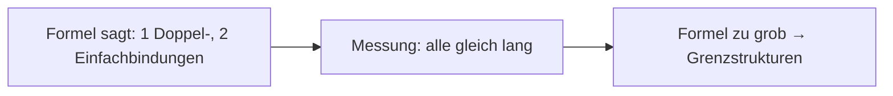

# Figuren im Dokument — Autoren-Konvention für den Agenten

> **Für wen**: den dokument-schreibenden Agenten (`create_conversion` über `INGEST_TOKEN`, `update_document` / `replace_section` über `CARD_TOKEN`) — Erklärbär-Dokumente, Reports, alles Markdown, das in der Library landet. Dieses Dokument ist als **Tool-Doc-Inhalt** gedacht.
> **Warum**: Seit RICH-MEDIA (2026-09-19) zeigt der Reader Schaubilder — Strukturformeln, Elektronenpaar-Pfeile, Flowcharts. **Ein** Renderer bedient Reader, PDF und EPUB; was hier steht, gilt für alle drei. Ohne Konvention entsteht SVG, das still zu einem Platzhalter wird, oder ein Text *über* SVG, der als kaputte Figur gelesen wird.

## Die vier Arten, eine Figur ins Markdown zu setzen

| Art | Wann | Beispiel |
|---|---|---|
| **Inline-`<svg>`** | Der Normalfall für Gezeichnetes: Strukturformel, Schema, Achsen. Skaliert, folgt dem Dark Mode, Beschriftung bleibt Text. | `<svg viewBox="0 0 320 160" …>…</svg>` als eigener Block |
| **Mermaid-Fence** | Flowchart, Sequenz, ER-Diagramm — alles, was Mermaid kann. | ```` ```mermaid ```` … ```` ``` ```` |
| **``** | Ein Rasterbild, das im Netz liegt. Lädt lazy, ohne Referrer. | `` |
| **`data:`-URI** (`` oder ``) | Ein **kleines** Rasterbild ohne Web-Adresse. Für Gezeichnetes lieber Inline-SVG. | `` |

Relative Pfade (``) zeigen **ins Leere** — es gibt noch keinen Asset-Store (Backlog RICH-MEDIA-ASSETS).

## Pflicht-Regeln

### 1. Ein Inline-SVG ist ein eigener Block: `<svg` am Zeilenanfang, Leerzeile davor und danach

```markdown
Text davor.

<svg viewBox="0 0 320 160" xmlns="http://www.w3.org/2000/svg">
  <title>Carbonat, Grenzstruktur A</title>
  …
</svg>

Text danach.
```

Am Zeilenanfang darf das SVG „schön formatiert" sein — Leerzeilen zwischen Gruppen, Attribute über mehrere Zeilen, erstes Kind auf der Tag-Zeile. **Mitten in einer Zeile** (`Skizze: <svg …>`) ist es Absatz-Inhalt: dort macht eine Leerzeile im SVG die Figur kaputt (Markdown liest sie als Absatzgrenze), und Markdown-Auszeichnung in den Labels (`*`, `_`) wird interpretiert. Für eine kleine Figur im Fließtext: **eine Zeile, keine Leerzeile**.

### 2. Wer *über* SVG schreibt, setzt Tags in Backticks

```markdown
Das Tag `<svg>` öffnet die Figur … und `</svg>` schließt sie.     ← richtig
Das Tag <svg> öffnet die Figur … und </svg> schließt sie.         ← wird als Figur gelesen
```

Ohne Backticks ist alles zwischen `<svg` und dem nächsten `</svg>` für den Renderer eine (kaputte) Figur: im Text erscheint ein Platzhalter *[Abbildung nicht darstellbar: …]*. Der Text selbst bleibt stehen — ein Figur-Fehler kostet nie den Text um ihn herum —, aber der Platzhalter steht mitten im Satz. Dasselbe gilt für Platzhalter in spitzen Klammern (`<Stelle>`, `<name>`): ohne Backticks verschwinden sie.

### 3. `viewBox` setzen, breit zeichnen

`viewBox` trägt die Skalierung; der Reader setzt `max-width: 100%; height: auto`. Fehlt sie und stehen `width`/`height` als Zahlen da, leitet der Server eine ab — verlass dich nicht darauf, `%`/`em` kann er nicht ableiten. Seitenverhältnis **~16:10 bis 3:1**: die Lesespalte ist ~70 Zeichen breit, auf dem iPhone 375 px — eine hohe Figur wird auf Briefmarkengröße skaliert. Schrift mindestens **viewBox-Breite ÷ 30**.

### 4. Beschriftung immer: `<title>` im SVG, `alt` am Bild, Satz im Text

- Inline-SVG: `<title>` als **erstes Kind** (Tooltip, Screenreader).
- Bilder: ein **sprechender `alt`-Text** — er ist auch das, was die Library-Vorschau und der MCP von einem `` behalten.
- Und ein Satz im Fließtext, der sagt, was die Figur zeigt: Markierungen (Highlights) gehen nur auf Text, nicht auf Figuren, und Lernkarten entstehen aus Markierungen.

### 5. Dark Mode über `currentColor`, nicht über Klassen

Der Reader erzwingt **keinen** Hintergrund. `stroke="currentColor"` / `fill="currentColor"` folgen der Textfarbe (dunkel auf hell, hell auf dunkel). Hart gesetzte Farben bleiben, wie sie sind: ein `fill="#fff"`-Rechteck ist im Dark Mode eine helle Fläche — als „Papier" unter einer Formel ist das legitim, dann aber **alles** darauf dunkel setzen. Nicht mischen: `currentColor`-Linien auf hartem Weiß sind im Dark Mode unsichtbar.

`class` und `style` gibt es auf SVG-Elementen **nicht** (werden still entfernt): Klassen kollidieren mit den App-Utilities, `style` kann über `url()` nachladen.

### 6. Alles selbsttragend

Keine `<image>`, kein `<use>`, keine Web-Fonts, keine externen Paint-Server — wird still entfernt. Lokale Referenzen funktionieren: `fill="url(#verlauf)"`, `marker-end="url(#pfeil)"`, `clip-path="url(#halb)"`, sofern das Ziel im selben SVG mit `id` definiert ist (`<marker>`, `<linearGradient>`, `<radialGradient>`, `<clipPath>`). Ein Backslash in so einem Wert kippt das Attribut. Schrift nur generisch: `font-family="sans-serif"`.

Erlaubte Tags und Attribute: **dieselbe Liste wie für Karten-Figuren** — [docs/card_svg_authoring.md](card_svg_authoring.md) § *Erlaubte Tags und Attribute*. Es gibt genau eine SVG-Policy ([services/svg_sanitize.py](../services/svg_sanitize.py)). Nicht erlaubt und nie erlaubt werdend: `<script>`, `<style>`, `<foreignObject>`, `<use>`, `<image>`, `<a>`, `<animate>`/`<set>`, `<mask>`, `<filter>`, alle `on*`-Handler.

### 7. `data:`-URIs: nur Bilder, nur im Bild, vollständig kodiert

- Nur `image/svg+xml`, `png`, `jpeg`, `webp`, `gif` — und nur als Bildquelle. Ein Link auf eine `data:`-URI (`[x](data:…)`, `<a href="data:…">`) verliert sein Ziel.
- In `` muss das SVG **prozent-kodiert** sein (`%3Csvg%20…`) oder base64: ein rohes `<svg …>` mit Leerzeichen ist kein gültiges Markdown-Linkziel. In `` mit Anführungszeichen geht auch die rohe Form.
- Für Gezeichnetes ist Inline-SVG besser: Labels bleiben Text, `currentColor` greift, keine Kodierung.

### 8. Mermaid

Normaler Fence mit `mermaid` als Sprache. Der Reader rendert ihn im Browser (Version fest gepinnt, `securityLevel: 'strict'` — HTML in Labels und `click`-Handler sind aus). Bei einem Syntaxfehler zeigt der Reader den Quelltext mit einem Hinweis, der Rest des Dokuments rendert. **Im PDF und im EPUB bleibt ein Mermaid-Block Quelltext** (kein Browser-JS dort) — was auch auf dem Kindle ein Bild sein muss, als Inline-SVG zeichnen.

## Limits

| Was | Grenze | Antwort |
|---|---|---|
| eine `data:`-URI | **2 MB** (Bytes, wie geschrieben — base64 zählt aufgebläht) | **413** „Ein eingebettetes Bild ist zu groß. Maximal 2 MB je data-URI." |
| Medien je Dokument (`data:`-URIs + Inline-SVG zusammen) | **10 MB** | **413** „Das Dokument enthält zu viele eingebettete Medien. Maximal 10 MB je Dokument." |

Gilt an **allen** Schreibwegen (`create_conversion`, `update_document`, `replace_section` — dort gemessen am **fertigen** Dokument, nicht an der Sektion — und im Editor). Bei 413 ist nichts geschrieben. Text hat kein Limit. Ein sauberes Schema liegt bei 1–5 kB; wer an die Grenze kommt, bettet Rasterbilder ein, die eine Web-Adresse oder (später) den Asset-Store brauchen.

`content_length` in `list_conversions` ist die **rohe** Länge inklusive jedes eingebetteten Bytes — mit Figuren kein Maß mehr für „wie viel Text". `content_preview` ist medienbereinigt (SVG-Quelltext, data-URIs, Mermaid-Quelltext entfernt, `alt`-Text bleibt).

## Wenn statt der Figur ein Platzhalter erscheint

> *[Abbildung nicht darstellbar: …]* — sichtbarer, markierbarer Text an der Stelle der Figur. Der Write wird **nicht** abgelehnt; der Grund steht im Platzhalter.

| Grund im Platzhalter | Ursache | Abhilfe |
|---|---|---|
| *nach der Sicherheitsprüfung bleibt kein zeichenbares Element übrig* | Alles Gezeichnete lag außerhalb der Allow-List (`<image>`, `<use>`, `<foreignObject>` …), oder es war Prosa zwischen `<svg>` und `</svg>` | Mit erlaubten Elementen zeichnen; Tags in Prosa in Backticks |
| *das SVG ist nicht geschlossen (`</svg>` fehlt)* | Abgeschnittenes SVG, oder ein `<svg>` in Prosa ohne Backticks | `</svg>` ergänzen; Backticks |
| *das SVG enthält eine Leerzeile, die Markdown als Absatzgrenze liest* | SVG beginnt **mitten in der Zeile** (oder steckt in einem HTML-Block wie `<figure>`) und enthält eine Leerzeile | `<svg` an den Zeilenanfang, Leerzeile davor — oder die Leerzeilen aus dem SVG nehmen |

Prüfen ohne Browser: das Dokument mit `get_transcript` zurücklesen zeigt den **rohen** Inhalt, nicht das Rendering. Verlässlich ist nur die Konvention — oder ein Blick in den Reader.

## Vorlage

````markdown
## Mesomerie am Carbonat

Alle drei C–O-Bindungen sind gleich lang — eine einzelne Lewis-Formel kann das nicht zeigen.

<svg viewBox="0 0 320 170" xmlns="http://www.w3.org/2000/svg" font-family="sans-serif" font-size="16">
  <title>Carbonat-Ion, Grenzstruktur A: eine C=O-Doppelbindung, zwei C–O⁻</title>
  <defs>
    <marker id="pfeil" viewBox="0 0 10 10" refX="8" refY="5" markerWidth="6" markerHeight="6" orient="auto">
      <path d="M0 0 L10 5 L0 10 z" fill="currentColor"/>
    </marker>
  </defs>

  <text x="160" y="98" text-anchor="middle">C</text>
  <text x="160" y="34" text-anchor="middle">O</text>
  <text x="72" y="146" text-anchor="middle">O⁻</text>
  <text x="248" y="146" text-anchor="middle">O⁻</text>

  <g stroke="currentColor" stroke-width="2" fill="none">
    <line x1="156" y1="80" x2="156" y2="42"/>
    <line x1="164" y1="80" x2="164" y2="42"/>
    <line x1="148" y1="100" x2="88" y2="132"/>
    <line x1="172" y1="100" x2="232" y2="132"/>
    <path d="M236 118 C 230 84, 196 60, 172 52" stroke-dasharray="4 3" marker-end="url(#pfeil)"/>
  </g>
</svg>

*Abb. 1: Grenzstruktur A. Der gestrichelte Pfeil zeigt, welches freie Elektronenpaar in Struktur B zur Doppelbindung wird.*


````

`<svg` am Zeilenanfang mit Leerzeile davor und danach, `viewBox`, `<title>` zuerst, nur `currentColor` (folgt dem Dark Mode), lokaler Marker, Leerzeilen im Block-SVG sind in Ordnung, Bildunterschrift als Text (markierbar), Mermaid als Fence. ~1,2 kB.

---

*Server-Seite: [app_pkg/markdown_render.py](../app_pkg/markdown_render.py) (ein Renderer für Reader, PDF, EPUB), [services/svg_sanitize.py](../services/svg_sanitize.py) (die eine SVG-Policy), [services/doc_media.py](../services/doc_media.py) (Limits, Vorschau), [static/js/reader_figures.js](../static/js/reader_figures.js) (Mermaid im Reader). Karten-Figuren: [docs/card_svg_authoring.md](card_svg_authoring.md). MCP-Brief: [docs/converter_mcp_rich_media_brief.md](converter_mcp_rich_media_brief.md).*
