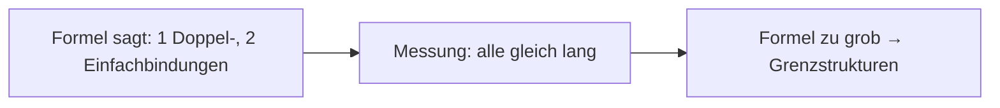

# Render-Probe: SVG in Markdown

Drei Varianten, dieselbe Skizze (Carbonat, Grenzstruktur A). Welche wird als Bild angezeigt?

## Variante 1 — inline `<svg>`

<svg xmlns="http://www.w3.org/2000/svg" width="260" height="150" viewBox="0 0 260 150" font-family="sans-serif" font-size="18">
  <rect width="260" height="150" fill="#fff" stroke="#999"/>
  <text x="122" y="90" text-anchor="middle">C</text>
  <text x="122" y="32" text-anchor="middle">O</text>
  <text x="40" y="128" text-anchor="middle">O</text>
  <text x="204" y="128" text-anchor="middle">O</text>
  <line x1="118" y1="74" x2="118" y2="40" stroke="#222" stroke-width="2"/>
  <line x1="126" y1="74" x2="126" y2="40" stroke="#222" stroke-width="2"/>
  <line x1="110" y1="92" x2="54" y2="118" stroke="#222" stroke-width="2"/>
  <line x1="134" y1="92" x2="190" y2="118" stroke="#222" stroke-width="2"/>
  <text x="22" y="112" font-size="12">−</text>
  <text x="218" y="112" font-size="12">−</text>
  <text x="130" y="140" text-anchor="middle" font-size="11" fill="#c00">Variante 1: inline svg</text>
</svg>

## Variante 2 — `` mit data-URI

## Variante 3 — Markdown-Bild mit data-URI

## Variante 4 — Mermaid (Codeblock)

Ende der Probe.
